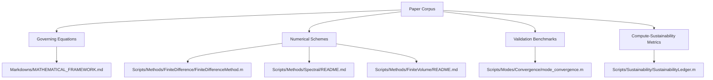
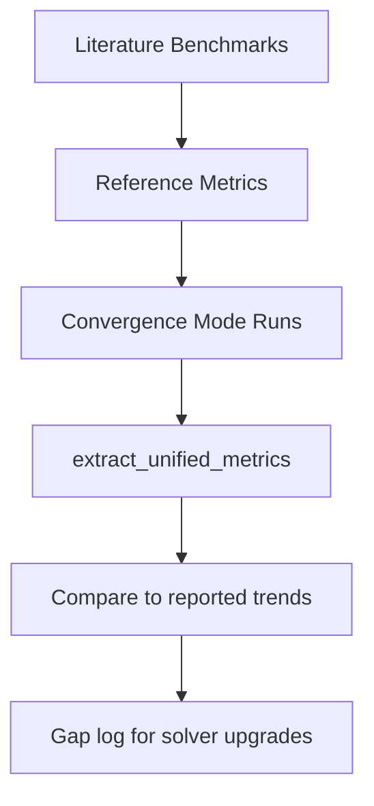
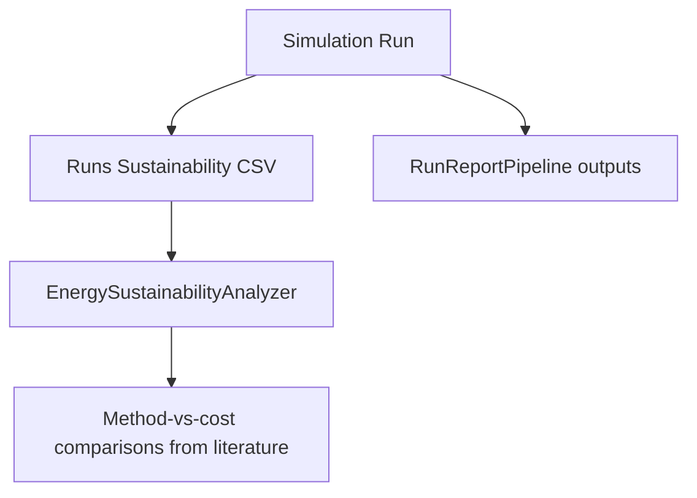

# Deep Research Report - Tsunami Vorticity Corpus (2026-02-11)

Generated: 2026-02-11T13:25:05Z

## Executive Synopsis

This report consolidates the local `Research Papers/` corpus into a single NotebookLM-style synthesis focused on numerical simulation of tsunami-related vorticity dynamics over ocean surfaces.

Corpus processing summary: 45 files -> 43 unique papers after SHA-256 deduplication; 43 paper sections generated.

## Table of Contents

- [Executive Synopsis](#executive-synopsis)
- [Corpus Manifest Summary](#corpus-manifest-summary)
- [Cross-Paper Tsunami-Vorticity Synthesis](#cross-paper-tsunami-vorticity-synthesis)
- [Per-Paper Summaries](#per-paper-summaries)
- [Bibliography](#bibliography)
- [Validation Checklist](#validation-checklist)

- [Paper 01: CHAPTER 1. TROPICAL CYCLONE MOTION Vorticity-streamfunction method](#paper-01-chapter-1-tropical-cyclone-motion-vorticity-streamfunction-method)
- [Paper 02: A coupled lattice Boltzmann and finite volume method for natural convection simulation](#paper-02-a-coupled-lattice-boltzmann-and-finite-volume-method-for-natural-convection-simulation)
- [Paper 03: A numerical study of the MRT-LBM for the shallow water equation in high Reynolds number flows: An application to real-world tsunami simulation](#paper-03-a-numerical-study-of-the-mrt-lbm-for-the-shallow-water-equation-in-high-reynolds-number-flows-an-application-to-real-world-tsunami-simulation)
- [Paper 04: Comput. Methods Appl. Mech. Engrg. 198 (2008) 367–376 Comput. Methods Appl. Mech. Engrg.](#paper-04-comput-methods-appl-mech-engrg-198-2008-367-376-comput-methods-appl-mech-engrg)
- [Paper 05: Effect of the kinematic viscosity on liquid flow hydrodynamics in vortex mixers](#paper-05-effect-of-the-kinematic-viscosity-on-liquid-flow-hydrodynamics-in-vortex-mixers)
- [Paper 06: Interaction of multiple vortices over a double delta wing](#paper-06-interaction-of-multiple-vortices-over-a-double-delta-wing)
- [Paper 07: A Lattice-Boltzmann solver for 3D fluid simulation on GPU](#paper-07-a-lattice-boltzmann-solver-for-3d-fluid-simulation-on-gpu)
- [Paper 08: Numerical modelling of advection diffusion equation using Chebyshev spectral collocation method and Laplace transform](#paper-08-numerical-modelling-of-advection-diffusion-equation-using-chebyshev-spectral-collocation-method-and-laplace-transform)
- [Paper 09: A maximum principle of the Fourier spectral method for diffusion equations](#paper-09-a-maximum-principle-of-the-fourier-spectral-method-for-diffusion-equations)
- [Paper 10: Vorticity dynamics](#paper-10-vorticity-dynamics)
- [Paper 11: The 2D Euler equations with random initial conditions Franco Flandoli, University of Pisa](#paper-11-the-2d-euler-equations-with-random-initial-conditions-franco-flandoli-university-of-pisa)
- [Paper 12: Modelling vortex-vortex and vortex-boundary interaction](#paper-12-modelling-vortex-vortex-and-vortex-boundary-interaction)
- [Paper 13: arXiv:2404.18754v1 [physics.flu-dyn] 29 Apr 2024 Spectral measures and iterative bounds for effective diffusivity](#paper-13-arxiv-2404-18754v1-physics-flu-dyn-29-apr-2024-spectral-measures-and-iterative-bounds-for-effective-diffusivity)
- [Paper 14: arXiv:2510.17885v1 [cs.PF] 18 Oct 2025 Metrics and evaluations for computational and](#paper-14-arxiv-2510-17885v1-cs-pf-18-oct-2025-metrics-and-evaluations-for-computational-and)
- [Paper 15: CHAPTER 10 EQUATIONS OF](#paper-15-chapter-10-equations-of)
- [Paper 16: Shallow-water approximation](#paper-16-shallow-water-approximation)
- [Paper 17: Vorticity dynamics](#paper-17-vorticity-dynamics)
- [Paper 18: Numerical Solution of Advection-Diffusion-Reaction Equations](#paper-18-numerical-solution-of-advection-diffusion-reaction-equations)
- [Paper 19: A spatial local method for solving 2D and 3D advection-diffusion equations](#paper-19-a-spatial-local-method-for-solving-2d-and-3d-advection-diffusion-equations)
- [Paper 20: P1: ARK/ary P2: MBL/vks](#paper-20-p1-ark-ary-p2-mbl-vks)
- [Paper 21: NUMERICAL METHODS FOR SHALLOW-WATER FLOW](#paper-21-numerical-methods-for-shallow-water-flow)
- [Paper 22: Vorticity Boundary Condition and Related Issues for Finite Difference Schemes](#paper-22-vorticity-boundary-condition-and-related-issues-for-finite-di-erence-schemes)
- [Paper 23: SIMPLE FINITE ELEMENT METHOD IN VORTICITY FORMULATION FOR INCOMPRESSIBLE FLOWS](#paper-23-simple-finite-element-method-in-vorticity-formulation-for-incompressible-flows)
- [Paper 24: Version date: March 22, 2010 Generation and diffusion of vorticity](#paper-24-version-date-march-22-2010-generation-and-diffusion-of-vorticity)
- [Paper 25: We have already encountered the vorticity field in the identity u · ∇u = ∇ |u|2 − u × (∇ × u).](#paper-25-we-have-already-encountered-the-vorticity-field-in-the-identity-u-u-u-2-u-u)
- [Paper 26: Viscous merging of three vortices](#paper-26-viscous-merging-of-three-vortices)
- [Paper 27: Data-Driven Modeling  Scientific Computation Methods for Complex Systems  Big Da](#paper-27-data-driven-modeling-scientific-computation-methods-for-complex-systems-big-da)
- [Paper 28: First vorticity–velocity–pressure numerical scheme for the Stokes problem](#paper-28-first-vorticity-velocity-pressure-numerical-scheme-for-the-stokes-problem)
- [Paper 29: Analysis of wind turbine wake dynamics by a gaussian-core vortex lattice technique](#paper-29-analysis-of-wind-turbine-wake-dynamics-by-a-gaussian-core-vortex-lattice-technique)
- [Paper 30: Modeling Spatio‐Temporal Transport: From Rigid Advection to Realistic Dynamics](#paper-30-modeling-spatio-temporal-transport-from-rigid-advection-to-realistic-dynamics)
- [Paper 31: Modelling of vorticity, sound and their interaction in two-dimensional superfluids](#paper-31-modelling-of-vorticity-sound-and-their-interaction-in-two-dimensional-superfluids)
- [Paper 32: Shallow water equations for equatorial tsunami waves](#paper-32-shallow-water-equations-for-equatorial-tsunami-waves)
- [Paper 33: Computational Fluid Dynamics I A Finite Difference Code](#paper-33-computational-fluid-dynamics-i-a-finite-difference-code)
- [Paper 34: Numerical Solution of the Advection-Diffusion Equation using the Discontinuous Enrichment Method (DEM)](#paper-34-numerical-solution-of-the-advection-diffusion-equation-using-the-discontinuous-enrichment-method-dem)
- [Paper 35: Numerical simulation of tsunami-scale wave boundary layers](#paper-35-numerical-simulation-of-tsunami-scale-wave-boundary-layers)
- [Paper 36: RBF-Vortex Methods for the Barotropic Vorticity Equation on a Sphere](#paper-36-rbf-vortex-methods-for-the-barotropic-vorticity-equation-on-a-sphere)
- [Paper 37: Quantitative experimental and numerical investigation of a vortex ring impinging on a wall](#paper-37-quantitative-experimental-and-numerical-investigation-of-a-vortex-ring-impinging-on-a-wall)
- [Paper 38: Impact of vorticity and viscosity on the hydrodynamic evolution of hot QCD medium](#paper-38-impact-of-vorticity-and-viscosity-on-the-hydrodynamic-evolution-of-hot-qcd-medium)
- [Paper 39: GREENER principles for environmentally sustainable computational science](#paper-39-greener-principles-for-environmentally-sustainable-computational-science)
- [Paper 40: Metrics for Computational and Sustainable AI Efficiency](#paper-40-metrics-for-computational-and-sustainable-ai-efficiency)
- [Paper 41: Unsteady aerodynamic loads on pitching aerofoils represented by Gaussian body force distributions](#paper-41-unsteady-aerodynamic-loads-on-pitching-aerofoils-represented-by-gaussian-body-force-distributions)
- [Paper 42: Reviewer](#paper-42-reviewer)
- [Paper 43: Vortices over bathymetry](#paper-43-vortices-over-bathymetry)

## Corpus Manifest Summary

| Metric | Value |
|---|---|
| Source files | 45 |
| Unique papers | 43 |
| Summarized sections | 43 |
| Duplicate groups | 2 |

## Cross-Paper Tsunami-Vorticity Synthesis

### Numerical Method Distribution (keyword-based signal)

| Method signal | Papers |
|---|---|
| Finite difference / Arakawa / RK4 | 3 |
| Spectral / FFT | 5 |
| Finite volume / flux form | 1 |
| LBM / MRT | 4 |
| Shallow-water / tsunami propagation | 3 |

### Literature-to-Solver Component Map



### Equation-to-Code Traceability

```mermaid
flowchart LR
  EQ1[Vorticity Eq: d(omega)/dt + u.grad(omega) = nu laplacian(omega)] --> FD[FiniteDifferenceMethod]
  EQ2[Poisson Eq: laplacian(psi) = -omega] --> POI[Poisson Solve in FD setup]
  EQ3[Shallow-water variants] --> BATHY[Variable_Bathymetry_Analysis]
  EQ4[Turbulence/LES/LBM models] --> FUTURE[Method extension backlog]
```

### Validation and Benchmark Workflow



### Sustainability Instrumentation Link



## Per-Paper Summaries

### Paper 01: CHAPTER 1. TROPICAL CYCLONE MOTION Vorticity-streamfunction method

**Citation [1]:** CHAPTER 1. TROPICAL CYCLONE MOTION Vorticity-streamfunction method.

**Canonical PDF:** `080704_TCs_Part_II_Chapter01.pdf`
**File aliases:** `080704_TCs_Part_II_Chapter01.pdf`

**Research objective and scope**

Vorticity-streamfunction method The vorticity-streamfunction method is a powerful way of solving two-dimensional flow

**Methods and numerical approach**

Vorticity-streamfunction method The vorticity-streamfunction method is a powerful way of solving two-dimensional flow ∂v/∂x − ∂u/∂y and satisfies the equation

**Key findings**

We show below that, in general, the location of Figure 1.1 shows an example of various flow fields for the tropical-cyclone-scale contour plots shown in the figure include the total wind speed, the relative vorticity,

**Limitations**

flow is assumed to be barotropic, there is no mechanism to change the vorticity of air However, neither the streamfunction distribution ψ(x, y, t), nor the pressure distribution p(x, y, t), are symmetric

**Key governing equations**

- `= −us · ∇(Γ + f ) − (U − c) · ∇ζs − U · ∇(Γ + f ),` (p.2)
- `= −us · ∇(Γ + f ) − (U − c) · ∇ζs − (U − c) · ∇(Γ + f ).` (p.3)
- `ψ(x, y) = −Uy + ψ  (r),` (p.3)
- `tangential wind speed of the symmetric vortex, Vm = (∂ψ  /∂r)max .` (p.3)
- `and Φ = ψ  (r)/r. This point is to the left of the vorticity centre in the direction of` (p.4)

**Detailed observations linked to repository modules**

- This paper links to the vorticity-streamfunction implementation documented in `Markdowns/MATHEMATICAL_FRAMEWORK.md` and `Scripts/Methods/FiniteDifference/README.md`.
- Its benchmarking ideas are directly relevant to convergence workflows in `Scripts/Modes/Convergence/mode_convergence.m` and `Scripts/Modes/Convergence/run_adaptive_convergence.m`.
- Its compute-performance implications connect to sustainability instrumentation in `Scripts/Sustainability/SustainabilityLedger.m` and `Scripts/Sustainability/EnergySustainabilityAnalyzer.m`.
- Its modeling direction can be compared with the ML roadmap in `Markdowns/MACHINE_LEARNING_VORTICITY_ABSORPTION.md`.

**Evidence anchors**

- [objective, p.1] Vorticity-streamfunction method
- [objective, p.1] The vorticity-streamfunction method is a powerful way of solving two-dimensional flow
- [methods, p.1] Vorticity-streamfunction method
- [methods, p.1] The vorticity-streamfunction method is a powerful way of solving two-dimensional flow
- [methods, p.1] ∂v/∂x − ∂u/∂y and satisfies the equation
- [findings, p.2] We show below that, in general, the location of
- [findings, p.3] Figure 1.1 shows an example of various flow fields for the tropical-cyclone-scale
- [findings, p.3] contour plots shown in the figure include the total wind speed, the relative vorticity,
- [limitations, p.2] flow is assumed to be barotropic, there is no mechanism to change the vorticity of air
- [limitations, p.3] However, neither the streamfunction distribution ψ(x, y, t), nor the pressure distribution p(x, y, t), are symmetric
- [equation, p.2] = −us · ∇(Γ + f ) − (U − c) · ∇ζs − U · ∇(Γ + f ),
- [equation, p.3] = −us · ∇(Γ + f ) − (U − c) · ∇ζs − (U − c) · ∇(Γ + f ).
- [equation, p.3] ψ(x, y) = −Uy + ψ  (r),
- [equation, p.3] tangential wind speed of the symmetric vortex, Vm = (∂ψ  /∂r)max .

**Figure gallery (scientific images)**


*Embedded figure from page 11*


*Embedded figure from page 11*


*Embedded figure from page 12*


*Embedded figure from page 13*


*Embedded figure from page 14*


*Embedded figure from page 17*


*Embedded figure from page 19*

### Paper 02: A coupled lattice Boltzmann and finite volume method for natural convection simulation

**Citation [2]:** Li, Zheng, Yang, Mo, Zhang, Yuwen. A coupled lattice Boltzmann and finite volume method for natural convection simulation. International Journal of Heat and Mass Transfer. 2014;. doi:10.1016/j.ijheatmasstransfer.2013.11.077.

**Canonical PDF:** `1-s2.0-S0017931013010417-main.pdf`
**File aliases:** `1-s2.0-S0017931013010417-main.pdf`
**DOI:** `10.1016/j.ijheatmasstransfer.2013.11.077`

**Research objective and scope**

The objective of this paper is to combine the LBM and FVM as a in FVM zone in this paper.

**Methods and numerical approach**

A coupled lattice Boltzmann and finite volume method for natural Nonequilibrium extrapolation scheme A coupled lattice Boltzmann and finite volume method is proposed to solve natural convection in a differentially heated squared enclosure.

**Key findings**

obtained from the coupled method agreed with those from pure FVM and LBM very well. energy distributions results while they can be solved directly in the density and energy distributions results directly.

**Limitations**

has the limitation when solving problems with complex computational domain [3]. However general reconstruction

**Key governing equations**

- `No extractable governing equation found in machine-readable text.` (p.1)

**Detailed observations linked to repository modules**

- This paper links to the vorticity-streamfunction implementation documented in `Markdowns/MATHEMATICAL_FRAMEWORK.md` and `Scripts/Methods/FiniteDifference/README.md`.
- It provides method-level rationale for the finite-volume roadmap in `Scripts/Methods/FiniteVolume/README.md`.
- Its benchmarking ideas are directly relevant to convergence workflows in `Scripts/Modes/Convergence/mode_convergence.m` and `Scripts/Modes/Convergence/run_adaptive_convergence.m`.
- Its compute-performance implications connect to sustainability instrumentation in `Scripts/Sustainability/SustainabilityLedger.m` and `Scripts/Sustainability/EnergySustainabilityAnalyzer.m`.
- Its modeling direction can be compared with the ML roadmap in `Markdowns/MACHINE_LEARNING_VORTICITY_ABSORPTION.md`.

**Evidence anchors**

- [objective, p.1] The objective of this paper is to combine the LBM and FVM as a
- [objective, p.2] in FVM zone in this paper.
- [methods, p.1] A coupled lattice Boltzmann and finite volume method for natural
- [methods, p.1] Nonequilibrium extrapolation scheme
- [methods, p.1] A coupled lattice Boltzmann and finite volume method is proposed to solve natural convection in a differentially heated squared enclosure.
- [findings, p.1] obtained from the coupled method agreed with those from pure FVM and LBM very well.
- [findings, p.1] energy distributions results while they can be solved directly in
- [findings, p.1] the density and energy distributions results directly.
- [limitations, p.1] has the limitation when solving problems with complex computational domain [3].
- [limitations, p.1] However general reconstruction
- [equation, p.1] No extractable governing equation found in machine-readable text.

**Figure gallery (scientific images)**


*Embedded figure from page 1*


*Embedded figure from page 2*


*Embedded figure from page 3*


*Embedded figure from page 3*


*Embedded figure from page 4*


*Embedded figure from page 4*


*Embedded figure from page 4*


*Embedded figure from page 5*


*Embedded figure from page 5*


*Embedded figure from page 6*


*Embedded figure from page 6*


*Embedded figure from page 7*


*Embedded figure from page 7*


*Embedded figure from page 8*


*Embedded figure from page 8*


*Embedded figure from page 8*


*Embedded figure from page 9*


*Embedded figure from page 10*


*Embedded figure from page 10*


*Embedded figure from page 10*

### Paper 03: A numerical study of the MRT-LBM for the shallow water equation in high Reynolds number flows: An application to real-world tsunami simulation

**Citation [3]:** Sato, Kenta, Kawasaki, Koji, Koshimura, Shunichi. A numerical study of the MRT-LBM for the shallow water equation in high Reynolds number flows: An application to real-world tsunami simulation. Nuclear Engineering and Design. 2023;. doi:10.1016/j.nucengdes.2023.112159. Available from: https://www.sciencedirect.com/science/article/pii/S0029549323000080.

**Canonical PDF:** `1-s2.0-S0029549323000080-main.pdf`
**File aliases:** `1-s2.0-S0029549323000080-main.pdf`
**DOI:** `10.1016/j.nucengdes.2023.112159`
**URL:** https://www.sciencedirect.com/science/article/pii/S0029549323000080

**Research objective and scope**

In this study, the turbulence model for the MRT model with the The structure of this paper is as follows.

**Methods and numerical approach**

A numerical study of the MRT-LBM for the shallow water equation in high Reynolds number flows: An application to real-world tsunami simulation The lattice Boltzmann method (LBM) has recently attracted attention as a simple computational fluid dynamics

**Key findings**

We verified the calculation accuracy by focusing on the tsunami propagation waveform and inundation depth with the computational accuracy equally as good as This tsunami disaster has shown that external forces

**Limitations**

However, it is well known that the LBM is prone to computational However, the kinematic and

**Key governing equations**

- `kinematic viscosity 𝜈 was 𝜈 = 2.5 × 10−5 m2 ∕s to obtain the Reynolds` (p.7)
- `parameters. The Reynolds number, which is defined as Re = 𝑈 𝐿∕𝜈,` (p.9)
- `viscosity coefficient 𝜈 = 1.0 × 10−6 m2 ∕s assuming real-world water.` (p.6)
- `simulation, 𝜏 is very close to 0.5 (e.g., 𝜏 = 0.5 + 3.0 × 10−6 in Case` (p.6)
- `Fig. 13 presents a plot of the time-averaged 𝑢𝑥 at 𝑥 = 1.0 m along` (p.9)

**Detailed observations linked to repository modules**

- This paper links to the vorticity-streamfunction implementation documented in `Markdowns/MATHEMATICAL_FRAMEWORK.md` and `Scripts/Methods/FiniteDifference/README.md`.
- Its numerical treatment can be mapped to the active FD path in `Scripts/Methods/FiniteDifference/FiniteDifferenceMethod.m` and runtime dispatch in `Scripts/Drivers/Tsunami_Vorticity_Emulator.m`.
- It provides method-level rationale for the finite-volume roadmap in `Scripts/Methods/FiniteVolume/README.md`.
- Its benchmarking ideas are directly relevant to convergence workflows in `Scripts/Modes/Convergence/mode_convergence.m` and `Scripts/Modes/Convergence/run_adaptive_convergence.m`.
- Its physical assumptions should be cross-checked against variable-bathymetry handling in `Scripts/Modes/Variable_Bathymetry_Analysis.m` and planned mode/method unification.
- Its compute-performance implications connect to sustainability instrumentation in `Scripts/Sustainability/SustainabilityLedger.m` and `Scripts/Sustainability/EnergySustainabilityAnalyzer.m`.

**Evidence anchors**

- [objective, p.2] In this study, the turbulence model for the MRT model with the
- [objective, p.2] The structure of this paper is as follows.
- [methods, p.1] A numerical study of the MRT-LBM for the shallow water equation in high
- [methods, p.1] Reynolds number flows: An application to real-world tsunami simulation
- [methods, p.1] The lattice Boltzmann method (LBM) has recently attracted attention as a simple computational fluid dynamics
- [findings, p.1] We verified the calculation accuracy by focusing on
- [findings, p.1] the tsunami propagation waveform and inundation depth with the computational accuracy equally as good as
- [findings, p.1] This tsunami disaster has shown that external forces
- [limitations, p.1] However, it is well known that the LBM is prone to computational
- [limitations, p.2] However, the kinematic and
- [equation, p.7] kinematic viscosity 𝜈 was 𝜈 = 2.5 × 10−5 m2 ∕s to obtain the Reynolds
- [equation, p.9] parameters. The Reynolds number, which is defined as Re = 𝑈 𝐿∕𝜈,
- [equation, p.6] viscosity coefficient 𝜈 = 1.0 × 10−6 m2 ∕s assuming real-world water.
- [equation, p.6] simulation, 𝜏 is very close to 0.5 (e.g., 𝜏 = 0.5 + 3.0 × 10−6 in Case

**Figure gallery (scientific images)**


*Embedded figure from page 1*


*Embedded figure from page 7*


*Embedded figure from page 8*


*Embedded figure from page 8*


*Embedded figure from page 9*


*Embedded figure from page 10*


*Embedded figure from page 12*


*Embedded figure from page 12*


*Embedded figure from page 12*


*Embedded figure from page 14*

### Paper 04: Comput. Methods Appl. Mech. Engrg. 198 (2008) 367–376 Comput. Methods Appl. Mech. Engrg.

**Citation [4]:** Comput. Methods Appl. Mech. Engrg. 198 (2008) 367–376 Comput. Methods Appl. Mech. Engrg.. 2008. doi:10.1016/j.cma.2008.08.007.

**Canonical PDF:** `1-s2.0-S0045782508002855-main.pdf`
**File aliases:** `1-s2.0-S0045782508002855-main.pdf`
**DOI:** `10.1016/j.cma.2008.08.007`

**Research objective and scope**

A lattice Boltzmann model for vorticity–streamfunction formulations is proposed in this paper. The rest of this paper is organized as follows.

**Methods and numerical approach**

A new method for the numerical solution of vorticity–streamfunction formulations A lattice Boltzmann model for vorticity–streamfunction formulations is proposed in this paper. results and other numerical data shows that this model is an efficient numerical method for the numerical solution of vorticity–streamfunction formulations.

**Key findings**

Excellent agreement between the present results and other numerical data shows that this model is an efficient numerical method for the numerical solution of vorticity–streamfunction formulations. of vorticity–streamfunction formulations have been demonstrated

**Limitations**

However, a few drawbacks still affect vorticity formulations. However, all existing LBMs are designed for primitive-variable

**Key governing equations**

- `industrial applications [63,64]. Fig. 1 shows a schematic of a rectangular lid-driven cavity with aspect ratio J ¼ H=W, H being the` (p.5)

**Detailed observations linked to repository modules**

- This paper links to the vorticity-streamfunction implementation documented in `Markdowns/MATHEMATICAL_FRAMEWORK.md` and `Scripts/Methods/FiniteDifference/README.md`.
- It informs the experimental spectral branch under `Scripts/Methods/Spectral/README.md`, which is currently not fully wired in dispatcher modes.
- Its benchmarking ideas are directly relevant to convergence workflows in `Scripts/Modes/Convergence/mode_convergence.m` and `Scripts/Modes/Convergence/run_adaptive_convergence.m`.
- Its modeling direction can be compared with the ML roadmap in `Markdowns/MACHINE_LEARNING_VORTICITY_ABSORPTION.md`.

**Evidence anchors**

- [objective, p.1] A lattice Boltzmann model for vorticity–streamfunction formulations is proposed in this paper.
- [objective, p.3] The rest of this paper is organized as follows.
- [methods, p.1] A new method for the numerical solution of vorticity–streamfunction formulations
- [methods, p.1] A lattice Boltzmann model for vorticity–streamfunction formulations is proposed in this paper.
- [methods, p.1] results and other numerical data shows that this model is an efficient numerical method for the numerical solution of vorticity–streamfunction formulations.
- [findings, p.1] Excellent agreement between the present
- [findings, p.1] results and other numerical data shows that this model is an efficient numerical method for the numerical solution of vorticity–streamfunction formulations.
- [findings, p.1] of vorticity–streamfunction formulations have been demonstrated
- [limitations, p.1] However, a few drawbacks still affect vorticity formulations.
- [limitations, p.2] However, all existing LBMs are designed for primitive-variable
- [equation, p.5] industrial applications [63,64]. Fig. 1 shows a schematic of a rectangular lid-driven cavity with aspect ratio J ¼ H=W, H being the

**Figure gallery (scientific images)**


*Fallback rendered page 1*


*Fallback rendered page 2*


*Fallback rendered page 3*


*Fallback rendered page 4*


*Fallback rendered page 5*


*Fallback rendered page 6*


*Fallback rendered page 7*


*Fallback rendered page 8*


*Fallback rendered page 9*


*Fallback rendered page 10*

### Paper 05: Effect of the kinematic viscosity on liquid flow hydrodynamics in vortex mixers

**Citation [5]:** GECIM, Gozde, ERKOC, Ertugrul. Effect of the kinematic viscosity on liquid flow hydrodynamics in vortex mixers. Chemical Engineering Research and Design. 2024;. doi:10.1016/j.cherd.2024.04.034.

**Canonical PDF:** `1-s2.0-S0263876224002363-main.pdf`
**File aliases:** `1-s2.0-S0263876224002363-main.pdf`
**DOI:** `10.1016/j.cherd.2024.04.034`

**Research objective and scope**

In this study, flow hydrodynamics for similar liquids in a vortex the work reported in this paper.

**Methods and numerical approach**

Jet mixing devices offer an alternate method for fluid mixing, The Adaptive PIV method, which was thoroughly detailed in our (rms) method, which considers the standard deviation of the corre­

**Key findings**

The critical Reynolds number of the flow regime transitions was found using PLIF and which results in shorter diffusion time and better mixing performance and vortex flow regimes showed stratification effects as a result of fluid

**Limitations**

critical Reynolds number; however, the coefficient is different for liquids and gases. Similar flow regimes were noted, however stratified

**Key governing equations**

- `Sultan et al., 2012). At Re = 200, a self-sustainable chaotic regime in` (p.1)
- `namics. Formation of swirl behavior was observed at Re = 40 for water/` (p.7)

**Detailed observations linked to repository modules**

- This paper links to the vorticity-streamfunction implementation documented in `Markdowns/MATHEMATICAL_FRAMEWORK.md` and `Scripts/Methods/FiniteDifference/README.md`.
- Its physical assumptions should be cross-checked against variable-bathymetry handling in `Scripts/Modes/Variable_Bathymetry_Analysis.m` and planned mode/method unification.
- Its compute-performance implications connect to sustainability instrumentation in `Scripts/Sustainability/SustainabilityLedger.m` and `Scripts/Sustainability/EnergySustainabilityAnalyzer.m`.
- Its modeling direction can be compared with the ML roadmap in `Markdowns/MACHINE_LEARNING_VORTICITY_ABSORPTION.md`.

**Evidence anchors**

- [objective, p.2] In this study, flow hydrodynamics for similar liquids in a vortex
- [objective, p.7] the work reported in this paper.
- [methods, p.1] Jet mixing devices offer an alternate method for fluid mixing,
- [methods, p.3] The Adaptive PIV method, which was thoroughly detailed in our
- [methods, p.3] (rms) method, which considers the standard deviation of the corre­
- [findings, p.1] The critical Reynolds number of the flow regime transitions was found using PLIF and
- [findings, p.2] which results in shorter diffusion time and better mixing performance
- [findings, p.2] and vortex flow regimes showed stratification effects as a result of fluid
- [limitations, p.1] critical Reynolds number; however, the coefficient is different for liquids and gases.
- [limitations, p.2] Similar flow regimes were noted, however stratified
- [equation, p.1] Sultan et al., 2012). At Re = 200, a self-sustainable chaotic regime in
- [equation, p.7] namics. Formation of swirl behavior was observed at Re = 40 for water/

**Figure gallery (scientific images)**


*Embedded figure from page 1*


*Embedded figure from page 2*


*Embedded figure from page 3*


*Embedded figure from page 4*


*Embedded figure from page 5*


*Embedded figure from page 6*


*Embedded figure from page 7*

### Paper 06: Interaction of multiple vortices over a double delta wing

**Citation [6]:** Zhang, X., Wang, Z., Gursul, I.. Interaction of multiple vortices over a double delta wing. Aerospace Science and Technology. 2016;. doi:10.1016/j.ast.2015.11.020.

**Canonical PDF:** `1-s2.0-S1270963815003648-main.pdf`
**File aliases:** `1-s2.0-S1270963815003648-main.pdf`
**DOI:** `10.1016/j.ast.2015.11.020`

**Research objective and scope**

main objective of this study is to investigate vortex interactions This paper reports an experimental study of the interactions of

**Methods and numerical approach**

challenging aspect of the simulation of flows around aircraft configurations. A recent example of this is the flow simulations [4] simulations and experiments that the merging process strongly depends on the strength of the vortices and the separation distance

**Key findings**

Prior to vortex breakdown, both wing and strake vortices were found meandering over generic (and simple) wings, and ultimately to enable control of multiple vortices to improve aerodynamic performance and Previous studies showed intensified interactions between strake and

**Limitations**

However, little is known about the interactions of these multiple vortices. Vortex breakdown is however not observed over the

**Key governing equations**

- `U ∞ = 10 m/s, giving a Reynolds number (Re = U ∞ c /ν , where U ∞` (p.3)
- `models had a chord length of c = 354 mm and a thickness-to-` (p.2)
- `Fig. 3. Time-averaged crossflow vorticity patterns over the double delta wing at various chordwise locations at a) α = 4◦ ; b) α = 8◦ ; c) α = 12◦ ; d) α = 16◦ ; e) α = 20◦ ;` (p.3)
- `f) α = 24◦ ; g) α = 28◦ ; h) α = 32◦ . The chordwise locations are x/c = 0.25, 0.375, 0.50, 0.625, 0.75, 0.875, and 1.00. For α = 4◦ and α = 32◦ , the locations are x/c = 0.25,` (p.3)
- `chord ratio of t /c = 2.8%. Both models were manufactured from` (p.3)

**Detailed observations linked to repository modules**

- This paper links to the vorticity-streamfunction implementation documented in `Markdowns/MATHEMATICAL_FRAMEWORK.md` and `Scripts/Methods/FiniteDifference/README.md`.
- Its benchmarking ideas are directly relevant to convergence workflows in `Scripts/Modes/Convergence/mode_convergence.m` and `Scripts/Modes/Convergence/run_adaptive_convergence.m`.
- Its physical assumptions should be cross-checked against variable-bathymetry handling in `Scripts/Modes/Variable_Bathymetry_Analysis.m` and planned mode/method unification.
- Its compute-performance implications connect to sustainability instrumentation in `Scripts/Sustainability/SustainabilityLedger.m` and `Scripts/Sustainability/EnergySustainabilityAnalyzer.m`.
- Its modeling direction can be compared with the ML roadmap in `Markdowns/MACHINE_LEARNING_VORTICITY_ABSORPTION.md`.

**Evidence anchors**

- [objective, p.1] main objective of this study is to investigate vortex interactions
- [objective, p.2] This paper reports an experimental study of the interactions of
- [methods, p.1] challenging aspect of the simulation of flows around aircraft configurations.
- [methods, p.1] A recent example of this is the flow simulations [4]
- [methods, p.1] simulations and experiments that the merging process strongly depends on the strength of the vortices and the separation distance
- [findings, p.1] Prior to vortex breakdown, both wing and strake vortices were found meandering
- [findings, p.1] over generic (and simple) wings, and ultimately to enable control of multiple vortices to improve aerodynamic performance and
- [findings, p.1] Previous studies showed intensified interactions between strake and
- [limitations, p.1] However, little is known about the interactions of these multiple vortices.
- [limitations, p.5] Vortex breakdown is however not observed over the
- [equation, p.3] U ∞ = 10 m/s, giving a Reynolds number (Re = U ∞ c /ν , where U ∞
- [equation, p.2] models had a chord length of c = 354 mm and a thickness-to-
- [equation, p.3] Fig. 3. Time-averaged crossflow vorticity patterns over the double delta wing at various chordwise locations at a) α = 4◦ ; b) α = 8◦ ; c) α = 12◦ ; d) α = 16◦ ; e) α = 20◦ ;
- [equation, p.3] f) α = 24◦ ; g) α = 28◦ ; h) α = 32◦ . The chordwise locations are x/c = 0.25, 0.375, 0.50, 0.625, 0.75, 0.875, and 1.00. For α = 4◦ and α = 32◦ , the locations are x/c = 0.25,

**Figure gallery (scientific images)**


*Embedded figure from page 1*


*Embedded figure from page 2*


*Embedded figure from page 3*


*Embedded figure from page 4*


*Embedded figure from page 5*


*Embedded figure from page 6*


*Embedded figure from page 7*


*Embedded figure from page 7*


*Embedded figure from page 8*


*Embedded figure from page 8*


*Embedded figure from page 9*


*Embedded figure from page 9*


*Embedded figure from page 10*


*Embedded figure from page 10*


*Embedded figure from page 11*


*Embedded figure from page 12*


*Embedded figure from page 15*


*Embedded figure from page 15*


*Embedded figure from page 16*


*Embedded figure from page 17*

### Paper 07: A Lattice-Boltzmann solver for 3D fluid simulation on GPU

**Citation [7]:** Rinaldi, P.R., Dari, E.A., Vénere, M.J., Clausse, A.. A Lattice-Boltzmann solver for 3D fluid simulation on GPU. Simulation Modelling Practice and Theory. 2012;. doi:10.1016/j.simpat.2012.03.004.

**Canonical PDF:** `1-s2.0-S1569190X1200038X-main.pdf`
**File aliases:** `1-s2.0-S1569190X1200038X-main.pdf`
**DOI:** `10.1016/j.simpat.2012.03.004`

**Research objective and scope**

Simulation Modelling Practice and Theory 25 (2012) 163–171 Contents lists available at SciVerse ScienceDirect

**Methods and numerical approach**

Simulation Modelling Practice and Theory 25 (2012) 163–171 Simulation Modelling Practice and Theory A Lattice-Boltzmann solver for 3D fluid simulation on GPU

**Key findings**

calculation of lid driven cubic cavity flow at Reynolds number 100 and 1000 showing great Several researchers have shown that the combination of GPU and Parallel CA is a valid tool to simulate fluids Although there has been interesting advances in this type of implementations, inter-processor data communication continues limiting the calculation performance, thus memory access optimizations is always necessary to take good

**Limitations**

However, memory access patterns, execution configurations and memory layout, are aspects that However, the domain cannot grow more than 512 cells in the x direction, due to the upper bound of threads per block.

**Key governing equations**

- `GPU. Only the grid refinement was changed to obtain different Reynolds numbers. With an imposed velocity Umax = 0.24 and` (p.7)
- `advection of particles distributions located in the same x-plane (i = 0, 2, 4, 5, 6, 12, 14, 16 and 18 in Fig. 1) can be coalesced.` (p.3)
- `(6) if (x==DIMX-1) //right border` (p.5)
- `(12) f[base + 18] = F[dirQD(x,y + north,z  back,18,k,DIMX,DIMY,DIMZ,Q)];` (p.5)
- `read for cell type, that is 38  4 bytes + 1  2 bytes = 154 bytes, at 259 MLUPS memory bandwidth is about 39.9 GB/s.` (p.8)

**Detailed observations linked to repository modules**

- This paper links to the vorticity-streamfunction implementation documented in `Markdowns/MATHEMATICAL_FRAMEWORK.md` and `Scripts/Methods/FiniteDifference/README.md`.
- Its benchmarking ideas are directly relevant to convergence workflows in `Scripts/Modes/Convergence/mode_convergence.m` and `Scripts/Modes/Convergence/run_adaptive_convergence.m`.
- Its compute-performance implications connect to sustainability instrumentation in `Scripts/Sustainability/SustainabilityLedger.m` and `Scripts/Sustainability/EnergySustainabilityAnalyzer.m`.
- Its modeling direction can be compared with the ML roadmap in `Markdowns/MACHINE_LEARNING_VORTICITY_ABSORPTION.md`.

**Evidence anchors**

- [objective, p.1] Simulation Modelling Practice and Theory 25 (2012) 163–171
- [objective, p.1] Contents lists available at SciVerse ScienceDirect
- [methods, p.1] Simulation Modelling Practice and Theory 25 (2012) 163–171
- [methods, p.1] Simulation Modelling Practice and Theory
- [methods, p.1] A Lattice-Boltzmann solver for 3D fluid simulation on GPU
- [findings, p.1] calculation of lid driven cubic cavity flow at Reynolds number 100 and 1000 showing great
- [findings, p.1] Several researchers have shown that the combination of GPU and Parallel CA is a valid tool to simulate fluids
- [findings, p.1] Although there has been interesting advances in this type of implementations, inter-processor data communication continues limiting the calculation performance, thus memory access optimizations is always necessary to take good
- [limitations, p.3] However, memory access patterns, execution configurations and memory layout, are aspects that
- [limitations, p.4] However, the domain cannot grow more than 512 cells in the x direction, due to the upper bound of threads per block.
- [equation, p.7] GPU. Only the grid refinement was changed to obtain different Reynolds numbers. With an imposed velocity Umax = 0.24 and
- [equation, p.3] advection of particles distributions located in the same x-plane (i = 0, 2, 4, 5, 6, 12, 14, 16 and 18 in Fig. 1) can be coalesced.
- [equation, p.5] (6) if (x==DIMX-1) //right border
- [equation, p.5] (12) f[base + 18] = F[dirQD(x,y + north,z  back,18,k,DIMX,DIMY,DIMZ,Q)];

**Figure gallery (scientific images)**


*Embedded figure from page 5*


*Embedded figure from page 6*


*Embedded figure from page 6*


*Embedded figure from page 7*

### Paper 08: Numerical modelling of advection diffusion equation using Chebyshev spectral collocation method and Laplace transform

**Citation [8]:** Shah, Farman Ali, Kamran, Shah, Kamal, Abdeljawad, Thabet. Numerical modelling of advection diffusion equation using Chebyshev spectral collocation method and Laplace transform. Results in Applied Mathematics. 2024;. doi:10.1016/j.rinam.2023.100420.

**Canonical PDF:** `1-s2.0-S2590037423000663-main.pdf`
**File aliases:** `1-s2.0-S2590037423000663-main.pdf`
**DOI:** `10.1016/j.rinam.2023.100420`

**Research objective and scope**

In order to numerically simulate ADE, the LT and Chebyshev spectral collocation method (CSCM) are coupled in this paper. This paper is first attempt to utilize the LT coupled with CSCM.

**Methods and numerical approach**

Numerical modelling of advection diffusion equation using Chebyshev spectral collocation method and Laplace transform Numerical inverse Laplace transform

**Key findings**

Results in Applied Mathematics 21 (2024) 100420 Results in Applied Mathematics journal homepage: www.elsevier.com/locate/results-in-applied-mathematics

**Limitations**

However, the analytical solution for ADEs is not always available. benefits of spectrum approaches that are not restricted to certain quadrature points.

**Key governing equations**

- `where  (𝝈, 𝑡) = 𝜁 𝛥 (𝝈, 𝑡) + 𝜉∇ (𝝈, 𝑡) − 𝜆 (𝝈, 𝑡), 𝐷𝑡 = 𝜕𝑡` (p.2)
- `𝐷𝑡  (𝝈, 𝑡) =𝜁 𝛥 (𝝈, 𝑡) + 𝜉∇ (𝝈, 𝑡) − 𝜆 (𝝈, 𝑡) + 𝑄(𝝈, 𝑡),` (p.2)
- `where ℘𝑖𝑗 (𝝈 𝑖𝑗 ) = 𝛿𝑖𝑗 , the 2𝑛𝑑 -order derivatives of the LIPs (16) are obtained as` (p.5)
- `̂(𝝈, 𝑧), 𝑧 = 𝜚+𝑖𝑦, as 𝑦 → ∞numerical` (p.6)
- `̂(𝝈, 𝑧) the idea of Talbot [49] can be utilized. According to Talbots suggestion the Bromwich line 𝑧 = 𝜚 + 𝑖𝑦, − ∞ < 𝑦 < ∞` (p.6)

**Detailed observations linked to repository modules**

- This paper links to the vorticity-streamfunction implementation documented in `Markdowns/MATHEMATICAL_FRAMEWORK.md` and `Scripts/Methods/FiniteDifference/README.md`.
- Its numerical treatment can be mapped to the active FD path in `Scripts/Methods/FiniteDifference/FiniteDifferenceMethod.m` and runtime dispatch in `Scripts/Drivers/Tsunami_Vorticity_Emulator.m`.
- It informs the experimental spectral branch under `Scripts/Methods/Spectral/README.md`, which is currently not fully wired in dispatcher modes.
- Its benchmarking ideas are directly relevant to convergence workflows in `Scripts/Modes/Convergence/mode_convergence.m` and `Scripts/Modes/Convergence/run_adaptive_convergence.m`.
- Its compute-performance implications connect to sustainability instrumentation in `Scripts/Sustainability/SustainabilityLedger.m` and `Scripts/Sustainability/EnergySustainabilityAnalyzer.m`.
- Its modeling direction can be compared with the ML roadmap in `Markdowns/MACHINE_LEARNING_VORTICITY_ABSORPTION.md`.

**Evidence anchors**

- [objective, p.2] In order to numerically simulate ADE, the LT and Chebyshev spectral collocation method (CSCM) are coupled in this paper.
- [objective, p.2] This paper is first attempt to utilize the LT coupled with CSCM.
- [methods, p.1] Numerical modelling of advection diffusion equation using
- [methods, p.1] Chebyshev spectral collocation method and Laplace transform
- [methods, p.1] Numerical inverse Laplace transform
- [findings, p.1] Results in Applied Mathematics 21 (2024) 100420
- [findings, p.1] Results in Applied Mathematics
- [findings, p.1] journal homepage: www.elsevier.com/locate/results-in-applied-mathematics
- [limitations, p.2] However, the analytical solution for ADEs is not always available.
- [limitations, p.2] benefits of spectrum approaches that are not restricted to certain quadrature points.
- [equation, p.2] where  (𝝈, 𝑡) = 𝜁 𝛥 (𝝈, 𝑡) + 𝜉∇ (𝝈, 𝑡) − 𝜆 (𝝈, 𝑡), 𝐷𝑡 = 𝜕𝑡
- [equation, p.2] 𝐷𝑡  (𝝈, 𝑡) =𝜁 𝛥 (𝝈, 𝑡) + 𝜉∇ (𝝈, 𝑡) − 𝜆 (𝝈, 𝑡) + 𝑄(𝝈, 𝑡),
- [equation, p.5] where ℘𝑖𝑗 (𝝈 𝑖𝑗 ) = 𝛿𝑖𝑗 , the 2𝑛𝑑 -order derivatives of the LIPs (16) are obtained as
- [equation, p.6] ̂(𝝈, 𝑧), 𝑧 = 𝜚+𝑖𝑦, as 𝑦 → ∞numerical

**Figure gallery (scientific images)**


*Embedded figure from page 1*


*Embedded figure from page 1*


*Embedded figure from page 9*


*Embedded figure from page 10*


*Embedded figure from page 12*


*Embedded figure from page 13*


*Embedded figure from page 14*

### Paper 09: A maximum principle of the Fourier spectral method for diffusion equations

**Citation [9]:** Kim, Junseok, Kwak, Soobin, Lee, Hyun Geun, Hwang, Youngjin, Ham, Seokjun. A maximum principle of the Fourier spectral method for diffusion equations. Electronic Research Archive. 2023;. doi:10.3934/era.2023273.

**Canonical PDF:** `10.3934_era.2023273.pdf`
**File aliases:** `10.3934_era.2023273.pdf`, `era-31-09-273.pdf`
**DOI:** `10.3934/era.2023273`

**Research objective and scope**

http://www.aimspress.com/journal/era Abstract: In this study, we investigate a maximum principle of the Fourier spectral method (FSM) for

**Methods and numerical approach**

A maximum principle of the Fourier spectral method for diffusion equations Abstract: In this study, we investigate a maximum principle of the Fourier spectral method (FSM) for The maximum principle holds for diffusion equations: A solution satisfying the diffusion equation has the maximum value

**Key findings**

The same result can hold for the discrete numerical solution by using the FSM when the initial condition is smooth. Lee [4] showed that the discrete maximum principle holds for the implicit finite difference scheme was used to demonstrate the unconditional stability of the proposed method.

**Limitations**

However, if the initial condition However, due to the oscillatory profile of the non-smooth initial conditions of a continuous representation in the FSM, it is possible for the discrete maximum principle to be violated.

**Key governing equations**

- `n · ∇u(x, t) = 0 on ∂Ω,` (p.1)
- `(IDCT). For simplicity of exposition, we consider the one-dimensional space Ω = (0, L). Let xi =` (p.3)
- `(i − 0.5)h for i = 1, . . . , N, where h = L/N and N is a positive integer. Let tn = n∆t for n = 1, . . . ,` (p.3)
- `respectively, where α1 = 1/N, α p = 2/N for p ≥ 2, and ξ p = (p−1)/L for p = 1, . . . , N [5,9,15,16].` (p.3)
- `û(p, tn+1 ) = û(p, tn )e−(ξ p π) ∆t for p = 1, . . . , N.` (p.4)

**Detailed observations linked to repository modules**

- This paper links to the vorticity-streamfunction implementation documented in `Markdowns/MATHEMATICAL_FRAMEWORK.md` and `Scripts/Methods/FiniteDifference/README.md`.
- Its numerical treatment can be mapped to the active FD path in `Scripts/Methods/FiniteDifference/FiniteDifferenceMethod.m` and runtime dispatch in `Scripts/Drivers/Tsunami_Vorticity_Emulator.m`.
- It informs the experimental spectral branch under `Scripts/Methods/Spectral/README.md`, which is currently not fully wired in dispatcher modes.
- Its benchmarking ideas are directly relevant to convergence workflows in `Scripts/Modes/Convergence/mode_convergence.m` and `Scripts/Modes/Convergence/run_adaptive_convergence.m`.
- Its compute-performance implications connect to sustainability instrumentation in `Scripts/Sustainability/SustainabilityLedger.m` and `Scripts/Sustainability/EnergySustainabilityAnalyzer.m`.
- Its modeling direction can be compared with the ML roadmap in `Markdowns/MACHINE_LEARNING_VORTICITY_ABSORPTION.md`.

**Evidence anchors**

- [objective, p.1] http://www.aimspress.com/journal/era
- [objective, p.1] Abstract: In this study, we investigate a maximum principle of the Fourier spectral method (FSM) for
- [methods, p.1] A maximum principle of the Fourier spectral method for diffusion equations
- [methods, p.1] Abstract: In this study, we investigate a maximum principle of the Fourier spectral method (FSM) for
- [methods, p.1] The maximum principle holds for diffusion equations: A solution satisfying the diffusion equation has the maximum value
- [findings, p.1] The same result can hold for the discrete numerical solution by using the FSM when the initial condition is smooth.
- [findings, p.2] Lee [4] showed that the discrete maximum principle holds for the implicit finite difference scheme
- [findings, p.2] was used to demonstrate the unconditional stability of the proposed method.
- [limitations, p.1] However, if the initial condition
- [limitations, p.3] However, due to the oscillatory profile of the non-smooth initial conditions of a continuous representation in the FSM, it is possible for the discrete maximum principle to be violated.
- [equation, p.1] n · ∇u(x, t) = 0 on ∂Ω,
- [equation, p.3] (IDCT). For simplicity of exposition, we consider the one-dimensional space Ω = (0, L). Let xi =
- [equation, p.3] (i − 0.5)h for i = 1, . . . , N, where h = L/N and N is a positive integer. Let tn = n∆t for n = 1, . . . ,
- [equation, p.3] respectively, where α1 = 1/N, α p = 2/N for p ≥ 2, and ξ p = (p−1)/L for p = 1, . . . , N [5,9,15,16].

**Figure gallery (scientific images)**


*Embedded figure from page 1*


*Embedded figure from page 10*

### Paper 10: Vorticity dynamics

**Citation [10]:** Katopodes, Nikolaos D. Vorticity dynamics. 2007. doi:10.1016/B978-0-12-815489-2.00007-1. Available from: https://linkinghub.elsevier.com/retrieve/pii/B9780128154892000071.

**Canonical PDF:** `128_1_online.pdf`
**File aliases:** `128_1_online.pdf`
**DOI:** `10.1016/B978-0-12-815489-2.00007-1`
**URL:** https://linkinghub.elsevier.com/retrieve/pii/B9780128154892000071

**Research objective and scope**

In this paper, we begin in Sec. Vorticity dynamics and sound generation in two-dimensional

**Methods and numerical approach**

A computational method of evaluating noncompact sound based on vortex sound theory Validation of a hybrid method of aeroacoustic noise computation applied to internal flows An approximate solution to the two-dimensional incompressible fluid equations is constructed by

**Key findings**

The resulting rotation frequency The present analytic result for the far-field acoustic pressure is shown to be substantially our result to a previous high Reynolds number numerical

**Limitations**

convention for repeated subscripts is assumed. The coefficient Q jk is assumed, without loss of

**Key governing equations**

- `ui = ⌫共t兲U␭i + D j共t兲` (p.3)
- `r = 冑x21 + x22, and r̂i, ␪ˆ i are the ith components of the radial and` (p.3)
- `approaches the two-dimensional point vortex ␥␦共r兲. The tangential velocity ␥U␭ is zero at r = 0, and has a radially symmetric core region in which the tangential velocity increases` (p.3)
- `= ␳0 ⵱ · 共␻ ⫻ u兲 + ␳0⵱2 u2 ,` (p.5)
- `S = ␳0 ⵱ · 共␻ ⫻ u兲 = S共0兲共t兲␦共r兲 + S共1兲` (p.5)

**Detailed observations linked to repository modules**

- This paper links to the vorticity-streamfunction implementation documented in `Markdowns/MATHEMATICAL_FRAMEWORK.md` and `Scripts/Methods/FiniteDifference/README.md`.
- Its benchmarking ideas are directly relevant to convergence workflows in `Scripts/Modes/Convergence/mode_convergence.m` and `Scripts/Modes/Convergence/run_adaptive_convergence.m`.
- Its modeling direction can be compared with the ML roadmap in `Markdowns/MACHINE_LEARNING_VORTICITY_ABSORPTION.md`.

**Evidence anchors**

- [objective, p.2] In this paper, we begin in Sec.
- [objective, p.1] Vorticity dynamics and sound generation in two-dimensional
- [methods, p.1] A computational method of evaluating noncompact sound based on vortex sound theory
- [methods, p.1] Validation of a hybrid method of aeroacoustic noise computation applied to internal flows
- [methods, p.2] An approximate solution to the two-dimensional incompressible fluid equations is constructed by
- [findings, p.2] The resulting rotation frequency
- [findings, p.2] The present analytic result for the far-field acoustic pressure is shown to be substantially
- [findings, p.2] our result to a previous high Reynolds number numerical
- [limitations, p.3] convention for repeated subscripts is assumed.
- [limitations, p.3] The coefficient Q jk is assumed, without loss of
- [equation, p.3] ui = ⌫共t兲U␭i + D j共t兲
- [equation, p.3] r = 冑x21 + x22, and r̂i, ␪ˆ i are the ith components of the radial and
- [equation, p.3] approaches the two-dimensional point vortex ␥␦共r兲. The tangential velocity ␥U␭ is zero at r = 0, and has a radially symmetric core region in which the tangential velocity increases
- [equation, p.5] = ␳0 ⵱ · 共␻ ⫻ u兲 + ␳0⵱2 u2 ,

**Figure gallery (scientific images)**


*Embedded figure from page 1*

### Paper 11: The 2D Euler equations with random initial conditions Franco Flandoli, University of Pisa

**Citation [11]:** The 2D Euler equations with random initial conditions Franco Flandoli, University of Pisa. 2017.

**Canonical PDF:** `1328flan.pdf`
**File aliases:** `1328flan.pdf`

**Research objective and scope**

The 2D Euler equations with random initial conditions Franco Flandoli, University of Pisa

**Methods and numerical approach**

The 2D Euler equations with random initial conditions Review of results on deterministic 2D Euler equations To simplify the exposition, let us consider the equations on the torus

**Key findings**

Review of results on deterministic 2D Euler equations Albeverio-Cruzeiro in the framework of more classical results Main results and perspectives

**Limitations**

We consider random initial conditions and precisely we assume that ω 0 is The 2D Euler equations with random initial conditions

**Key governing equations**

- `∂t u + u ru + rp = 0` (p.3)
- `∂t ω + u rω = 0.` (p.3)
- `∂t ω + u r ω = 0` (p.9)
- `hω t , φi = hω 0 , φi +` (p.15)
- `d ω + u rωdt + rω dW = 0` (p.27)

**Detailed observations linked to repository modules**

- This paper links to the vorticity-streamfunction implementation documented in `Markdowns/MATHEMATICAL_FRAMEWORK.md` and `Scripts/Methods/FiniteDifference/README.md`.
- It informs the experimental spectral branch under `Scripts/Methods/Spectral/README.md`, which is currently not fully wired in dispatcher modes.
- Its compute-performance implications connect to sustainability instrumentation in `Scripts/Sustainability/SustainabilityLedger.m` and `Scripts/Sustainability/EnergySustainabilityAnalyzer.m`.
- Its modeling direction can be compared with the ML roadmap in `Markdowns/MACHINE_LEARNING_VORTICITY_ABSORPTION.md`.

**Evidence anchors**

- [objective, p.1] The 2D Euler equations with random initial conditions
- [objective, p.1] Franco Flandoli, University of Pisa
- [methods, p.1] The 2D Euler equations with random initial conditions
- [methods, p.2] Review of results on deterministic 2D Euler equations
- [methods, p.3] To simplify the exposition, let us consider the equations on the torus
- [findings, p.2] Review of results on deterministic 2D Euler equations
- [findings, p.2] Albeverio-Cruzeiro in the framework of more classical results
- [findings, p.2] Main results and perspectives
- [limitations, p.7] We consider random initial conditions and precisely we assume that ω 0 is
- [limitations, p.1] The 2D Euler equations with random initial conditions
- [equation, p.3] ∂t u + u ru + rp = 0
- [equation, p.3] ∂t ω + u rω = 0.
- [equation, p.9] ∂t ω + u r ω = 0
- [equation, p.15] hω t , φi = hω 0 , φi +

**Figure gallery (scientific images)**


*Fallback rendered page 1*


*Fallback rendered page 2*


*Fallback rendered page 3*


*Fallback rendered page 4*


*Fallback rendered page 5*


*Fallback rendered page 6*


*Fallback rendered page 7*


*Fallback rendered page 8*


*Fallback rendered page 9*


*Fallback rendered page 10*


*Fallback rendered page 11*


*Fallback rendered page 12*

### Paper 12: Modelling vortex-vortex and vortex-boundary interaction

**Citation [12]:** Burnett, Rhodri. Modelling vortex-vortex and vortex-boundary interaction. 2009.

**Canonical PDF:** `19222.pdf`
**File aliases:** `19222.pdf`

**Research objective and scope**

Modelling vortex-vortex and vortex-boundary DEPARTMENT OF MATHEMATICS

**Methods and numerical approach**

linear (small-amplitude) limit and then numerically for the fully nonlinear problem. Numerical equilibria agree well with those predicted by linear theory when the amplitude of the Numerical computations using

**Key findings**

vortices located near a vorticity interface generated by a shear flow are found analytically in the considered are mainly periodic in nature and it is found that an array of equilibrium shapes exist. Numerical equilibria agree well with those predicted by linear theory when the amplitude of the

**Limitations**

7 Conclusions and future work However, with the development and

**Key governing equations**

- `by D/Dt = ∂t + u · ∇ and p is the pressure owing to the change in depth H = h − hB` (p.212)
- `b = 0.0 in the stereographic plane. A background flow is present with ψB as in (5.28)` (p.152)
- `is present with vorticity jump ω̃ = −1 such that ω = 1/2 in y > 0 and ω = −1/2` (p.22)
- `Denote the y-direction displacement of the vortical interface by y = η(x), where` (p.22)
- `For a stationary configuration ∂η/∂t = 0, therefore the linearised problem is to find` (p.23)

**Detailed observations linked to repository modules**

- This paper links to the vorticity-streamfunction implementation documented in `Markdowns/MATHEMATICAL_FRAMEWORK.md` and `Scripts/Methods/FiniteDifference/README.md`.
- Its numerical treatment can be mapped to the active FD path in `Scripts/Methods/FiniteDifference/FiniteDifferenceMethod.m` and runtime dispatch in `Scripts/Drivers/Tsunami_Vorticity_Emulator.m`.
- It provides method-level rationale for the finite-volume roadmap in `Scripts/Methods/FiniteVolume/README.md`.
- Its physical assumptions should be cross-checked against variable-bathymetry handling in `Scripts/Modes/Variable_Bathymetry_Analysis.m` and planned mode/method unification.
- Its compute-performance implications connect to sustainability instrumentation in `Scripts/Sustainability/SustainabilityLedger.m` and `Scripts/Sustainability/EnergySustainabilityAnalyzer.m`.
- Its modeling direction can be compared with the ML roadmap in `Markdowns/MACHINE_LEARNING_VORTICITY_ABSORPTION.md`.

**Evidence anchors**

- [objective, p.1] Modelling vortex-vortex and vortex-boundary
- [objective, p.1] DEPARTMENT OF MATHEMATICS
- [methods, p.3] linear (small-amplitude) limit and then numerically for the fully nonlinear problem.
- [methods, p.3] Numerical equilibria agree well with those predicted by linear theory when the amplitude of the
- [methods, p.3] Numerical computations using
- [findings, p.3] vortices located near a vorticity interface generated by a shear flow are found analytically in the
- [findings, p.3] considered are mainly periodic in nature and it is found that an array of equilibrium shapes exist.
- [findings, p.3] Numerical equilibria agree well with those predicted by linear theory when the amplitude of the
- [limitations, p.6] 7 Conclusions and future work
- [limitations, p.8] However, with the development and
- [equation, p.212] by D/Dt = ∂t + u · ∇ and p is the pressure owing to the change in depth H = h − hB
- [equation, p.152] b = 0.0 in the stereographic plane. A background flow is present with ψB as in (5.28)
- [equation, p.22] is present with vorticity jump ω̃ = −1 such that ω = 1/2 in y > 0 and ω = −1/2
- [equation, p.22] Denote the y-direction displacement of the vortical interface by y = η(x), where

**Figure gallery (scientific images)**


*Embedded figure from page 22*


*Embedded figure from page 32*


*Embedded figure from page 39*


*Embedded figure from page 43*


*Embedded figure from page 44*


*Embedded figure from page 45*


*Embedded figure from page 46*


*Embedded figure from page 47*


*Embedded figure from page 48*


*Embedded figure from page 52*


*Embedded figure from page 53*


*Embedded figure from page 55*


*Embedded figure from page 76*


*Embedded figure from page 77*


*Embedded figure from page 78*


*Embedded figure from page 79*


*Embedded figure from page 83*


*Embedded figure from page 84*


*Embedded figure from page 85*


*Embedded figure from page 86*


*Embedded figure from page 87*


*Embedded figure from page 102*


*Embedded figure from page 144*


*Embedded figure from page 148*


*Embedded figure from page 163*


*Embedded figure from page 177*


*Embedded figure from page 178*


*Embedded figure from page 179*

### Paper 13: arXiv:2404.18754v1 [physics.flu-dyn] 29 Apr 2024 Spectral measures and iterative bounds for effective diffusivity

**Citation [13]:** arXiv:2404.18754v1 [physics.flu-dyn] 29 Apr 2024 Spectral measures and iterative bounds for effective diffusivity. 2024.

**Canonical PDF:** `2404.18754v1.pdf`
**File aliases:** `2404.18754v1.pdf`

**Research objective and scope**

arXiv:2404.18754v1 [physics.flu-dyn] 29 Apr 2024 Spectral measures and iterative bounds for effective diffusivity

**Methods and numerical approach**

Spectral measures and iterative bounds for effective diffusivity Over three decades ago the advection-diffusion equation for a steady fluid velocity field was homogenized, leading to a Stieltjes integral representation for the effective diffusivity, which is given in terms of a spectral measure of a compact self-adjoint operator and the Péclet number of the fluid flow.

**Key findings**

result was recently extended to space-time periodic flows, instead involving an unbounded self-adjoint The method is demonstrated for periodic flows in two spatial dimensions. order upper and lower bounds, demonstrating the ability of the method to provide accurate estimates

**Limitations**

However, with the lack of a method for calculating the moments However, for over 3 decades, the lack of a way to calculate the measure moments

**Key governing equations**

- `satisfies ∇·u = 0. In equation (1), ε > 0 is the molecular diffusion constant, ∂t denotes partial differentiation` (p.2)
- `with respect to time t, and ∆ = ∇·∇ = ∇2 is the Laplacian. Moreover, ψ·ϕ = ψ T ϕ, where ψ T denotes` (p.2)
- `∂t φ(t, x) = u(t, x)·∇φ(t, x) + ε∆φ(t, x),` (p.2)
- `transposition of the vector ψ and ϕ denotes component-wise complex conjugation, with ψ·ψ = |ψ|2 . Later,` (p.2)
- `∂t φδ (t, x) = δ −1 u(t/δ 2 , x/δ)·∇φδ (t, x) + ε∆φδ (t, x),` (p.3)

**Detailed observations linked to repository modules**

- This paper links to the vorticity-streamfunction implementation documented in `Markdowns/MATHEMATICAL_FRAMEWORK.md` and `Scripts/Methods/FiniteDifference/README.md`.
- It informs the experimental spectral branch under `Scripts/Methods/Spectral/README.md`, which is currently not fully wired in dispatcher modes.
- Its benchmarking ideas are directly relevant to convergence workflows in `Scripts/Modes/Convergence/mode_convergence.m` and `Scripts/Modes/Convergence/run_adaptive_convergence.m`.
- Its compute-performance implications connect to sustainability instrumentation in `Scripts/Sustainability/SustainabilityLedger.m` and `Scripts/Sustainability/EnergySustainabilityAnalyzer.m`.
- Its modeling direction can be compared with the ML roadmap in `Markdowns/MACHINE_LEARNING_VORTICITY_ABSORPTION.md`.

**Evidence anchors**

- [objective, p.1] arXiv:2404.18754v1 [physics.flu-dyn] 29 Apr 2024
- [objective, p.1] Spectral measures and iterative bounds for effective diffusivity
- [methods, p.1] Spectral measures and iterative bounds for effective diffusivity
- [methods, p.1] Over three decades ago the advection-diffusion equation for a steady fluid velocity field was homogenized, leading to a Stieltjes integral representation for the effective diffusivity, which is given in terms
- [methods, p.1] of a spectral measure of a compact self-adjoint operator and the Péclet number of the fluid flow.
- [findings, p.1] result was recently extended to space-time periodic flows, instead involving an unbounded self-adjoint
- [findings, p.1] The method is demonstrated for periodic flows in two spatial dimensions.
- [findings, p.1] order upper and lower bounds, demonstrating the ability of the method to provide accurate estimates
- [limitations, p.1] However, with the lack of a method for calculating the moments
- [limitations, p.1] However, for over 3 decades, the lack of a way to calculate the measure moments
- [equation, p.2] satisfies ∇·u = 0. In equation (1), ε > 0 is the molecular diffusion constant, ∂t denotes partial differentiation
- [equation, p.2] with respect to time t, and ∆ = ∇·∇ = ∇2 is the Laplacian. Moreover, ψ·ϕ = ψ T ϕ, where ψ T denotes
- [equation, p.2] ∂t φ(t, x) = u(t, x)·∇φ(t, x) + ε∆φ(t, x),
- [equation, p.2] transposition of the vector ψ and ϕ denotes component-wise complex conjugation, with ψ·ψ = |ψ|2 . Later,

**Figure gallery (scientific images)**


*Fallback rendered page 1*


*Fallback rendered page 2*


*Fallback rendered page 3*


*Fallback rendered page 4*


*Fallback rendered page 5*


*Fallback rendered page 6*


*Fallback rendered page 7*


*Fallback rendered page 8*


*Fallback rendered page 9*


*Fallback rendered page 10*


*Fallback rendered page 11*


*Fallback rendered page 12*

### Paper 14: arXiv:2510.17885v1 [cs.PF] 18 Oct 2025 Metrics and evaluations for computational and

**Citation [14]:** arXiv:2510.17885v1 [cs.PF] 18 Oct 2025 Metrics and evaluations for computational and. 2025.

**Canonical PDF:** `2510.17885v1.pdf`
**File aliases:** `2510.17885v1.pdf`

**Research objective and scope**

latency and throughput for service-level objectives (SLOs), a parallel literature To close this gap, we propose a unified, reproducible

**Methods and numerical approach**

methodologies from sustainable computing [13, 15, 2]. methodology for AI model inference that integrates computational and environmental metrics under realistic serving conditions and yields a pragmatic, methodology for calculating latency in AI systems, emphasizing the practical

**Key findings**

To optimize the performance, efficiency, Prior systems work shows that tail latencies (p95 or p99) dominate perceived performance at scale and thus must be managed explicitly, not inferred metrics are instantiated under matched accuracy constraints so that efficiency

**Limitations**

However, most LLM benchmarking still relies on data-center overheads (PUE), others assume fixed grid emissions factors, and

**Key governing equations**

- `E = P dt expressed in Watt-hours; and we compute location-adjusted carbon` (p.2)

**Detailed observations linked to repository modules**

- This paper links to the vorticity-streamfunction implementation documented in `Markdowns/MATHEMATICAL_FRAMEWORK.md` and `Scripts/Methods/FiniteDifference/README.md`.
- Its benchmarking ideas are directly relevant to convergence workflows in `Scripts/Modes/Convergence/mode_convergence.m` and `Scripts/Modes/Convergence/run_adaptive_convergence.m`.
- Its compute-performance implications connect to sustainability instrumentation in `Scripts/Sustainability/SustainabilityLedger.m` and `Scripts/Sustainability/EnergySustainabilityAnalyzer.m`.
- Its modeling direction can be compared with the ML roadmap in `Markdowns/MACHINE_LEARNING_VORTICITY_ABSORPTION.md`.

**Evidence anchors**

- [objective, p.1] latency and throughput for service-level objectives (SLOs), a parallel literature
- [objective, p.1] To close this gap, we propose a unified, reproducible
- [methods, p.1] methodologies from sustainable computing [13, 15, 2].
- [methods, p.1] methodology for AI model inference that integrates computational and environmental metrics under realistic serving conditions and yields a pragmatic,
- [methods, p.3] methodology for calculating latency in AI systems, emphasizing the practical
- [findings, p.1] To optimize the performance, efficiency,
- [findings, p.1] Prior systems work shows that tail latencies (p95 or p99) dominate perceived performance at scale and thus must be managed explicitly, not inferred
- [findings, p.2] metrics are instantiated under matched accuracy constraints so that efficiency
- [limitations, p.1] However, most LLM benchmarking still relies on
- [limitations, p.2] data-center overheads (PUE), others assume fixed grid emissions factors, and
- [equation, p.2] E = P dt expressed in Watt-hours; and we compute location-adjusted carbon

**Figure gallery (scientific images)**


*Fallback rendered page 1*


*Fallback rendered page 2*


*Fallback rendered page 3*


*Fallback rendered page 4*


*Fallback rendered page 5*


*Fallback rendered page 6*


*Fallback rendered page 7*


*Fallback rendered page 8*


*Fallback rendered page 9*


*Fallback rendered page 10*


*Fallback rendered page 11*

### Paper 15: CHAPTER 10 EQUATIONS OF

**Citation [15]:** CHAPTER 10 EQUATIONS OF.

**Canonical PDF:** `3-s2.0-B9780121678807500150-main.pdf`
**File aliases:** `3-s2.0-B9780121678807500150-main.pdf`

**Research objective and scope**

In this chapter, we consider another important branch of continuum mechanics: the mechanics of nonviscous and Newtonian viscous fluids.

**Methods and numerical approach**

We restrict ourselves to the derivation of the governing equations for nonviscous and Newtonian viscous fluid EQUATIONS OF FLUID MECHANICS Taking the trace of this equation, we find that

**Key findings**

Experimental observations show that, in a fluid at rest or in uniform Experimental observation also shows that fluids in nonuniform motion However, in many practical problems, it is found that the effects of

**Limitations**

However, in many practical problems, it is found that the effects of In this chapter, we consider another important branch of continuum

**Key governing equations**

- `— 6 + - = -ν Γ+--^ + h` (p.10)
- `cD—- = - - f + - ν 2 Γ + h` (p.12)
- `v = νφ, where φ = x3 - 3xy2. Verify that the boundary condition` (p.16)
- `Vp = ρ(ω2τ - ge3)` (p.20)
- `b = -νχ for some scalar function χ (called the potential ofb). Equations` (p.26)

**Detailed observations linked to repository modules**

- This paper links to the vorticity-streamfunction implementation documented in `Markdowns/MATHEMATICAL_FRAMEWORK.md` and `Scripts/Methods/FiniteDifference/README.md`.
- It informs the experimental spectral branch under `Scripts/Methods/Spectral/README.md`, which is currently not fully wired in dispatcher modes.
- It provides method-level rationale for the finite-volume roadmap in `Scripts/Methods/FiniteVolume/README.md`.
- Its compute-performance implications connect to sustainability instrumentation in `Scripts/Sustainability/SustainabilityLedger.m` and `Scripts/Sustainability/EnergySustainabilityAnalyzer.m`.
- Its modeling direction can be compared with the ML roadmap in `Markdowns/MACHINE_LEARNING_VORTICITY_ABSORPTION.md`.

**Evidence anchors**

- [objective, p.1] In this chapter, we consider another important branch of continuum
- [objective, p.1] mechanics: the mechanics of nonviscous and Newtonian viscous fluids.
- [methods, p.1] We restrict ourselves to the derivation of the governing equations for nonviscous and Newtonian viscous fluid
- [methods, p.2] EQUATIONS OF FLUID MECHANICS
- [methods, p.2] Taking the trace of this equation, we find that
- [findings, p.2] Experimental observations show that, in a fluid at rest or in uniform
- [findings, p.2] Experimental observation also shows that fluids in nonuniform motion
- [findings, p.2] However, in many practical problems, it is found that the effects of
- [limitations, p.2] However, in many practical problems, it is found that the effects of
- [limitations, p.1] In this chapter, we consider another important branch of continuum
- [equation, p.10] — 6 + - = -ν Γ+--^ + h
- [equation, p.12] cD—- = - - f + - ν 2 Γ + h
- [equation, p.16] v = νφ, where φ = x3 - 3xy2. Verify that the boundary condition
- [equation, p.20] Vp = ρ(ω2τ - ge3)

**Figure gallery (scientific images)**


*Embedded figure from page 1*


*Embedded figure from page 2*


*Embedded figure from page 3*


*Embedded figure from page 4*


*Embedded figure from page 5*


*Embedded figure from page 6*


*Embedded figure from page 7*


*Embedded figure from page 8*


*Embedded figure from page 9*


*Embedded figure from page 10*


*Embedded figure from page 11*


*Embedded figure from page 12*


*Embedded figure from page 13*


*Embedded figure from page 14*


*Embedded figure from page 15*


*Embedded figure from page 16*


*Embedded figure from page 17*


*Embedded figure from page 18*


*Embedded figure from page 19*


*Embedded figure from page 20*


*Embedded figure from page 21*


*Embedded figure from page 22*


*Embedded figure from page 23*


*Embedded figure from page 24*


*Embedded figure from page 25*


*Embedded figure from page 26*


*Embedded figure from page 27*


*Embedded figure from page 28*


*Embedded figure from page 29*


*Embedded figure from page 30*


*Embedded figure from page 31*


*Embedded figure from page 32*


*Embedded figure from page 33*


*Embedded figure from page 34*


*Embedded figure from page 35*


*Embedded figure from page 36*


*Embedded figure from page 37*


*Embedded figure from page 38*


*Embedded figure from page 39*


*Embedded figure from page 40*


*Embedded figure from page 41*


*Embedded figure from page 42*


*Embedded figure from page 43*


*Embedded figure from page 44*


*Embedded figure from page 45*


*Embedded figure from page 46*


*Embedded figure from page 47*


*Embedded figure from page 48*


*Embedded figure from page 49*


*Embedded figure from page 50*


*Embedded figure from page 51*


*Embedded figure from page 52*


*Embedded figure from page 53*


*Embedded figure from page 54*


*Embedded figure from page 55*


*Embedded figure from page 56*


*Embedded figure from page 57*


*Embedded figure from page 58*


*Embedded figure from page 59*


*Embedded figure from page 60*


*Embedded figure from page 61*


*Embedded figure from page 62*


*Embedded figure from page 63*


*Embedded figure from page 64*


*Embedded figure from page 65*


*Embedded figure from page 66*


*Embedded figure from page 67*


*Embedded figure from page 68*


*Embedded figure from page 69*


*Embedded figure from page 70*


*Embedded figure from page 71*


*Embedded figure from page 72*


*Embedded figure from page 73*


*Embedded figure from page 74*


*Embedded figure from page 75*


*Embedded figure from page 76*


*Embedded figure from page 77*


*Embedded figure from page 78*


*Embedded figure from page 79*


*Embedded figure from page 80*


*Embedded figure from page 81*


*Embedded figure from page 82*


*Embedded figure from page 83*


*Embedded figure from page 84*


*Embedded figure from page 85*


*Embedded figure from page 86*


*Embedded figure from page 87*


*Embedded figure from page 88*


*Embedded figure from page 89*


*Embedded figure from page 90*


*Embedded figure from page 91*


*Embedded figure from page 92*


*Embedded figure from page 93*


*Embedded figure from page 94*


*Embedded figure from page 95*


*Embedded figure from page 96*


*Embedded figure from page 97*


*Embedded figure from page 98*


*Embedded figure from page 99*


*Embedded figure from page 100*


*Embedded figure from page 101*


*Embedded figure from page 102*


*Embedded figure from page 103*


*Embedded figure from page 104*


*Embedded figure from page 105*


*Embedded figure from page 106*


*Embedded figure from page 107*


*Embedded figure from page 108*

### Paper 16: Shallow-water approximation

**Citation [16]:** Katopodes, Nikolaos D. Shallow-water approximation. 1981. doi:10.1016/B978-0-12-815487-8.00004-4. Available from: https://linkinghub.elsevier.com/retrieve/pii/B9780128154878000044.

**Canonical PDF:** `3-s2.0-B9780128154878000044-main.pdf`
**File aliases:** `3-s2.0-B9780128154878000044-main.pdf`
**DOI:** `10.1016/B978-0-12-815487-8.00004-4`
**URL:** https://linkinghub.elsevier.com/retrieve/pii/B9780128154878000044

**Research objective and scope**

Tidal bore in Severn River (Peregrine, 1981). Reproduced with permission by Cambridge University

**Methods and numerical approach**

The free-surface flow equations developed in Chapter 2 are nonlinear partial viscosity, which result in the linear Laplace equation, the free-surface boundary the governing equations in a form that reveals the true influence of the factors

**Key findings**

viscosity, which result in the linear Laplace equation, the free-surface boundary yield results almost identical to the exact solution. The resulting dimensionless equations contain partial derivatives

**Limitations**

However, an uneven bottom does not affect the analysis, as it will be shown However, because the ratio h0 /L is typically very small, minor

**Key governing equations**

- `η = αη(1) + α 2 η(2)` (p.29)
- `η̃ = αη(1) + α 2 η(2)` (p.33)
- `h∗ = η∗ + 1` (p.4)
- `dy = −v y=η + v y=−h` (p.6)
- `w dy = −v y=η + u` (p.6)

**Detailed observations linked to repository modules**

- This paper links to the vorticity-streamfunction implementation documented in `Markdowns/MATHEMATICAL_FRAMEWORK.md` and `Scripts/Methods/FiniteDifference/README.md`.
- Its physical assumptions should be cross-checked against variable-bathymetry handling in `Scripts/Modes/Variable_Bathymetry_Analysis.m` and planned mode/method unification.
- Its compute-performance implications connect to sustainability instrumentation in `Scripts/Sustainability/SustainabilityLedger.m` and `Scripts/Sustainability/EnergySustainabilityAnalyzer.m`.
- Its modeling direction can be compared with the ML roadmap in `Markdowns/MACHINE_LEARNING_VORTICITY_ABSORPTION.md`.

**Evidence anchors**

- [objective, p.1] Tidal bore in Severn River (Peregrine, 1981).
- [objective, p.1] Reproduced with permission by Cambridge University
- [methods, p.3] The free-surface flow equations developed in Chapter 2 are nonlinear partial
- [methods, p.3] viscosity, which result in the linear Laplace equation, the free-surface boundary
- [methods, p.3] the governing equations in a form that reveals the true influence of the factors
- [findings, p.3] viscosity, which result in the linear Laplace equation, the free-surface boundary
- [findings, p.3] yield results almost identical to the exact solution.
- [findings, p.3] The resulting dimensionless equations contain partial derivatives
- [limitations, p.4] However, an uneven bottom does not affect the analysis, as it will be shown
- [limitations, p.5] However, because the ratio h0 /L is typically very small, minor
- [equation, p.29] η = αη(1) + α 2 η(2)
- [equation, p.33] η̃ = αη(1) + α 2 η(2)
- [equation, p.4] h∗ = η∗ + 1
- [equation, p.6] dy = −v y=η + v y=−h

**Figure gallery (scientific images)**


*Embedded figure from page 1*


*Embedded figure from page 10*


*Embedded figure from page 13*


*Embedded figure from page 17*


*Embedded figure from page 18*


*Embedded figure from page 19*


*Embedded figure from page 37*


*Embedded figure from page 41*


*Embedded figure from page 45*


*Embedded figure from page 45*


*Embedded figure from page 46*


*Embedded figure from page 49*

### Paper 17: Vorticity dynamics

**Citation [17]:** Katopodes, Nikolaos D. Vorticity dynamics. 2006. doi:10.1016/B978-0-12-815489-2.00007-1. Available from: https://linkinghub.elsevier.com/retrieve/pii/B9780128154892000071.

**Canonical PDF:** `3-s2.0-B9780128154892000071-main.pdf`
**File aliases:** `3-s2.0-B9780128154892000071-main.pdf`
**DOI:** `10.1016/B978-0-12-815489-2.00007-1`
**URL:** https://linkinghub.elsevier.com/retrieve/pii/B9780128154892000071

**Research objective and scope**

Transition to turbulence by Kelvin-Helmholtz instability in a shear flow. Falkovich, G., Sreenivasan, K.R., 2006, Lessons from hydrodynamic turbulence.

**Methods and numerical approach**

The equations describing the vortex lines can be written, in analogy careful experiments or a numerical simulation of the flow. measure of fluid rotation over a finite region.

**Key findings**

Observations show that at large distances from This is shown in the experiment captured by a series of a tube, which is called a vortex tube, as shown in Fig.

**Limitations**

In viscous fluids, however, in addition to the It turns out, however, that with the exception of its center, this common vortex actually has no

**Key governing equations**

- `+ (V · ∇) V = ∇ × g − ∇ ×` (p.25)
- `∇ × (V × ω) = V (∇ · ω) + (ω · ∇) V − ω (∇ · V) − (V · ∇) ω` (p.25)
- `where ω̃ = ω/ρ is the vorticity per unit mass.` (p.26)
- `= (ω̃ · ∇) V + 3 (∇ρ × ∇p) + ν∇ 2 ω̃` (p.27)
- `= (ω · ∇) V + 2 (∇ρ × ∇p) + ν∇ 2 ω` (p.29)

**Detailed observations linked to repository modules**

- This paper links to the vorticity-streamfunction implementation documented in `Markdowns/MATHEMATICAL_FRAMEWORK.md` and `Scripts/Methods/FiniteDifference/README.md`.
- Its modeling direction can be compared with the ML roadmap in `Markdowns/MACHINE_LEARNING_VORTICITY_ABSORPTION.md`.

**Evidence anchors**

- [objective, p.1] Transition to turbulence by Kelvin-Helmholtz instability in a shear flow.
- [objective, p.1] Falkovich, G., Sreenivasan, K.R., 2006, Lessons from hydrodynamic turbulence.
- [methods, p.3] The equations describing the vortex lines can be written, in analogy
- [methods, p.7] careful experiments or a numerical simulation of the flow.
- [methods, p.9] measure of fluid rotation over a finite region.
- [findings, p.3] Observations show that at large distances from
- [findings, p.3] This is shown in the experiment captured by a series of
- [findings, p.4] a tube, which is called a vortex tube, as shown in Fig.
- [limitations, p.3] In viscous fluids, however, in addition to the
- [limitations, p.3] It turns out, however, that with the exception of its center, this common vortex actually has no
- [equation, p.25] + (V · ∇) V = ∇ × g − ∇ ×
- [equation, p.25] ∇ × (V × ω) = V (∇ · ω) + (ω · ∇) V − ω (∇ · V) − (V · ∇) ω
- [equation, p.26] where ω̃ = ω/ρ is the vorticity per unit mass.
- [equation, p.27] = (ω̃ · ∇) V + 3 (∇ρ × ∇p) + ν∇ 2 ω̃

**Figure gallery (scientific images)**


*Embedded figure from page 1*


*Embedded figure from page 4*


*Embedded figure from page 5*


*Embedded figure from page 7*


*Embedded figure from page 13*


*Embedded figure from page 22*


*Embedded figure from page 27*


*Embedded figure from page 32*


*Embedded figure from page 33*


*Embedded figure from page 36*


*Embedded figure from page 39*


*Embedded figure from page 40*


*Embedded figure from page 41*


*Embedded figure from page 44*

### Paper 18: Numerical Solution of Advection-Diffusion-Reaction Equations

**Citation [18]:** Numerical Solution of Advection-Diffusion-Reaction Equations. 2000.

**Canonical PDF:** `66bdd115ac105ea17af303e73d4fec449754-v448bk.pdf`
**File aliases:** `66bdd115ac105ea17af303e73d4fec449754-v448bk.pdf`

**Research objective and scope**

of Advection-Diffusion-Reaction Equations Lecture notes, 2000, Thomas Stieltjes Institute

**Methods and numerical approach**

of Advection-Diffusion-Reaction Equations Some simple space discretizations and modified equations Finite difference discretizations .

**Key findings**

Positivity results of Bolley & Crouzeix . Boundary conditions and spatial accuracy Boundary conditions and temporal accuracy

**Limitations**

u(x, 0) will be given and we also assume that suitable boundary conditions are provided. of Advection-Diffusion-Reaction Equations

**Key governing equations**

- `with φ ∈ [0, 2π] and ν = τ /∆x the Courant number. The CFL restriction on ν is such that` (p.111)
- `ψ(x − h) − ψ(x) = −ψx (x) + O(h)` (p.11)
- `ψ(x − h) − ψ(x + h) = −ψx (x) + O(h2 )` (p.11)
- `ψ(x − h) − ψ(x) = −ψx (x) + hψxx (x) + O(h2 ).` (p.12)
- `ψ(x − h) − ψ(x + h) = −ψx (x) − h2 ψxxx (x) + O(h4 ),` (p.12)

**Detailed observations linked to repository modules**

- This paper links to the vorticity-streamfunction implementation documented in `Markdowns/MATHEMATICAL_FRAMEWORK.md` and `Scripts/Methods/FiniteDifference/README.md`.
- Its numerical treatment can be mapped to the active FD path in `Scripts/Methods/FiniteDifference/FiniteDifferenceMethod.m` and runtime dispatch in `Scripts/Drivers/Tsunami_Vorticity_Emulator.m`.
- It informs the experimental spectral branch under `Scripts/Methods/Spectral/README.md`, which is currently not fully wired in dispatcher modes.
- It provides method-level rationale for the finite-volume roadmap in `Scripts/Methods/FiniteVolume/README.md`.
- Its benchmarking ideas are directly relevant to convergence workflows in `Scripts/Modes/Convergence/mode_convergence.m` and `Scripts/Modes/Convergence/run_adaptive_convergence.m`.
- Its physical assumptions should be cross-checked against variable-bathymetry handling in `Scripts/Modes/Variable_Bathymetry_Analysis.m` and planned mode/method unification.

**Evidence anchors**

- [objective, p.1] of Advection-Diffusion-Reaction Equations
- [objective, p.1] Lecture notes, 2000, Thomas Stieltjes Institute
- [methods, p.1] of Advection-Diffusion-Reaction Equations
- [methods, p.2] Some simple space discretizations and modified equations
- [methods, p.2] Finite difference discretizations .
- [findings, p.2] Positivity results of Bolley & Crouzeix .
- [findings, p.2] Boundary conditions and spatial accuracy
- [findings, p.3] Boundary conditions and temporal accuracy
- [limitations, p.5] u(x, 0) will be given and we also assume that suitable boundary conditions are provided.
- [limitations, p.1] of Advection-Diffusion-Reaction Equations
- [equation, p.111] with φ ∈ [0, 2π] and ν = τ /∆x the Courant number. The CFL restriction on ν is such that
- [equation, p.11] ψ(x − h) − ψ(x) = −ψx (x) + O(h)
- [equation, p.11] ψ(x − h) − ψ(x + h) = −ψx (x) + O(h2 )
- [equation, p.12] ψ(x − h) − ψ(x) = −ψx (x) + hψxx (x) + O(h2 ).

**Figure gallery (scientific images)**


*Fallback rendered page 1*


*Fallback rendered page 2*


*Fallback rendered page 3*


*Fallback rendered page 4*


*Fallback rendered page 5*


*Fallback rendered page 6*


*Fallback rendered page 7*


*Fallback rendered page 8*


*Fallback rendered page 9*


*Fallback rendered page 10*


*Fallback rendered page 11*


*Fallback rendered page 12*

### Paper 19: A spatial local method for solving 2D and 3D advection-diffusion equations

**Citation [19]:** Tunc, Huseyin, Sari, Murat. A spatial local method for solving 2D and 3D advection-diffusion equations. Engineering Computations. 2023;. doi:10.1108/ec-06-2022-0434.

**Canonical PDF:** `a72b33c6-0c16-41d6-b854-8833501f7b7f.pdf`
**File aliases:** `a72b33c6-0c16-41d6-b854-8833501f7b7f.pdf`, `A_spatial_local_method_for_solving_2D_and_3D_advec.pdf`
**DOI:** `10.1108/ec-06-2022-0434`

**Research objective and scope**

In this study, an implicit-explicit local differential transform method (IELDTM) based on In this study, an implicitexplicit local differential transform method (IELDTM) based on Taylor series expansions is

**Methods and numerical approach**

A spatial local method for solving 2D and 3D advection-diffusion equations In this study, an implicit-explicit local differential transform method (IELDTM) based on Taylor series representations is produced for solving 2D and 3D advection-diffusion equations.

**Key findings**

It has been proven that IELDTM provides more accurate results the ℎ −refinement procedure seems to be the only reasoned option to increase the accuracy of It is shown that the present algorithm provides much more accurate

**Limitations**

However, the FDM has crucial restrictions, such as the need for a structured The global semi-analytic Taylor seriesbased methods are known to be highly restricted for some specific problems [21].

**Key governing equations**

- `𝛼𝑁 = 1/2 for any time boundary point. In equation (5), 𝑇̅𝑛 (𝑡) is defined in terms of the first` (p.4)
- `where 𝒄(𝑥, 𝑦) = [𝑐0 (𝑥, 𝑦), 𝑐1 (𝑥, 𝑦), 𝑐2 (𝑥, 𝑦), . . . , 𝑐𝑁 (𝑥, 𝑦)]𝑻 is ((𝑁 + 1) × 1) column vector.` (p.5)
- `Let us divide the spatial domain 𝐴 = [𝑎, 𝑏] × [𝑐, 𝑑] into 𝑀𝑥 𝑀𝑦 spatial element [𝑥𝑖 , 𝑥𝑖+1 ] ×` (p.5)
- `[𝑦𝑗 , 𝑦𝑗+1 ] with ∆𝑥 = 𝑥𝑖+1 − 𝑥𝑖 , ∆𝑦 = 𝑦𝑗+1 − 𝑦𝑗 and the centre of each element is defined at` (p.5)
- `𝒄(𝑥, 𝑦) about 𝑥 = 𝑥𝑖+1 and 𝑦 = 𝑦𝑗+1 for 𝑖 = 0,1, … , 𝑀𝑥 − 1 and 𝑗 = 0,1, … , 𝑀𝑦 − 1. To` (p.5)

**Detailed observations linked to repository modules**

- This paper links to the vorticity-streamfunction implementation documented in `Markdowns/MATHEMATICAL_FRAMEWORK.md` and `Scripts/Methods/FiniteDifference/README.md`.
- Its numerical treatment can be mapped to the active FD path in `Scripts/Methods/FiniteDifference/FiniteDifferenceMethod.m` and runtime dispatch in `Scripts/Drivers/Tsunami_Vorticity_Emulator.m`.
- It informs the experimental spectral branch under `Scripts/Methods/Spectral/README.md`, which is currently not fully wired in dispatcher modes.
- It provides method-level rationale for the finite-volume roadmap in `Scripts/Methods/FiniteVolume/README.md`.
- Its benchmarking ideas are directly relevant to convergence workflows in `Scripts/Modes/Convergence/mode_convergence.m` and `Scripts/Modes/Convergence/run_adaptive_convergence.m`.
- Its compute-performance implications connect to sustainability instrumentation in `Scripts/Sustainability/SustainabilityLedger.m` and `Scripts/Sustainability/EnergySustainabilityAnalyzer.m`.

**Evidence anchors**

- [objective, p.1] In this study, an implicit-explicit local differential transform method (IELDTM) based on
- [objective, p.3] In this study, an implicitexplicit local differential transform method (IELDTM) based on Taylor series expansions is
- [methods, p.1] A spatial local method for solving 2D and 3D advection-diffusion equations
- [methods, p.1] In this study, an implicit-explicit local differential transform method (IELDTM) based on
- [methods, p.1] Taylor series representations is produced for solving 2D and 3D advection-diffusion equations.
- [findings, p.1] It has been proven that IELDTM provides more accurate results
- [findings, p.2] the ℎ −refinement procedure seems to be the only reasoned option to increase the accuracy of
- [findings, p.3] It is shown that the present algorithm provides much more accurate
- [limitations, p.2] However, the FDM has crucial restrictions, such as the need for a structured
- [limitations, p.3] The global semi-analytic Taylor seriesbased methods are known to be highly restricted for some specific problems [21].
- [equation, p.4] 𝛼𝑁 = 1/2 for any time boundary point. In equation (5), 𝑇̅𝑛 (𝑡) is defined in terms of the first
- [equation, p.5] where 𝒄(𝑥, 𝑦) = [𝑐0 (𝑥, 𝑦), 𝑐1 (𝑥, 𝑦), 𝑐2 (𝑥, 𝑦), . . . , 𝑐𝑁 (𝑥, 𝑦)]𝑻 is ((𝑁 + 1) × 1) column vector.
- [equation, p.5] Let us divide the spatial domain 𝐴 = [𝑎, 𝑏] × [𝑐, 𝑑] into 𝑀𝑥 𝑀𝑦 spatial element [𝑥𝑖 , 𝑥𝑖+1 ] ×
- [equation, p.5] [𝑦𝑗 , 𝑦𝑗+1 ] with ∆𝑥 = 𝑥𝑖+1 − 𝑥𝑖 , ∆𝑦 = 𝑦𝑗+1 − 𝑦𝑗 and the centre of each element is defined at

**Figure gallery (scientific images)**


*Embedded figure from page 12*


*Embedded figure from page 13*


*Embedded figure from page 14*


*Embedded figure from page 14*


*Embedded figure from page 15*


*Embedded figure from page 15*


*Embedded figure from page 16*


*Embedded figure from page 17*


*Embedded figure from page 18*


*Embedded figure from page 19*


*Embedded figure from page 19*

### Paper 20: P1: ARK/ary P2: MBL/vks

**Citation [20]:** P1: ARK/ary P2: MBL/vks. 1997.

**Canonical PDF:** `annurev.fluid.30.1.329.pdf`
**File aliases:** `annurev.fluid.30.1.329.pdf`

**Research objective and scope**

We present an overview of the lattice Boltzmann method (LBM), a parallel and Downloaded from www.annualreviews.org.

**Methods and numerical approach**

lattice Boltzmann method, mesoscopic approach, fluid flow simulation We present an overview of the lattice Boltzmann method (LBM), a parallel and extensions of this method are described, including simulations of fluid turbulence,

**Key findings**

macroscopic dynamics of a fluid is the result of the collective behavior of many f i resulting from collision. The resulting momentum equation is

**Limitations**

The above formula assumes that the diffusion time scale t2 is much slower than If we further assume that the local particle distribution relaxes to an equilibrium state at a single rate τ ,

**Key governing equations**

- `+ ∇ · ρu = 0,` (p.6)
- `(ei )α (ei )β f i1 = ν(∇α (ρuβ ) + ∇β (ρuα )),` (p.7)
- `1/ 3, and ν = (2τ − 1)/6 is the kinematic viscosity.` (p.7)
- `+ ∇β · uα uβ = −∇α p + ν∇β · (∇α ρuβ + ∇β ρuα ),` (p.8)
- `f i as f i (x, t) = f i(0) + f i0 (x, t), where the global equilibrium populations f i(0)` (p.12)

**Detailed observations linked to repository modules**

- This paper links to the vorticity-streamfunction implementation documented in `Markdowns/MATHEMATICAL_FRAMEWORK.md` and `Scripts/Methods/FiniteDifference/README.md`.
- Its numerical treatment can be mapped to the active FD path in `Scripts/Methods/FiniteDifference/FiniteDifferenceMethod.m` and runtime dispatch in `Scripts/Drivers/Tsunami_Vorticity_Emulator.m`.
- It provides method-level rationale for the finite-volume roadmap in `Scripts/Methods/FiniteVolume/README.md`.
- Its compute-performance implications connect to sustainability instrumentation in `Scripts/Sustainability/SustainabilityLedger.m` and `Scripts/Sustainability/EnergySustainabilityAnalyzer.m`.
- Its modeling direction can be compared with the ML roadmap in `Markdowns/MACHINE_LEARNING_VORTICITY_ABSORPTION.md`.

**Evidence anchors**

- [objective, p.1] We present an overview of the lattice Boltzmann method (LBM), a parallel and
- [objective, p.1] Downloaded from www.annualreviews.org.
- [methods, p.1] lattice Boltzmann method, mesoscopic approach, fluid flow simulation
- [methods, p.1] We present an overview of the lattice Boltzmann method (LBM), a parallel and
- [methods, p.1] extensions of this method are described, including simulations of fluid turbulence,
- [findings, p.1] macroscopic dynamics of a fluid is the result of the collective behavior of many
- [findings, p.4] f i resulting from collision.
- [findings, p.8] The resulting momentum equation is
- [limitations, p.5] The above formula assumes that the diffusion time scale t2 is much slower than
- [limitations, p.6] If we further assume that the local particle distribution relaxes to an equilibrium state at a single rate τ ,
- [equation, p.6] + ∇ · ρu = 0,
- [equation, p.7] (ei )α (ei )β f i1 = ν(∇α (ρuβ ) + ∇β (ρuα )),
- [equation, p.7] 1/ 3, and ν = (2τ − 1)/6 is the kinematic viscosity.
- [equation, p.8] + ∇β · uα uβ = −∇α p + ν∇β · (∇α ρuβ + ∇β ρuα ),

**Figure gallery (scientific images)**


*Embedded figure from page 14*


*Embedded figure from page 18*


*Embedded figure from page 25*


*Embedded figure from page 26*


*Embedded figure from page 27*

### Paper 21: NUMERICAL METHODS FOR SHALLOW-WATER FLOW

**Citation [21]:** NUMERICAL METHODS FOR SHALLOW-WATER FLOW.

**Canonical PDF:** `C._B._Vreugdenhil.Numerical_Methods.pdf`
**File aliases:** `C._B._Vreugdenhil.Numerical_Methods.pdf`

**Research objective and scope**

include all relevant contributions, though without any claim to be exhaustive. NUMERICAL METHODS FOR SHALLOW-WATER FLOW

**Methods and numerical approach**

NUMERICAL METHODS FOR SHALLOW-WATER FLOW Navier-Stokes and Reynolds equations Two-dimensional shallow-water equations

**Key findings**

Accuracy in a 1-d example Accuracy in a 2-d example Accuracy of boundary treatment

**Limitations**

Recent research, however, is concentrating on 3-d flows. The book is self-contained but the reader is assumed to have a

**Key governing equations**

- `Take, e.g. a simple extrapolation UnJ =Un-1J • From (10.38)` (p.225)
- `grid point (n+l) and assuming some sort of symmetry:un+lj = un. 1J. In this case, (10.40)` (p.225)
- `- + u - + v - + w - - - Dk- =~-+--+gKv--E (11.11)` (p.230)
- `= Ft(~, 77) + (1 - 77) lf(~,O)- Ft(~. 0) }+ 1] lf(~,l)- Ft(~, 1)} (6.28)` (p.117)
- `expression then has only one extremal value at sin c; =sin 17 =0 for which inequality (8.13)` (p.154)

**Detailed observations linked to repository modules**

- This paper links to the vorticity-streamfunction implementation documented in `Markdowns/MATHEMATICAL_FRAMEWORK.md` and `Scripts/Methods/FiniteDifference/README.md`.
- Its numerical treatment can be mapped to the active FD path in `Scripts/Methods/FiniteDifference/FiniteDifferenceMethod.m` and runtime dispatch in `Scripts/Drivers/Tsunami_Vorticity_Emulator.m`.
- It informs the experimental spectral branch under `Scripts/Methods/Spectral/README.md`, which is currently not fully wired in dispatcher modes.
- Its physical assumptions should be cross-checked against variable-bathymetry handling in `Scripts/Modes/Variable_Bathymetry_Analysis.m` and planned mode/method unification.
- Its compute-performance implications connect to sustainability instrumentation in `Scripts/Sustainability/SustainabilityLedger.m` and `Scripts/Sustainability/EnergySustainabilityAnalyzer.m`.
- Its modeling direction can be compared with the ML roadmap in `Markdowns/MACHINE_LEARNING_VORTICITY_ABSORPTION.md`.

**Evidence anchors**

- [objective, p.9] include all relevant contributions, though without any claim to be exhaustive.
- [objective, p.1] NUMERICAL METHODS FOR SHALLOW-WATER FLOW
- [methods, p.1] NUMERICAL METHODS FOR SHALLOW-WATER FLOW
- [methods, p.5] Navier-Stokes and Reynolds equations
- [methods, p.5] Two-dimensional shallow-water equations
- [findings, p.7] Accuracy in a 1-d example
- [findings, p.7] Accuracy in a 2-d example
- [findings, p.8] Accuracy of boundary treatment
- [limitations, p.9] Recent research, however, is concentrating on 3-d flows.
- [limitations, p.9] The book is self-contained but the reader is assumed to have a
- [equation, p.225] Take, e.g. a simple extrapolation UnJ =Un-1J • From (10.38)
- [equation, p.225] grid point (n+l) and assuming some sort of symmetry:un+lj = un. 1J. In this case, (10.40)
- [equation, p.230] - + u - + v - + w - - - Dk- =~-+--+gKv--E (11.11)
- [equation, p.117] = Ft(~, 77) + (1 - 77) lf(~,O)- Ft(~. 0) }+ 1] lf(~,l)- Ft(~, 1)} (6.28)

**Figure gallery (scientific images)**


*Embedded figure from page 12*


*Embedded figure from page 14*


*Embedded figure from page 15*


*Embedded figure from page 16*


*Embedded figure from page 17*


*Embedded figure from page 18*


*Embedded figure from page 19*


*Embedded figure from page 20*


*Embedded figure from page 21*


*Embedded figure from page 22*


*Embedded figure from page 23*


*Embedded figure from page 90*


*Embedded figure from page 103*


*Embedded figure from page 113*


*Embedded figure from page 117*


*Embedded figure from page 117*


*Embedded figure from page 119*


*Embedded figure from page 119*


*Embedded figure from page 169*


*Embedded figure from page 216*


*Embedded figure from page 244*


*Embedded figure from page 248*

### Paper 22: Vorticity Boundary Condition and Related Issues for Finite Difference Schemes

**Citation [22]:** Vorticity Boundary Condition and Related Issues for Finite Difference Schemes.

**Canonical PDF:** `cfd5.pdf`
**File aliases:** `cfd5.pdf`

**Research objective and scope**

This paper discusses three basic issues related to the design of finite We present numerical results for driven cavity

**Methods and numerical approach**

Key Words: viscous incompressible flow, finite difference scheme, vorticity boundary conditions, MAC scheme, cell Reynolds number, Runge-Kutta methods Running head: Vorticity Boundary Condition for Finite Difference Schemes

**Key findings**

We also show that if we couple a standard centered difference scheme with 3rd or 4th order explicit Runge-Kutta methods, the resulting schemes We present numerical results for driven cavity

**Limitations**

Vorticity Boundary Condition and Related Issues for Institute for Advanced Study

**Key governing equations**

- `mesh 5122 with a smaller Reynolds number (ν = 3 × 10−5 ) was done on a SPARC-10 workstation, and that took about three days. Obviously there is a lot of room for improvement.` (p.24)
- ` ∂t ω + (u·∇)ω = ν∆ω ,` (p.6)
- ` dω − D̃y ψ D̃x ω + D̃x ψ D̃y ω = ν∆h ω ,` (p.6)
- `µ = 2.8833556585893, σ = −ν(µ2 + 1). Time step was chosen to be sufficiently small so` (p.8)
- `ν = 0.01, ∆x = 0.01 is given in Figures 1 and 2 for Fromm’s, Thom’s, Wilkes-Pearson’s,` (p.9)

**Detailed observations linked to repository modules**

- This paper links to the vorticity-streamfunction implementation documented in `Markdowns/MATHEMATICAL_FRAMEWORK.md` and `Scripts/Methods/FiniteDifference/README.md`.
- Its benchmarking ideas are directly relevant to convergence workflows in `Scripts/Modes/Convergence/mode_convergence.m` and `Scripts/Modes/Convergence/run_adaptive_convergence.m`.
- Its modeling direction can be compared with the ML roadmap in `Markdowns/MACHINE_LEARNING_VORTICITY_ABSORPTION.md`.

**Evidence anchors**

- [objective, p.3] This paper discusses three basic issues related to the design of finite
- [objective, p.3] We present numerical results for driven cavity
- [methods, p.1] Key Words: viscous incompressible flow, finite difference scheme, vorticity boundary
- [methods, p.1] conditions, MAC scheme, cell Reynolds number, Runge-Kutta methods
- [methods, p.2] Running head: Vorticity Boundary Condition for Finite Difference Schemes
- [findings, p.3] We also show that if we couple a standard centered
- [findings, p.3] difference scheme with 3rd or 4th order explicit Runge-Kutta methods, the resulting schemes
- [findings, p.3] We present numerical results for driven cavity
- [limitations, p.1] Vorticity Boundary Condition and Related Issues for
- [limitations, p.1] Institute for Advanced Study
- [equation, p.24] mesh 5122 with a smaller Reynolds number (ν = 3 × 10−5 ) was done on a SPARC-10 workstation, and that took about three days. Obviously there is a lot of room for improvement.
- [equation, p.6]  ∂t ω + (u·∇)ω = ν∆ω ,
- [equation, p.6]  dω − D̃y ψ D̃x ω + D̃x ψ D̃y ω = ν∆h ω ,
- [equation, p.8] µ = 2.8833556585893, σ = −ν(µ2 + 1). Time step was chosen to be sufficiently small so

**Figure gallery (scientific images)**


*Fallback rendered page 1*


*Fallback rendered page 2*


*Fallback rendered page 3*


*Fallback rendered page 4*


*Fallback rendered page 5*


*Fallback rendered page 6*


*Fallback rendered page 7*


*Fallback rendered page 8*


*Fallback rendered page 9*


*Fallback rendered page 10*


*Fallback rendered page 11*


*Fallback rendered page 12*

### Paper 23: SIMPLE FINITE ELEMENT METHOD IN VORTICITY FORMULATION FOR INCOMPRESSIBLE FLOWS

**Citation [23]:** LIu, JIAN-GUO, E, Weinan. SIMPLE FINITE ELEMENT METHOD IN VORTICITY FORMULATION FOR INCOMPRESSIBLE FLOWS. 1991. Available from: https://web.math.princeton.edu/~weinan/papers/cfd9.pdf.

**Canonical PDF:** `cfd9.pdf`
**File aliases:** `cfd9.pdf`
**URL:** https://web.math.princeton.edu/~weinan/papers/cfd9.pdf

**Research objective and scope**

In this paper, we present a very simple-minded nite element method for the this paper is an eÆcient time stepping procedure of (1.5) which will be described

**Methods and numerical approach**

SIMPLE FINITE ELEMENT METHOD IN VORTICITY A very simple and eÆcient nite element method is introduced The method relies on recasting traditional nite element method

**Key findings**

Optimal accuracy of arbitrary order can be achieved The resulting scheme is stable under the standard convective CFL and 3D, with arbitrary order of accuracy.

**Limitations**

However we can also put (1.4) However, the computation of the vorticity and stream function

**Key governing equations**

- `@t ! + (u  r) ! =  ! ;` (p.1)
- `hr' ; r@t i + hr' ; ! ui =  hr' ; r!i ; 8' 2 H01 ;` (p.2)
- `optimal estimate of hk 1=2 in L2 -norm for velocity and vorticity will be proved for` (p.3)
- `u = un + tf (u ) :` (p.3)
- `h' ; !n+1 i = h' ; !n i + thr' ; !n un i  thr' ; r!n i :` (p.3)

**Detailed observations linked to repository modules**

- This paper links to the vorticity-streamfunction implementation documented in `Markdowns/MATHEMATICAL_FRAMEWORK.md` and `Scripts/Methods/FiniteDifference/README.md`.
- Its numerical treatment can be mapped to the active FD path in `Scripts/Methods/FiniteDifference/FiniteDifferenceMethod.m` and runtime dispatch in `Scripts/Drivers/Tsunami_Vorticity_Emulator.m`.
- It informs the experimental spectral branch under `Scripts/Methods/Spectral/README.md`, which is currently not fully wired in dispatcher modes.
- Its benchmarking ideas are directly relevant to convergence workflows in `Scripts/Modes/Convergence/mode_convergence.m` and `Scripts/Modes/Convergence/run_adaptive_convergence.m`.
- Its compute-performance implications connect to sustainability instrumentation in `Scripts/Sustainability/SustainabilityLedger.m` and `Scripts/Sustainability/EnergySustainabilityAnalyzer.m`.
- Its modeling direction can be compared with the ML roadmap in `Markdowns/MACHINE_LEARNING_VORTICITY_ABSORPTION.md`.

**Evidence anchors**

- [objective, p.1] In this paper, we present a very simple-minded nite element method for the
- [objective, p.2] this paper is an eÆcient time stepping procedure of (1.5) which will be described
- [methods, p.1] SIMPLE FINITE ELEMENT METHOD IN VORTICITY
- [methods, p.1] A very simple and eÆcient nite element method is introduced
- [methods, p.1] The method relies on recasting traditional nite element method
- [findings, p.1] Optimal accuracy of arbitrary order can be achieved
- [findings, p.1] The resulting scheme is stable under the standard convective CFL
- [findings, p.2] and 3D, with arbitrary order of accuracy.
- [limitations, p.2] However we can also put (1.4)
- [limitations, p.2] However, the computation of the vorticity and stream function
- [equation, p.1] @t ! + (u  r) ! =  ! ;
- [equation, p.2] hr' ; r@t i + hr' ; ! ui =  hr' ; r!i ; 8' 2 H01 ;
- [equation, p.3] optimal estimate of hk 1=2 in L2 -norm for velocity and vorticity will be proved for
- [equation, p.3] u = un + tf (u ) :

**Figure gallery (scientific images)**


*Fallback rendered page 1*


*Fallback rendered page 2*


*Fallback rendered page 3*


*Fallback rendered page 4*


*Fallback rendered page 5*


*Fallback rendered page 6*


*Fallback rendered page 7*


*Fallback rendered page 8*


*Fallback rendered page 9*


*Fallback rendered page 10*


*Fallback rendered page 11*


*Fallback rendered page 12*

### Paper 24: Version date: March 22, 2010 Generation and diffusion of vorticity

**Citation [24]:** Version date: March 22, 2010 Generation and diffusion of vorticity. 2010.

**Canonical PDF:** `chapter3.pdf`
**File aliases:** `chapter3.pdf`

**Research objective and scope**

Can we propose a solution to this modified problem in the form Version date: March 22, 2010

**Methods and numerical approach**

Then, taking the curl of this equation (and noting that ∇2 commutes with taking the curl) we obtain the vorticity equation: So we have the equivalent forms of the vorticity equation

**Key findings**

This expression shows that the vorticity distribution is initially δ-like and concentrated showing that the vorticity is everywhere in the z-direction. which shows that the distribution of vorticity is Gaussian, with a characteristic width

**Limitations**

Version date: March 22, 2010 Generation and diffusion of vorticity

**Key governing equations**

- `= − ∇p + ν∇2 u` (p.1)
- `= u × ω − ∇ p + ρu2 + ν∇2 u.` (p.1)
- `= ∇ × (u × ω) + ν∇2 ω.` (p.1)
- `+ u · ∇ω = ν∇2 ω` (p.2)
- `If ν = 0 and the flow is steady, i.e. ∂ω/∂t = 0, then (3) reduces to` (p.2)

**Detailed observations linked to repository modules**

- This paper links to the vorticity-streamfunction implementation documented in `Markdowns/MATHEMATICAL_FRAMEWORK.md` and `Scripts/Methods/FiniteDifference/README.md`.
- Its numerical treatment can be mapped to the active FD path in `Scripts/Methods/FiniteDifference/FiniteDifferenceMethod.m` and runtime dispatch in `Scripts/Drivers/Tsunami_Vorticity_Emulator.m`.
- It provides method-level rationale for the finite-volume roadmap in `Scripts/Methods/FiniteVolume/README.md`.
- Its benchmarking ideas are directly relevant to convergence workflows in `Scripts/Modes/Convergence/mode_convergence.m` and `Scripts/Modes/Convergence/run_adaptive_convergence.m`.
- Its physical assumptions should be cross-checked against variable-bathymetry handling in `Scripts/Modes/Variable_Bathymetry_Analysis.m` and planned mode/method unification.
- Its modeling direction can be compared with the ML roadmap in `Markdowns/MACHINE_LEARNING_VORTICITY_ABSORPTION.md`.

**Evidence anchors**

- [objective, p.7] Can we propose a solution to this modified problem in the form
- [objective, p.1] Version date: March 22, 2010
- [methods, p.1] Then, taking the curl of this equation (and noting that ∇2 commutes with taking the
- [methods, p.1] curl) we obtain the vorticity equation:
- [methods, p.1] So we have the equivalent forms of the vorticity equation
- [findings, p.5] This expression shows that the vorticity distribution is initially δ-like and concentrated
- [findings, p.9] showing that the vorticity is everywhere in the z-direction.
- [findings, p.9] which shows that the distribution of vorticity is Gaussian, with a characteristic width
- [limitations, p.1] Version date: March 22, 2010
- [limitations, p.1] Generation and diffusion of vorticity
- [equation, p.1] = − ∇p + ν∇2 u
- [equation, p.1] = u × ω − ∇ p + ρu2 + ν∇2 u.
- [equation, p.1] = ∇ × (u × ω) + ν∇2 ω.
- [equation, p.2] + u · ∇ω = ν∇2 ω

**Figure gallery (scientific images)**


*Embedded figure from page 1*


*Embedded figure from page 3*


*Embedded figure from page 4*


*Embedded figure from page 5*


*Embedded figure from page 5*


*Embedded figure from page 6*


*Embedded figure from page 7*


*Embedded figure from page 8*

### Paper 25: We have already encountered the vorticity field in the identity u · ∇u = ∇ |u|2 − u × (∇ × u).

**Citation [25]:** We have already encountered the vorticity field in the identity u · ∇u = ∇ |u|2 − u × (∇ × u)..

**Canonical PDF:** `chpthree.pdf`
**File aliases:** `chpthree.pdf`

**Research objective and scope**

We have already encountered the vorticity field in the identity u · ∇u = ∇ |u|2 − u × (∇ × u).

**Methods and numerical approach**

These equations couple together the rotation associated with the vorticity at Making use of the momentum equation Du In either case it is of interest to consider an equation for vorticity, which can

**Key findings**

on a circle, taken counter-clockwise, is found to be unity. our basic element a section of a vortex tube as shown in figure 3.1. In the mid-nineteenth century Helmholtz laid the foundations for the mechanics of vorticity.

**Limitations**

We the may assume our coordinate system is such The intervening discussion will deal with only a restricted class of compressible flows, the barotropic fluids.

**Key governing equations**

- `∇ · u = −ρ−1 Dρ/Dt. We then get in place of (3.18)` (p.5)
- `component of the vorticity is non-zero, ω3 = ∂x` (p.2)
- `simply as the scalar ω. Consider the two-dimensional flow (u, v) = (y, 0). In` (p.2)
- `Example 3.2: Consider the flow (u, v) = (−y, x). This is a simple solidbody rotation in the anti-clockwise sense. The vorticity is ω = 2, and e = 0.` (p.2)
- `Dt + ρ ∇p + ∇Φ = 0 we have` (p.4)

**Detailed observations linked to repository modules**

- This paper links to the vorticity-streamfunction implementation documented in `Markdowns/MATHEMATICAL_FRAMEWORK.md` and `Scripts/Methods/FiniteDifference/README.md`.
- Its numerical treatment can be mapped to the active FD path in `Scripts/Methods/FiniteDifference/FiniteDifferenceMethod.m` and runtime dispatch in `Scripts/Drivers/Tsunami_Vorticity_Emulator.m`.
- It provides method-level rationale for the finite-volume roadmap in `Scripts/Methods/FiniteVolume/README.md`.
- Its modeling direction can be compared with the ML roadmap in `Markdowns/MACHINE_LEARNING_VORTICITY_ABSORPTION.md`.

**Evidence anchors**

- [objective, p.1] We have already encountered the vorticity field in the identity
- [objective, p.1] u · ∇u = ∇ |u|2 − u × (∇ × u).
- [methods, p.2] These equations couple together the rotation associated with the vorticity at
- [methods, p.4] Making use of the momentum equation Du
- [methods, p.4] In either case it is of interest to consider an equation for vorticity, which can
- [findings, p.3] on a circle, taken counter-clockwise, is found to be unity.
- [findings, p.6] our basic element a section of a vortex tube as shown in figure 3.1.
- [findings, p.6] In the mid-nineteenth century Helmholtz laid the foundations for the mechanics of vorticity.
- [limitations, p.2] We the may assume our coordinate system is such
- [limitations, p.3] The intervening discussion will deal with only a restricted class of compressible flows, the barotropic fluids.
- [equation, p.5] ∇ · u = −ρ−1 Dρ/Dt. We then get in place of (3.18)
- [equation, p.2] component of the vorticity is non-zero, ω3 = ∂x
- [equation, p.2] simply as the scalar ω. Consider the two-dimensional flow (u, v) = (y, 0). In
- [equation, p.2] Example 3.2: Consider the flow (u, v) = (−y, x). This is a simple solidbody rotation in the anti-clockwise sense. The vorticity is ω = 2, and e = 0.

**Figure gallery (scientific images)**


*Embedded figure from page 12*

### Paper 26: Viscous merging of three vortices

**Citation [26]:** Dam, Marc J.B., Hansen, Jesper S., Andersen, Morten. Viscous merging of three vortices. European Journal of Mechanics - B/Fluids. 2023;. doi:10.1016/j.euromechflu.2022.12.014.

**Canonical PDF:** `Dam2023_Viscous_merging_3_vort.pdf`
**File aliases:** `Dam2023_Viscous_merging_3_vort.pdf`
**DOI:** `10.1016/j.euromechflu.2022.12.014`

**Research objective and scope**

immediately and investigate your claim. Following this approach we investigate vortex interaction and merging using extremal

**Methods and numerical approach**

The core-growth model is shown to approximate well the vorticity transport equation experimental approach as well as based on simulation of Navier– Stokes equation or simplified models such as two-dimensional

**Key findings**

The core-growth model is shown to approximate well the vorticity transport equation Three point vortices show more complicated dynamics though it can still be analyzed in detail and and show that the Gaussian vortex centers cannot collapse in

**Limitations**

vortices remain on an equilateral triangle for all future time, in Within uncertainties of the

**Key governing equations**

- `The Reynolds number is defined as Re = Γ /ν . When simulating at different Reynolds numbers, we keep the vortex strengths` (p.6)
- `∂t ω = −u · ∇ω + ν ∆ω ,` (p.2)
- `where ν is the viscosity, Γ is the vortex strength, z = x + iy and` (p.3)
- `where ω is the vorticity, u = (u1 , u2 ) is the fluid velocity and ν is` (p.2)
- `|H | = (∂xx ω) ∂yy ω − (∂xy ω)2 ,` (p.2)

**Detailed observations linked to repository modules**

- This paper links to the vorticity-streamfunction implementation documented in `Markdowns/MATHEMATICAL_FRAMEWORK.md` and `Scripts/Methods/FiniteDifference/README.md`.
- Its numerical treatment can be mapped to the active FD path in `Scripts/Methods/FiniteDifference/FiniteDifferenceMethod.m` and runtime dispatch in `Scripts/Drivers/Tsunami_Vorticity_Emulator.m`.
- It informs the experimental spectral branch under `Scripts/Methods/Spectral/README.md`, which is currently not fully wired in dispatcher modes.
- Its benchmarking ideas are directly relevant to convergence workflows in `Scripts/Modes/Convergence/mode_convergence.m` and `Scripts/Modes/Convergence/run_adaptive_convergence.m`.
- Its compute-performance implications connect to sustainability instrumentation in `Scripts/Sustainability/SustainabilityLedger.m` and `Scripts/Sustainability/EnergySustainabilityAnalyzer.m`.
- Its modeling direction can be compared with the ML roadmap in `Markdowns/MACHINE_LEARNING_VORTICITY_ABSORPTION.md`.

**Evidence anchors**

- [objective, p.1] immediately and investigate your claim.
- [objective, p.2] Following this approach we investigate vortex interaction and merging using extremal
- [methods, p.2] The core-growth model is shown to approximate well the vorticity transport equation
- [methods, p.2] experimental approach as well as based on simulation of Navier–
- [methods, p.2] Stokes equation or simplified models such as two-dimensional
- [findings, p.2] The core-growth model is shown to approximate well the vorticity transport equation
- [findings, p.2] Three point vortices show more complicated dynamics though it can still be analyzed in detail and
- [findings, p.3] and show that the Gaussian vortex centers cannot collapse in
- [limitations, p.3] vortices remain on an equilateral triangle for all future time, in
- [limitations, p.6] Within uncertainties of the
- [equation, p.6] The Reynolds number is defined as Re = Γ /ν . When simulating at different Reynolds numbers, we keep the vortex strengths
- [equation, p.2] ∂t ω = −u · ∇ω + ν ∆ω ,
- [equation, p.3] where ν is the viscosity, Γ is the vortex strength, z = x + iy and
- [equation, p.2] where ω is the vorticity, u = (u1 , u2 ) is the fluid velocity and ν is

**Figure gallery (scientific images)**


*Embedded figure from page 2*


*Embedded figure from page 2*


*Embedded figure from page 5*


*Embedded figure from page 6*


*Embedded figure from page 7*

### Paper 27: Data-Driven Modeling  Scientific Computation Methods for Complex Systems  Big Da

**Citation [27]:** Data-Driven Modeling  Scientific Computation Methods for Complex Systems  Big Da.

**Canonical PDF:** `Data-Driven Modeling  Scientific Computation Methods for Complex Systems  Big Da.pdf`
**File aliases:** `Data-Driven Modeling  Scientific Computation Methods for Complex Systems  Big Da.pdf`

**Research objective and scope**

It furthers the University’s objective of excellence in research, scholarship, Oxford disclaims any responsibility for the materials

**Methods and numerical approach**

Methods for Complex Systems & Big Data And over the last couple of years, the book expanded to included methods for data implementation ideas with Peter Blossey and Sorin Mitran; and more recently on dimensionality reduction methods with Steven Brunton, Edwin Ding, Joshua Proctor, Peter Schmid, Eli

**Key findings**

by law, by licence or under terms agreed with the appropriate reprographics Optimizing Computational Performance: Rules of Thumb Data-Driven Modeling & Scientific Computation

**Limitations**

Data-Driven Modeling & Scientific Computation This page intentionally left blank

**Key governing equations**

- `and ∇ 2 = ∂x2 + ∂y2 is the two-dimensional Laplacian. Note that this equation has both an advection component (hyperbolic) from [ψ, ω] and a diffusion component (parabolic) from ν∇ 2 ω.` (p.199)
- `and ∇ 2 = ∂x2 + ∂y2 is the two-dimensional Laplacian. A spectral method has been developed for` (p.514)
- `i=1 ∂xi1 + ∂xi2 + ∂xi3 is the kinetic energy or Laplacian operator for` (p.557)
- `Here, x = xi , and  is the one-particle Laplacian in three dimensions. The Euler–Lagrange equation (22.1.5) is identical for all ψ(xi , t). Equation (22.1.5) describes the nonlinear, nonlocal, mean` (p.558)
- `i=1 ∂xi1 + ∂xi2 + ∂xi3 is the kinetic energy or Laplacian operator for N` (p.620)

**Detailed observations linked to repository modules**

- This paper links to the vorticity-streamfunction implementation documented in `Markdowns/MATHEMATICAL_FRAMEWORK.md` and `Scripts/Methods/FiniteDifference/README.md`.
- Its benchmarking ideas are directly relevant to convergence workflows in `Scripts/Modes/Convergence/mode_convergence.m` and `Scripts/Modes/Convergence/run_adaptive_convergence.m`.
- Its modeling direction can be compared with the ML roadmap in `Markdowns/MACHINE_LEARNING_VORTICITY_ABSORPTION.md`.

**Evidence anchors**

- [objective, p.5] It furthers the University’s objective of excellence in research, scholarship,
- [objective, p.5] Oxford disclaims any responsibility for the materials
- [methods, p.4] Methods for Complex Systems & Big Data
- [methods, p.7] And over the last couple of years, the book expanded to included methods for data
- [methods, p.7] implementation ideas with Peter Blossey and Sorin Mitran; and more recently on dimensionality reduction methods with Steven Brunton, Edwin Ding, Joshua Proctor, Peter Schmid, Eli
- [findings, p.5] by law, by licence or under terms agreed with the appropriate reprographics
- [findings, p.10] Optimizing Computational Performance: Rules of Thumb
- [findings, p.2] Data-Driven Modeling & Scientific Computation
- [limitations, p.2] Data-Driven Modeling & Scientific Computation
- [limitations, p.3] This page intentionally left blank
- [equation, p.199] and ∇ 2 = ∂x2 + ∂y2 is the two-dimensional Laplacian. Note that this equation has both an advection component (hyperbolic) from [ψ, ω] and a diffusion component (parabolic) from ν∇ 2 ω.
- [equation, p.514] and ∇ 2 = ∂x2 + ∂y2 is the two-dimensional Laplacian. A spectral method has been developed for
- [equation, p.557] i=1 ∂xi1 + ∂xi2 + ∂xi3 is the kinetic energy or Laplacian operator for
- [equation, p.558] Here, x = xi , and  is the one-particle Laplacian in three dimensions. The Euler–Lagrange equation (22.1.5) is identical for all ψ(xi , t). Equation (22.1.5) describes the nonlinear, nonlocal, mean

**Figure gallery (scientific images)**


*Embedded figure from page 1*


*Embedded figure from page 41*


*Embedded figure from page 60*


*Embedded figure from page 69*


*Embedded figure from page 70*


*Embedded figure from page 72*


*Embedded figure from page 74*


*Embedded figure from page 75*


*Embedded figure from page 76*


*Embedded figure from page 109*


*Embedded figure from page 111*


*Embedded figure from page 119*


*Embedded figure from page 143*


*Embedded figure from page 143*


*Embedded figure from page 143*


*Embedded figure from page 144*


*Embedded figure from page 144*


*Embedded figure from page 145*


*Embedded figure from page 148*


*Embedded figure from page 149*


*Embedded figure from page 149*


*Embedded figure from page 151*


*Embedded figure from page 204*


*Embedded figure from page 212*


*Embedded figure from page 239*


*Embedded figure from page 240*


*Embedded figure from page 241*


*Embedded figure from page 242*


*Embedded figure from page 243*


*Embedded figure from page 268*


*Embedded figure from page 273*


*Embedded figure from page 276*


*Embedded figure from page 291*


*Embedded figure from page 293*


*Embedded figure from page 293*


*Embedded figure from page 294*


*Embedded figure from page 300*


*Embedded figure from page 317*


*Embedded figure from page 365*


*Embedded figure from page 366*


*Embedded figure from page 367*


*Embedded figure from page 369*


*Embedded figure from page 370*


*Embedded figure from page 370*


*Embedded figure from page 371*


*Embedded figure from page 371*


*Embedded figure from page 372*


*Embedded figure from page 373*


*Embedded figure from page 379*


*Embedded figure from page 382*


*Embedded figure from page 384*


*Embedded figure from page 385*


*Embedded figure from page 386*


*Embedded figure from page 387*


*Embedded figure from page 388*


*Embedded figure from page 392*


*Embedded figure from page 394*


*Embedded figure from page 416*


*Embedded figure from page 434*


*Embedded figure from page 436*


*Embedded figure from page 436*


*Embedded figure from page 437*


*Embedded figure from page 443*


*Embedded figure from page 445*


*Embedded figure from page 446*


*Embedded figure from page 448*


*Embedded figure from page 451*


*Embedded figure from page 453*


*Embedded figure from page 454*


*Embedded figure from page 455*


*Embedded figure from page 456*


*Embedded figure from page 457*


*Embedded figure from page 465*


*Embedded figure from page 467*


*Embedded figure from page 484*


*Embedded figure from page 487*


*Embedded figure from page 489*


*Embedded figure from page 514*


*Embedded figure from page 517*


*Embedded figure from page 532*


*Embedded figure from page 537*


*Embedded figure from page 538*


*Embedded figure from page 539*


*Embedded figure from page 573*


*Embedded figure from page 576*


*Embedded figure from page 579*


*Embedded figure from page 586*


*Embedded figure from page 587*


*Embedded figure from page 588*


*Embedded figure from page 593*


*Embedded figure from page 601*


*Embedded figure from page 605*


*Embedded figure from page 623*


*Embedded figure from page 633*


*Embedded figure from page 642*


*Embedded figure from page 642*


*Embedded figure from page 642*


*Embedded figure from page 642*


*Embedded figure from page 643*


*Embedded figure from page 643*


*Embedded figure from page 643*


*Embedded figure from page 643*

### Paper 28: First vorticity–velocity–pressure numerical scheme for the Stokes problem

**Citation [28]:** Dubois, F, Salaün, M, Salmon, S. First vorticity–velocity–pressure numerical scheme for the Stokes problem. Computer Methods in Applied Mechanics and Engineering. 2003;. doi:10.1016/S0045-7825(03)00377-3. Available from: https://linkinghub.elsevier.com/retrieve/pii/S0045782503003773.

**Canonical PDF:** `Dubois-Salaun-Salmon-2003.pdf`
**File aliases:** `Dubois-Salaun-Salmon-2003.pdf`
**DOI:** `10.1016/S0045-7825(03)00377-3`
**URL:** https://linkinghub.elsevier.com/retrieve/pii/S0045782503003773

**Research objective and scope**

In this paper, we recall the variational formulation previously proposed and in this paper, we restrict ourselves to bidimensional domains.

**Methods and numerical approach**

First vorticity-velocity-pressure numerical scheme for First vorticity-velocity-pressure numerical scheme Computer Methods in Applied Mechanics and Engineering, 2003, 192 (44-46),

**Key findings**

paper the numerical results we obtain. Numerical results are in accordance with the theoretical ones. Finally, we show on some examples that we observe numerical convergence for regular meshes or embedded ones for Dirichlet boundary conditions on the velocity.

**Limitations**

Let Ω be a bounded connected domain of IR2 with an assumed regular boundary ∂Ω ≡ Γ. assumed to belong to (L2 (Ω))2 .

**Key governing equations**

- `−ν∆u + ∇p = f in Ω` (p.3)
- `curl ω + ∇p = f in Ω` (p.6)
- `(∇p, v) = − (p, div v) + < p, v •n >Γ` (p.8)
- `Let us observe that we can choose s = 1/2 + η with 0 < η < 1/2 because q` (p.13)
- `is in L2 (Ω) which is contained in H s−1 (Ω) = H η−1/2 (Ω) as η < 1/2. And, g,` (p.13)

**Detailed observations linked to repository modules**

- This paper links to the vorticity-streamfunction implementation documented in `Markdowns/MATHEMATICAL_FRAMEWORK.md` and `Scripts/Methods/FiniteDifference/README.md`.
- Its numerical treatment can be mapped to the active FD path in `Scripts/Methods/FiniteDifference/FiniteDifferenceMethod.m` and runtime dispatch in `Scripts/Drivers/Tsunami_Vorticity_Emulator.m`.
- It provides method-level rationale for the finite-volume roadmap in `Scripts/Methods/FiniteVolume/README.md`.
- Its benchmarking ideas are directly relevant to convergence workflows in `Scripts/Modes/Convergence/mode_convergence.m` and `Scripts/Modes/Convergence/run_adaptive_convergence.m`.
- Its modeling direction can be compared with the ML roadmap in `Markdowns/MACHINE_LEARNING_VORTICITY_ABSORPTION.md`.

**Evidence anchors**

- [objective, p.3] In this paper, we recall the variational formulation previously proposed and
- [objective, p.4] in this paper, we restrict ourselves to bidimensional domains.
- [methods, p.1] First vorticity-velocity-pressure numerical scheme for
- [methods, p.1] First vorticity-velocity-pressure numerical scheme
- [methods, p.1] Computer Methods in Applied Mechanics and Engineering, 2003, 192 (44-46),
- [findings, p.2] paper the numerical results we obtain.
- [findings, p.2] Numerical results are in accordance with the theoretical ones.
- [findings, p.2] Finally, we show on some examples that we observe numerical convergence for regular meshes or embedded ones for Dirichlet boundary conditions on the velocity.
- [limitations, p.3] Let Ω be a bounded connected domain of IR2 with an assumed regular boundary ∂Ω ≡ Γ.
- [limitations, p.6] assumed to belong to (L2 (Ω))2 .
- [equation, p.3] −ν∆u + ∇p = f in Ω
- [equation, p.6] curl ω + ∇p = f in Ω
- [equation, p.8] (∇p, v) = − (p, div v) + < p, v •n >Γ
- [equation, p.13] Let us observe that we can choose s = 1/2 + η with 0 < η < 1/2 because q

**Figure gallery (scientific images)**


*Embedded figure from page 1*

### Paper 29: Analysis of wind turbine wake dynamics by a gaussian-core vortex lattice technique

**Citation [29]:** Baruah, Apurva, Ponta, Fernando. Analysis of wind turbine wake dynamics by a gaussian-core vortex lattice technique. Dynamics. 2024;. doi:10.3390/dynamics4010006. Available from: https://www.mdpi.com/2673-8716/4/1/6.

**Canonical PDF:** `dynamics-04-00006-v2.pdf`
**File aliases:** `dynamics-04-00006-v2.pdf`
**DOI:** `10.3390/dynamics4010006`
**URL:** https://www.mdpi.com/2673-8716/4/1/6

**Research objective and scope**

In this article, we present a novel vortex It is the aim of the current endeavor

**Methods and numerical approach**

simulation tools that model the entire wind farm while balancing accuracy and computational cost. full-system wind farm simulation must consider the atmospheric inflow, the wakes and consequent lattice model that enables the effective representation of the complex vortex wake dynamics of the

**Key findings**

simulation tools that model the entire wind farm while balancing accuracy and computational cost. Herein, we compare the results of our GVLM The comparison shows remarkable similarities between the simulation and field measurements of the

**Limitations**

However, even with these advancements, some of the classical problems still remain. conversion system, future advancements are bound by this law.

**Key governing equations**

- `rc 2(treal ) = 5.04 ν (treal + tVorCre )` (p.8)
- `rc 2(treal ) = 5.04 ν treal + R2VorCre .` (p.8)
- `R2VorCre = rc 2(treal = 0) = 5.04 ν tVorCre` (p.8)
- `ω (r, t) =` (p.6)
- `rc 2 = 5.04 ν t` (p.6)

**Detailed observations linked to repository modules**

- This paper links to the vorticity-streamfunction implementation documented in `Markdowns/MATHEMATICAL_FRAMEWORK.md` and `Scripts/Methods/FiniteDifference/README.md`.
- Its benchmarking ideas are directly relevant to convergence workflows in `Scripts/Modes/Convergence/mode_convergence.m` and `Scripts/Modes/Convergence/run_adaptive_convergence.m`.
- Its compute-performance implications connect to sustainability instrumentation in `Scripts/Sustainability/SustainabilityLedger.m` and `Scripts/Sustainability/EnergySustainabilityAnalyzer.m`.
- Its modeling direction can be compared with the ML roadmap in `Markdowns/MACHINE_LEARNING_VORTICITY_ABSORPTION.md`.

**Evidence anchors**

- [objective, p.1] In this article, we present a novel vortex
- [objective, p.3] It is the aim of the current endeavor
- [methods, p.1] simulation tools that model the entire wind farm while balancing accuracy and computational cost.
- [methods, p.1] full-system wind farm simulation must consider the atmospheric inflow, the wakes and consequent
- [methods, p.1] lattice model that enables the effective representation of the complex vortex wake dynamics of the
- [findings, p.1] simulation tools that model the entire wind farm while balancing accuracy and computational cost.
- [findings, p.1] Herein, we compare the results of our GVLM
- [findings, p.1] The comparison shows remarkable similarities between the simulation and field measurements of the
- [limitations, p.1] However, even with these advancements, some of the classical problems still remain.
- [limitations, p.1] conversion system, future advancements are bound by this law.
- [equation, p.8] rc 2(treal ) = 5.04 ν (treal + tVorCre )
- [equation, p.8] rc 2(treal ) = 5.04 ν treal + R2VorCre .
- [equation, p.8] R2VorCre = rc 2(treal = 0) = 5.04 ν tVorCre
- [equation, p.6] ω (r, t) =

**Figure gallery (scientific images)**


*Embedded figure from page 1*


*Embedded figure from page 12*


*Embedded figure from page 13*


*Embedded figure from page 14*


*Embedded figure from page 15*


*Embedded figure from page 16*


*Embedded figure from page 16*


*Embedded figure from page 16*


*Embedded figure from page 17*


*Embedded figure from page 18*


*Embedded figure from page 18*


*Embedded figure from page 18*


*Embedded figure from page 19*


*Embedded figure from page 20*


*Embedded figure from page 20*

### Paper 30: Modeling Spatio‐Temporal Transport: From Rigid Advection to Realistic Dynamics

**Citation [30]:** Battagliola, Maria Laura, Olhede, Sofia C.. Modeling Spatio‐Temporal Transport: From Rigid Advection to Realistic Dynamics. Environmetrics. 2026;. doi:10.1002/env.70079.

**Canonical PDF:** `Environmetrics - 2026 - Battagliola - Modeling Spatio‐.pdf`
**File aliases:** `Environmetrics - 2026 - Battagliola - Modeling Spatio‐.pdf`
**DOI:** `10.1002/env.70079`

**Research objective and scope**

aims to bridge the gap between this simple framework and its physically realistic extensions. To achieve this, we present two distinct approaches.

**Methods and numerical approach**

Keywords: advection-diffusion processes | non-separable models | simulation | spatio-temporal models | spectral methods | velocity fields The second is a spectral technique that replaces the singular spectrum of rigid advection with a more flexible form, introducing We accompany these models with efficient simulation algorithms and demonstrate their success in replicating complex dynamics, such as tropical cyclones and the solutions of partial differential equations.

**Key findings**

We accompany these models with efficient simulation algorithms and demonstrate their success in replicating complex dynamics, such as tropical cyclones and the solutions of partial differential equations. We then demonstrate how these We demonstrate that these algorithms are competitive with, and in some cases superior to, standard approaches

**Limitations**

remarks and outlines directions for future research. mean is constant (assumed to be zero without loss of generality

**Key governing equations**

- `+ v ⋅ ∇𝑍(s, 𝑡) = 0,` (p.3)
- `+ (M𝑖 v) ⋅ ∇𝑍𝑖 (s, 𝑡) = 0,` (p.5)
- `+ v ⋅ ∇𝑍(s, 𝑡) = −∇ ⋅` (p.9)
- `+ v ⋅ ∇𝑍(s, 𝑡) = ∇ ⋅ (C∇𝑍(s, 𝑡)).` (p.9)
- `v(s, 𝑡) = arg max Corr 𝑍(s , 𝑡), 𝑍(s + (Δ𝑠1 , Δ𝑠2 ), 𝑡 + 1) ,` (p.11)

**Detailed observations linked to repository modules**

- This paper links to the vorticity-streamfunction implementation documented in `Markdowns/MATHEMATICAL_FRAMEWORK.md` and `Scripts/Methods/FiniteDifference/README.md`.
- It informs the experimental spectral branch under `Scripts/Methods/Spectral/README.md`, which is currently not fully wired in dispatcher modes.
- It provides method-level rationale for the finite-volume roadmap in `Scripts/Methods/FiniteVolume/README.md`.
- Its benchmarking ideas are directly relevant to convergence workflows in `Scripts/Modes/Convergence/mode_convergence.m` and `Scripts/Modes/Convergence/run_adaptive_convergence.m`.
- Its compute-performance implications connect to sustainability instrumentation in `Scripts/Sustainability/SustainabilityLedger.m` and `Scripts/Sustainability/EnergySustainabilityAnalyzer.m`.
- Its modeling direction can be compared with the ML roadmap in `Markdowns/MACHINE_LEARNING_VORTICITY_ABSORPTION.md`.

**Evidence anchors**

- [objective, p.1] aims to bridge the gap between this simple framework and its physically realistic extensions.
- [objective, p.1] To achieve this, we present two distinct approaches.
- [methods, p.1] Keywords: advection-diffusion processes | non-separable models | simulation | spatio-temporal models | spectral methods | velocity fields
- [methods, p.1] The second is a spectral technique that replaces the singular spectrum of rigid advection with a more flexible form, introducing
- [methods, p.1] We accompany these models with efficient simulation algorithms and demonstrate their success in replicating complex dynamics, such as tropical cyclones and the solutions of partial differential equations.
- [findings, p.1] We accompany these models with efficient simulation algorithms and demonstrate their success in replicating complex dynamics, such as tropical cyclones and the solutions of partial differential equations.
- [findings, p.2] We then demonstrate how these
- [findings, p.2] We demonstrate that these algorithms are competitive with, and in some cases superior to, standard approaches
- [limitations, p.2] remarks and outlines directions for future research.
- [limitations, p.2] mean is constant (assumed to be zero without loss of generality
- [equation, p.3] + v ⋅ ∇𝑍(s, 𝑡) = 0,
- [equation, p.5] + (M𝑖 v) ⋅ ∇𝑍𝑖 (s, 𝑡) = 0,
- [equation, p.9] + v ⋅ ∇𝑍(s, 𝑡) = −∇ ⋅
- [equation, p.9] + v ⋅ ∇𝑍(s, 𝑡) = ∇ ⋅ (C∇𝑍(s, 𝑡)).

**Figure gallery (scientific images)**


*Embedded figure from page 14*


*Embedded figure from page 14*


*Embedded figure from page 14*


*Embedded figure from page 14*


*Embedded figure from page 14*


*Embedded figure from page 14*


*Embedded figure from page 14*


*Embedded figure from page 14*


*Embedded figure from page 14*


*Embedded figure from page 14*

### Paper 31: Modelling of vorticity, sound and their interaction in two-dimensional superfluids

**Citation [31]:** Forstner, Stefan, Sachkou, Yauhen, Woolley, Matt, Harris, Glen I, He, Xin, Bowen, Warwick P, Baker, Christopher G. Modelling of vorticity, sound and their interaction in two-dimensional superfluids. New Journal of Physics. 2019;. doi:10.1088/1367-2630/ab1bb5.

**Canonical PDF:** `Forstner_2019_New_J._Phys._21_053029.pdf`
**File aliases:** `Forstner_2019_New_J._Phys._21_053029.pdf`
**DOI:** `10.1088/1367-2630/ab1bb5`

**Research objective and scope**

Further, we present a perturbative analytic model, approximating the FEMsimulation for circular geometries, which offers some intuitive insight on the vortex-sound coupling In this section, we investigate the feasibility of observing the quantization of circulation in two-dimensional

**Methods and numerical approach**

In this work, we develop methods Further, we present a perturbative analytic model, approximating the FEMsimulation for circular geometries, which offers some intuitive insight on the vortex-sound coupling Pitaevskii equation, and are not fully understood [49].

**Key findings**

result from vortex-unpinning events [17]; evidence for half quantum vortices (HQVs) has been found in We show how the vortex number can be extracted from experimental generated by point vortices within the domains shown in (a).

**Limitations**

thin film—however, despite elaborate mathematical analysis [34], their modelling of vortex-sound interaction We assume small perturbations in the density (BEC) or film height (helium), η, from an equilibrium ρ0,

**Key governing equations**

- `in (B.2) and linearize for small density fluctuations, r (r ) = r0 + a (r ) with a  r0, and recover equations (3)` (p.13)
- `Since for a harmonic oscillator E is proportional to Ω2, E = 2 W and the splitting Δf (in Hz) equals:` (p.12)
- `boundary condition η=0 allows flow in and out of the resonator and the film height at the boundary is fixed to` (p.14)
- `= - · (rv ) ,` (p.3)
- `+ (v · ) v = - g r + C ,` (p.3)

**Detailed observations linked to repository modules**

- This paper links to the vorticity-streamfunction implementation documented in `Markdowns/MATHEMATICAL_FRAMEWORK.md` and `Scripts/Methods/FiniteDifference/README.md`.
- Its compute-performance implications connect to sustainability instrumentation in `Scripts/Sustainability/SustainabilityLedger.m` and `Scripts/Sustainability/EnergySustainabilityAnalyzer.m`.
- Its modeling direction can be compared with the ML roadmap in `Markdowns/MACHINE_LEARNING_VORTICITY_ABSORPTION.md`.

**Evidence anchors**

- [objective, p.3] Further, we present a perturbative analytic model, approximating the FEMsimulation for circular geometries, which offers some intuitive insight on the vortex-sound coupling
- [objective, p.7] In this section, we investigate the feasibility of observing the quantization of circulation in two-dimensional
- [methods, p.2] In this work, we develop methods
- [methods, p.3] Further, we present a perturbative analytic model, approximating the FEMsimulation for circular geometries, which offers some intuitive insight on the vortex-sound coupling
- [methods, p.3] Pitaevskii equation, and are not fully understood [49].
- [findings, p.2] result from vortex-unpinning events [17]; evidence for half quantum vortices (HQVs) has been found in
- [findings, p.3] We show how the vortex number can be extracted from experimental
- [findings, p.4] generated by point vortices within the domains shown in (a).
- [limitations, p.3] thin film—however, despite elaborate mathematical analysis [34], their modelling of vortex-sound interaction
- [limitations, p.4] We assume small perturbations in the density (BEC) or film height (helium), η, from an equilibrium ρ0,
- [equation, p.13] in (B.2) and linearize for small density fluctuations, r (r ) = r0 + a (r ) with a  r0, and recover equations (3)
- [equation, p.12] Since for a harmonic oscillator E is proportional to Ω2, E = 2 W and the splitting Δf (in Hz) equals:
- [equation, p.14] boundary condition η=0 allows flow in and out of the resonator and the film height at the boundary is fixed to
- [equation, p.3] = - · (rv ) ,

**Figure gallery (scientific images)**


*Embedded figure from page 1*


*Embedded figure from page 4*


*Embedded figure from page 5*


*Embedded figure from page 6*


*Embedded figure from page 8*


*Embedded figure from page 9*


*Embedded figure from page 11*


*Embedded figure from page 12*

### Paper 32: Shallow water equations for equatorial tsunami waves

**Citation [32]:** Geyer, Anna, Quirchmayr, Ronald. Shallow water equations for equatorial tsunami waves. Philosophical Transactions of the Royal Society A Mathematical Physical and Engineering Sciences. 2025;. doi:10.1098/rsta.2017.0100.

**Canonical PDF:** `geyer-quirchmayr-2017-shallow-water-equations-for-equatorial-tsunami-waves.pdf`
**File aliases:** `geyer-quirchmayr-2017-shallow-water-equations-for-equatorial-tsunami-waves.pdf`
**DOI:** `10.1098/rsta.2017.0100`

**Research objective and scope**

We present derivations of shallow water model This paper deals with shallow water equations which model tsunami waves in the vicinity of

**Methods and numerical approach**

Shallow water equations for Shallow water equations for equatorial equatorial shallow water equations,

**Key findings**

where the scaling of v is required to ensure a divergence free flow field in the resulting system. The result of the transformation (3.1) is system (2.7) but with δ 2 replaced by ε. the resulting equation from the last expression evaluated in y = 1 yields

**Limitations**

investigation, however, the restriction to two-dimensional flows in the f -plane approximation is In such regions, large parts of the ocean bed are almost flat, as assumed in our model,

**Key governing equations**

- `ut + uux + vuy + 2ωv = −ρ −1 px` (p.2)
- `v = ηt + uηx` (p.2)
- `vt + uvx + vvy − 2ωu = −ρ −1 py − g` (p.2)
- `on y = h0 + η(x, t)⎪` (p.2)
- `on y = h0 + η(x, t)` (p.2)

**Detailed observations linked to repository modules**

- This paper links to the vorticity-streamfunction implementation documented in `Markdowns/MATHEMATICAL_FRAMEWORK.md` and `Scripts/Methods/FiniteDifference/README.md`.
- Its physical assumptions should be cross-checked against variable-bathymetry handling in `Scripts/Modes/Variable_Bathymetry_Analysis.m` and planned mode/method unification.
- Its compute-performance implications connect to sustainability instrumentation in `Scripts/Sustainability/SustainabilityLedger.m` and `Scripts/Sustainability/EnergySustainabilityAnalyzer.m`.
- Its modeling direction can be compared with the ML roadmap in `Markdowns/MACHINE_LEARNING_VORTICITY_ABSORPTION.md`.

**Evidence anchors**

- [objective, p.1] We present derivations of shallow water model
- [objective, p.3] This paper deals with shallow water equations which model tsunami waves in the vicinity of
- [methods, p.1] Shallow water equations for
- [methods, p.1] Shallow water equations for equatorial
- [methods, p.1] equatorial shallow water equations,
- [findings, p.5] where the scaling of v is required to ensure a divergence free flow field in the resulting system.
- [findings, p.5] The result of the transformation (3.1) is system (2.7) but with δ 2 replaced by ε.
- [findings, p.8] the resulting equation from the last expression evaluated in y = 1 yields
- [limitations, p.2] investigation, however, the restriction to two-dimensional flows in the f -plane approximation is
- [limitations, p.3] In such regions, large parts of the ocean bed are almost flat, as assumed in our model,
- [equation, p.2] ut + uux + vuy + 2ωv = −ρ −1 px
- [equation, p.2] v = ηt + uηx
- [equation, p.2] vt + uvx + vvy − 2ωu = −ρ −1 py − g
- [equation, p.2] on y = h0 + η(x, t)⎪

**Figure gallery (scientific images)**


*Fallback rendered page 1*


*Fallback rendered page 2*


*Fallback rendered page 3*


*Fallback rendered page 4*


*Fallback rendered page 5*


*Fallback rendered page 6*


*Fallback rendered page 7*


*Fallback rendered page 8*


*Fallback rendered page 9*


*Fallback rendered page 10*


*Fallback rendered page 11*


*Fallback rendered page 12*

### Paper 33: Computational Fluid Dynamics I A Finite Difference Code

**Citation [33]:** Computational Fluid Dynamics I A Finite Difference Code. 2001.

**Canonical PDF:** `Lecture05.pdf`
**File aliases:** `Lecture05.pdf`

**Research objective and scope**

Computational Fluid Dynamics I Vorticity/Stream Function

**Methods and numerical approach**

solving the Navier-Stokes equations using a numerical problem using the Navier-Stokes equations in vorticity The Navier-Stokes Equations in Vorticity/Stream

**Key findings**

Computational Fluid Dynamics I Vorticity/Stream Function Develop an understanding of the steps involved in

**Limitations**

Computational Fluid Dynamics I Vorticity/Stream Function

**Key governing equations**

- `ψ i, j = 2 = ψ i, j =1 + Uwall h − ω wall` (p.27)
- `ω wall = (ψ i , j =1 − ψ i , j =2 ) 2 + Uwall + O(h)` (p.27)
- `ω wall = (ψ i , j = ny −ψ i , j = ny −1 ) 2 − U wall + O(h)` (p.28)
- `ψ i,n +j 1 = β 0.25 (ψ ni+1, j + ψ ni−+1,1 j + ψ ni, j +1 + ψ in,+j 1−1 + h2ω in, j )` (p.30)
- `= Uwall ; ω wall = − 2` (p.15)

**Detailed observations linked to repository modules**

- This paper links to the vorticity-streamfunction implementation documented in `Markdowns/MATHEMATICAL_FRAMEWORK.md` and `Scripts/Methods/FiniteDifference/README.md`.
- Its numerical treatment can be mapped to the active FD path in `Scripts/Methods/FiniteDifference/FiniteDifferenceMethod.m` and runtime dispatch in `Scripts/Drivers/Tsunami_Vorticity_Emulator.m`.
- Its benchmarking ideas are directly relevant to convergence workflows in `Scripts/Modes/Convergence/mode_convergence.m` and `Scripts/Modes/Convergence/run_adaptive_convergence.m`.

**Evidence anchors**

- [objective, p.1] Computational Fluid Dynamics I
- [objective, p.1] Vorticity/Stream Function
- [methods, p.2] solving the Navier-Stokes equations using a numerical
- [methods, p.2] problem using the Navier-Stokes equations in vorticity
- [methods, p.3] The Navier-Stokes Equations in Vorticity/Stream
- [findings, p.1] Computational Fluid Dynamics I
- [findings, p.1] Vorticity/Stream Function
- [findings, p.2] Develop an understanding of the steps involved in
- [limitations, p.1] Computational Fluid Dynamics I
- [limitations, p.1] Vorticity/Stream Function
- [equation, p.27] ψ i, j = 2 = ψ i, j =1 + Uwall h − ω wall
- [equation, p.27] ω wall = (ψ i , j =1 − ψ i , j =2 ) 2 + Uwall + O(h)
- [equation, p.28] ω wall = (ψ i , j = ny −ψ i , j = ny −1 ) 2 − U wall + O(h)
- [equation, p.30] ψ i,n +j 1 = β 0.25 (ψ ni+1, j + ψ ni−+1,1 j + ψ ni, j +1 + ψ in,+j 1−1 + h2ω in, j )

**Figure gallery (scientific images)**


*Embedded figure from page 1*


*Embedded figure from page 2*


*Embedded figure from page 3*


*Embedded figure from page 4*


*Embedded figure from page 5*


*Embedded figure from page 6*


*Embedded figure from page 8*


*Embedded figure from page 9*


*Embedded figure from page 10*


*Embedded figure from page 15*


*Embedded figure from page 16*


*Embedded figure from page 20*


*Embedded figure from page 27*


*Embedded figure from page 34*


*Embedded figure from page 38*

### Paper 34: Numerical Solution of the Advection-Diffusion Equation using the Discontinuous Enrichment Method (DEM)

**Citation [34]:** Numerical Solution of the Advection-Diffusion Equation using the Discontinuous Enrichment Method (DEM). 2008.

**Canonical PDF:** `melosh08_kalashnikova.pdf`
**File aliases:** `melosh08_kalashnikova.pdf`

**Research objective and scope**

This paper presents a discontinuous enrichment method for the solution of the 2D This paper is organized as follows.

**Methods and numerical approach**

Numerical Solution of the Advection-Diffusion Equation using the Discontinuous Enrichment This paper presents a discontinuous enrichment method for the solution of the 2D

**Key findings**

Preliminary results reveal Although this property assures good performance at any mesh resolution for The DEM has shown much promise when applied to the 2-dimensional

**Limitations**

Numerical Solution of the Advection-Diffusion Equation using the Discontinuous Enrichment

**Key governing equations**

- `asymmetric operator Lu = −∆u + 2k · ∇u and the usual model for the more` (p.2)
- `a(u, v) = (2vk + ∇v) · ∇udΩ` (p.3)
- `2k · ∇u − ∆u = 0 on Ω` (p.2)
- `∇u · n|h1 = ∇u · n|h2 = 0` (p.2)
- `taken as boundary normal derivatives of the enrichment field: λh = ∂u` (p.4)

**Detailed observations linked to repository modules**

- This paper links to the vorticity-streamfunction implementation documented in `Markdowns/MATHEMATICAL_FRAMEWORK.md` and `Scripts/Methods/FiniteDifference/README.md`.
- Its benchmarking ideas are directly relevant to convergence workflows in `Scripts/Modes/Convergence/mode_convergence.m` and `Scripts/Modes/Convergence/run_adaptive_convergence.m`.
- Its physical assumptions should be cross-checked against variable-bathymetry handling in `Scripts/Modes/Variable_Bathymetry_Analysis.m` and planned mode/method unification.
- Its compute-performance implications connect to sustainability instrumentation in `Scripts/Sustainability/SustainabilityLedger.m` and `Scripts/Sustainability/EnergySustainabilityAnalyzer.m`.
- Its modeling direction can be compared with the ML roadmap in `Markdowns/MACHINE_LEARNING_VORTICITY_ABSORPTION.md`.

**Evidence anchors**

- [objective, p.1] This paper presents a discontinuous enrichment method for the solution of the 2D
- [objective, p.2] This paper is organized as follows.
- [methods, p.1] Numerical Solution of the Advection-Diffusion
- [methods, p.1] Equation using the Discontinuous Enrichment
- [methods, p.1] This paper presents a discontinuous enrichment method for the solution of the 2D
- [findings, p.1] Preliminary results reveal
- [findings, p.1] Although this property assures good performance at any mesh resolution for
- [findings, p.1] The DEM has shown much promise when applied to the 2-dimensional
- [limitations, p.1] Numerical Solution of the Advection-Diffusion
- [limitations, p.1] Equation using the Discontinuous Enrichment
- [equation, p.2] asymmetric operator Lu = −∆u + 2k · ∇u and the usual model for the more
- [equation, p.3] a(u, v) = (2vk + ∇v) · ∇udΩ
- [equation, p.2] 2k · ∇u − ∆u = 0 on Ω
- [equation, p.2] ∇u · n|h1 = ∇u · n|h2 = 0

**Figure gallery (scientific images)**


*Fallback rendered page 1*


*Fallback rendered page 2*


*Fallback rendered page 3*


*Fallback rendered page 4*


*Fallback rendered page 5*

### Paper 35: Numerical simulation of tsunami-scale wave boundary layers

**Citation [35]:** Williams, Isaac A, Fuhrman, David R. Numerical simulation of tsunami-scale wave boundary layers. Coastal Engineering. 2025;. doi:10.1016/j.coastaleng.2015.12.002.

**Canonical PDF:** `Numerical_simulation_of_tsunami_scale_wave_boundary_layers_.pdf`
**File aliases:** `Numerical_simulation_of_tsunami_scale_wave_boundary_layers_.pdf`
**DOI:** `10.1016/j.coastaleng.2015.12.002`

**Research objective and scope**

and investigate your claim. This paper presents a numerical study of the boundary layer flow and properties induced by tsunami-scale waves.

**Methods and numerical approach**

Numerical simulation of tsunami-scale wave boundary layers Numerical simulation of tsunami-scale wave boundary layers. Numerical simulation of tsunami-scale wave boundary

**Key findings**

flows, collectively demonstrating the ability to reproduce accurate velocity profiles, turbulence, and bed shear stresses on both smooth and rough The results generally support a notion that the boundary layers induced by The results likewise suggest that there

**Limitations**

However, the aforementioned theoretical, experimental Downloaded from orbit.dtu.dk on: Dec 10, 2025

**Key governing equations**

- `where ks+ = ks Uf /ν is the roughness Reynolds number, expressed in terms` (p.7)
- `ω = 10 U1m /ν, where U1m is the maximum amplitude of the free stream` (p.7)
- `model validation, with ν = 1.0 × 10−6 m2 /s.` (p.9)
- `Re = aU1m /ν` (p.9)
- `where Rk = 3, Rω = 2.61, Rβ = 8.` (p.7)

**Detailed observations linked to repository modules**

- This paper links to the vorticity-streamfunction implementation documented in `Markdowns/MATHEMATICAL_FRAMEWORK.md` and `Scripts/Methods/FiniteDifference/README.md`.
- Its numerical treatment can be mapped to the active FD path in `Scripts/Methods/FiniteDifference/FiniteDifferenceMethod.m` and runtime dispatch in `Scripts/Drivers/Tsunami_Vorticity_Emulator.m`.
- Its benchmarking ideas are directly relevant to convergence workflows in `Scripts/Modes/Convergence/mode_convergence.m` and `Scripts/Modes/Convergence/run_adaptive_convergence.m`.
- Its physical assumptions should be cross-checked against variable-bathymetry handling in `Scripts/Modes/Variable_Bathymetry_Analysis.m` and planned mode/method unification.
- Its compute-performance implications connect to sustainability instrumentation in `Scripts/Sustainability/SustainabilityLedger.m` and `Scripts/Sustainability/EnergySustainabilityAnalyzer.m`.
- Its modeling direction can be compared with the ML roadmap in `Markdowns/MACHINE_LEARNING_VORTICITY_ABSORPTION.md`.

**Evidence anchors**

- [objective, p.1] and investigate your claim.
- [objective, p.2] This paper presents a numerical study of the boundary layer flow and properties induced by tsunami-scale waves.
- [methods, p.1] Numerical simulation of tsunami-scale wave boundary layers
- [methods, p.1] Numerical simulation of tsunami-scale wave boundary layers.
- [methods, p.2] Numerical simulation of tsunami-scale wave boundary
- [findings, p.2] flows, collectively demonstrating the ability to reproduce accurate velocity profiles, turbulence, and bed shear stresses on both smooth and rough
- [findings, p.2] The results generally support a notion that the boundary layers induced by
- [findings, p.3] The results likewise suggest that there
- [limitations, p.4] However, the aforementioned theoretical, experimental
- [limitations, p.1] Downloaded from orbit.dtu.dk on: Dec 10, 2025
- [equation, p.7] where ks+ = ks Uf /ν is the roughness Reynolds number, expressed in terms
- [equation, p.7] ω = 10 U1m /ν, where U1m is the maximum amplitude of the free stream
- [equation, p.9] model validation, with ν = 1.0 × 10−6 m2 /s.
- [equation, p.9] Re = aU1m /ν

**Figure gallery (scientific images)**


*Fallback rendered page 1*


*Fallback rendered page 2*


*Fallback rendered page 3*


*Fallback rendered page 4*


*Fallback rendered page 5*


*Fallback rendered page 6*


*Fallback rendered page 7*


*Fallback rendered page 8*


*Fallback rendered page 9*


*Fallback rendered page 10*


*Fallback rendered page 11*


*Fallback rendered page 12*

### Paper 36: RBF-Vortex Methods for the Barotropic Vorticity Equation on a Sphere

**Citation [36]:** RBF-Vortex Methods for the Barotropic Vorticity Equation on a Sphere. 2015.

**Canonical PDF:** `OP194_with_Jianping_and_LeiVRBFJCPpaper_postprint_arch.pdf`
**File aliases:** `OP194_with_Jianping_and_LeiVRBFJCPpaper_postprint_arch.pdf`

**Research objective and scope**

RBF-Vortex Methods for the Barotropic Vorticity Equation Jianping Xiao1 , Lei Wang2 , and John P.

**Methods and numerical approach**

RBF-Vortex Methods for the Barotropic Vorticity Equation Vortex blob methods approximate a flow as a sum of many small vortices of Gaussian problem — expensive but accurate — while vortex methods sacrifice accuracy through

**Key findings**

problem — expensive but accurate — while vortex methods sacrifice accuracy through algorithms with spectral accuracy are stable for flows on the sphere. In this work, we show that on modern workstations, spectrally-accurate RBF-vortex

**Limitations**

However, RBFs solve an exact interpolation However, the conserved vorticity can be wound up into a

**Key governing equations**

- `Table 1: Rossby-Haurwitz: ψ = a sin(θ) cos(λ − t/2). The relative error is the` (p.19)
- `To compute derivatives of the stream function, ψ = Gζ, recall that aψ = G` (p.13)
- `P~ : RBF discretization of the Poisson equation such that P~ aψ = ~` (p.14)
- `∇Ynm = −n(n + 1)Ynm` (p.16)
- `ψ(λ − ct, θ) = (3/2) {cos(θ) cos(θp ) + sin(θ) sin(θp ) cos(λ − λp )} − (1/2)` (p.17)

**Detailed observations linked to repository modules**

- This paper links to the vorticity-streamfunction implementation documented in `Markdowns/MATHEMATICAL_FRAMEWORK.md` and `Scripts/Methods/FiniteDifference/README.md`.
- It informs the experimental spectral branch under `Scripts/Methods/Spectral/README.md`, which is currently not fully wired in dispatcher modes.
- Its benchmarking ideas are directly relevant to convergence workflows in `Scripts/Modes/Convergence/mode_convergence.m` and `Scripts/Modes/Convergence/run_adaptive_convergence.m`.
- Its compute-performance implications connect to sustainability instrumentation in `Scripts/Sustainability/SustainabilityLedger.m` and `Scripts/Sustainability/EnergySustainabilityAnalyzer.m`.
- Its modeling direction can be compared with the ML roadmap in `Markdowns/MACHINE_LEARNING_VORTICITY_ABSORPTION.md`.

**Evidence anchors**

- [objective, p.1] RBF-Vortex Methods for the Barotropic Vorticity Equation
- [objective, p.1] Jianping Xiao1 , Lei Wang2 , and John P.
- [methods, p.1] RBF-Vortex Methods for the Barotropic Vorticity Equation
- [methods, p.1] Vortex blob methods approximate a flow as a sum of many small vortices of Gaussian
- [methods, p.1] problem — expensive but accurate — while vortex methods sacrifice accuracy through
- [findings, p.1] problem — expensive but accurate — while vortex methods sacrifice accuracy through
- [findings, p.1] algorithms with spectral accuracy are stable for flows on the sphere.
- [findings, p.3] In this work, we show that on modern workstations, spectrally-accurate RBF-vortex
- [limitations, p.1] However, RBFs solve an exact interpolation
- [limitations, p.2] However, the conserved vorticity can be wound up into a
- [equation, p.19] Table 1: Rossby-Haurwitz: ψ = a sin(θ) cos(λ − t/2). The relative error is the
- [equation, p.13] To compute derivatives of the stream function, ψ = Gζ, recall that aψ = G
- [equation, p.14] P~ : RBF discretization of the Poisson equation such that P~ aψ = ~
- [equation, p.16] ∇Ynm = −n(n + 1)Ynm

**Figure gallery (scientific images)**


*Embedded figure from page 34*


*Embedded figure from page 38*


*Embedded figure from page 38*


*Embedded figure from page 38*


*Embedded figure from page 38*


*Embedded figure from page 38*


*Embedded figure from page 38*


*Embedded figure from page 38*


*Embedded figure from page 38*


*Embedded figure from page 39*


*Embedded figure from page 39*


*Embedded figure from page 39*


*Embedded figure from page 39*


*Embedded figure from page 39*

### Paper 37: Quantitative experimental and numerical investigation of a vortex ring impinging on a wall

**Citation [37]:** Fabris, Drazen, Liepmann, Dorian, Marcus, Daniel. Quantitative experimental and numerical investigation of a vortex ring impinging on a wall. Physics of Fluids. 1996;. doi:10.1063/1.869049. Available from: https://pubs.aip.org/pof/article/8/10/2640/259211/Quantitative-experimental-and-numerical.

**Canonical PDF:** `Quantitative_experimental_and_numerical_investigat.pdf`
**File aliases:** `Quantitative_experimental_and_numerical_investigat.pdf`
**DOI:** `10.1063/1.869049`
**URL:** https://pubs.aip.org/pof/article/8/10/2640/259211/Quantitative-experimental-and-numerical

**Research objective and scope**

The objective is to make a velocity field measurement of In this study we present the first experimental velocity

**Methods and numerical approach**

Quantitative experimental and numerical investigation of a vortex ring A joint experimental and computational methodology is developed and applied to investigate a The method uses digital particle image velocimetry to

**Key findings**

The experiment and the simulation are compared at later times and agree extremely In addition, a ring with a Gaussian core is simulated and compared to demonstrate the realistic initial conditions and another, to demonstrate the

**Limitations**

however, the dye experiments can, at best, provide qualitative estimates due to differing dye and vorticity diffusion characterization of the core vortex distribution is uncertain.

**Key governing equations**

- `No extractable governing equation found in machine-readable text.` (p.1)

**Detailed observations linked to repository modules**

- This paper links to the vorticity-streamfunction implementation documented in `Markdowns/MATHEMATICAL_FRAMEWORK.md` and `Scripts/Methods/FiniteDifference/README.md`.
- Its numerical treatment can be mapped to the active FD path in `Scripts/Methods/FiniteDifference/FiniteDifferenceMethod.m` and runtime dispatch in `Scripts/Drivers/Tsunami_Vorticity_Emulator.m`.
- Its benchmarking ideas are directly relevant to convergence workflows in `Scripts/Modes/Convergence/mode_convergence.m` and `Scripts/Modes/Convergence/run_adaptive_convergence.m`.
- Its physical assumptions should be cross-checked against variable-bathymetry handling in `Scripts/Modes/Variable_Bathymetry_Analysis.m` and planned mode/method unification.
- Its compute-performance implications connect to sustainability instrumentation in `Scripts/Sustainability/SustainabilityLedger.m` and `Scripts/Sustainability/EnergySustainabilityAnalyzer.m`.
- Its modeling direction can be compared with the ML roadmap in `Markdowns/MACHINE_LEARNING_VORTICITY_ABSORPTION.md`.

**Evidence anchors**

- [objective, p.2] The objective is to make a velocity field measurement of
- [objective, p.9] In this study we present the first experimental velocity
- [methods, p.1] Quantitative experimental and numerical investigation of a vortex ring
- [methods, p.1] A joint experimental and computational methodology is developed and applied to investigate a
- [methods, p.1] The method uses digital particle image velocimetry to
- [findings, p.1] The experiment and the simulation are compared at later times and agree extremely
- [findings, p.1] In addition, a ring with a Gaussian core is simulated and compared to demonstrate the
- [findings, p.1] realistic initial conditions and another, to demonstrate the
- [limitations, p.1] however, the dye experiments can, at best, provide qualitative estimates due to differing dye and vorticity diffusion
- [limitations, p.1] characterization of the core vortex distribution is uncertain.
- [equation, p.1] No extractable governing equation found in machine-readable text.

**Figure gallery (scientific images)**


*Fallback rendered page 1*


*Fallback rendered page 2*


*Fallback rendered page 3*


*Fallback rendered page 4*


*Fallback rendered page 5*


*Fallback rendered page 6*


*Fallback rendered page 7*


*Fallback rendered page 8*


*Fallback rendered page 9*


*Fallback rendered page 10*

### Paper 38: Impact of vorticity and viscosity on the hydrodynamic evolution of hot QCD medium

**Citation [38]:** Sahoo, Bhagyarathi, Singh, Captain R., Sahu, Dushmanta, Sahoo, Raghunath, Alam, Jan-e. Impact of vorticity and viscosity on the hydrodynamic evolution of hot QCD medium. The European Physical Journal C. 2023;. doi:10.1140/epjc/s10052-023-12027-3.

**Canonical PDF:** `s10052-023-12027-3.pdf`
**File aliases:** `s10052-023-12027-3.pdf`
**DOI:** `10.1140/epjc/s10052-023-12027-3`

**Research objective and scope**

This paper is organized as follows. For this study, we use a simple equation of state (EoS)

**Methods and numerical approach**

evolution of QGP crucially depends on the equation of state hydrodynamics models with finite viscous correction become some recent studies [36], viscosity can generate some finite

**Key findings**

This makes QGP the most vortical fluid found in nature so Hydrodynamic models with η/s ≃ 0.2 explain the elliptic flow results from the They show that vorticity decreases as the system

**Limitations**

However, the static magnetic This vorticity, however, does not contribute to global hyperon

**Key governing equations**

- `ωμ = (0, 0, ω, 0), one needs to solve Eqs. (15) and (16)` (p.4)
- `TI deal = ( + P)u μ u ν − g μν P` (p.2)
- `∂μ (( + P)u μ ) = u ν g μν ∂μ P` (p.2)
- `= − ( + P) ∂μ u μ` (p.2)
- `= − ( + P − ) ∂μ u μ` (p.3)

**Detailed observations linked to repository modules**

- This paper links to the vorticity-streamfunction implementation documented in `Markdowns/MATHEMATICAL_FRAMEWORK.md` and `Scripts/Methods/FiniteDifference/README.md`.
- Its compute-performance implications connect to sustainability instrumentation in `Scripts/Sustainability/SustainabilityLedger.m` and `Scripts/Sustainability/EnergySustainabilityAnalyzer.m`.
- Its modeling direction can be compared with the ML roadmap in `Markdowns/MACHINE_LEARNING_VORTICITY_ABSORPTION.md`.

**Evidence anchors**

- [objective, p.2] This paper is organized as follows.
- [objective, p.2] For this study, we use a simple equation of state (EoS)
- [methods, p.1] evolution of QGP crucially depends on the equation of state
- [methods, p.2] hydrodynamics models with finite viscous correction become
- [methods, p.2] some recent studies [36], viscosity can generate some finite
- [findings, p.1] This makes QGP the most vortical fluid found in nature so
- [findings, p.2] Hydrodynamic models with η/s ≃ 0.2 explain the elliptic flow results from the
- [findings, p.2] They show that vorticity decreases as the system
- [limitations, p.1] However, the static magnetic
- [limitations, p.1] This vorticity, however, does not contribute to global hyperon
- [equation, p.4] ωμ = (0, 0, ω, 0), one needs to solve Eqs. (15) and (16)
- [equation, p.2] TI deal = ( + P)u μ u ν − g μν P
- [equation, p.2] ∂μ (( + P)u μ ) = u ν g μν ∂μ P
- [equation, p.2] = − ( + P) ∂μ u μ

**Figure gallery (scientific images)**


*Fallback rendered page 1*


*Fallback rendered page 2*


*Fallback rendered page 3*


*Fallback rendered page 4*


*Fallback rendered page 5*


*Fallback rendered page 6*


*Fallback rendered page 7*


*Fallback rendered page 8*


*Fallback rendered page 9*


*Fallback rendered page 10*


*Fallback rendered page 11*


*Fallback rendered page 12*

### Paper 39: GREENER principles for environmentally sustainable computational science

**Citation [39]:** Lannelongue, Loïc, Aronson, Hans-Erik G., Bateman, Alex, Birney, Ewan, Caplan, Talia, Juckes, Martin, McEntyre, Johanna, Morris, Andrew D., Reilly, Gerry, Inouye, Michael. GREENER principles for environmentally sustainable computational science. Nature Computational Science. 2023;. doi:10.1038/s43588-023-00461-y.

**Canonical PDF:** `s43588-023-00461-y.pdf`
**File aliases:** `s43588-023-00461-y.pdf`
**DOI:** `10.1038/s43588-023-00461-y`

**Research objective and scope**

Here, we present a snapshot of where In doing so, we present GREENER (Governance,

**Methods and numerical approach**

infrastructure investment and computational methods. new tool is greener can be an argument in support of a new method60. differential abundance analysis methods: current status and

**Key findings**

and is the standard metric for carbon footprints, although its accuracy is sometimes debated8) The annual meeting of the Society for With the increasing scale of high-performance and cloud computing, the computational sciences are susceptible to having silent Foundation Cardiovascular Epidemiology Unit, Department of Public Health and Primary Care, University of Cambridge, Cambridge, UK.

**Limitations**

we must take a coordinated approach to our current challenges, including sustainability challenges of HPC and to be

**Key governing equations**

- `No extractable governing equation found in machine-readable text.` (p.1)

**Detailed observations linked to repository modules**

- This paper links to the vorticity-streamfunction implementation documented in `Markdowns/MATHEMATICAL_FRAMEWORK.md` and `Scripts/Methods/FiniteDifference/README.md`.
- Its compute-performance implications connect to sustainability instrumentation in `Scripts/Sustainability/SustainabilityLedger.m` and `Scripts/Sustainability/EnergySustainabilityAnalyzer.m`.
- Its modeling direction can be compared with the ML roadmap in `Markdowns/MACHINE_LEARNING_VORTICITY_ABSORPTION.md`.

**Evidence anchors**

- [objective, p.1] Here, we present a snapshot of where
- [objective, p.2] In doing so, we present GREENER (Governance,
- [methods, p.3] infrastructure investment and computational methods.
- [methods, p.3] new tool is greener can be an argument in support of a new method60.
- [methods, p.6] differential abundance analysis methods: current status and
- [findings, p.1] and is the standard metric for carbon footprints, although its accuracy is sometimes debated8) The annual meeting of the Society for
- [findings, p.1] With the increasing scale of high-performance and cloud computing, the computational sciences are susceptible to having silent
- [findings, p.1] Foundation Cardiovascular Epidemiology Unit, Department of Public Health and Primary Care, University of Cambridge, Cambridge, UK.
- [limitations, p.1] we must take a coordinated approach to our current challenges, including
- [limitations, p.2] sustainability challenges of HPC and to be
- [equation, p.1] No extractable governing equation found in machine-readable text.

**Figure gallery (scientific images)**


*Embedded figure from page 2*

### Paper 40: Metrics for Computational and Sustainable AI Efficiency

**Citation [40]:** Liu, Hongyuan, Liu, Xinyang, Hu, Guosheng. Metrics for Computational and Sustainable AI Efficiency. 2025.

**Canonical PDF:** `Technical_Report__Metrics_and_Evaluations_of_AI_Comput.pdf`
**File aliases:** `Technical_Report__Metrics_and_Evaluations_of_AI_Comput.pdf`

**Research objective and scope**

latency and throughput for service-level objectives (SLOs), a parallel literature To close this gap, we propose a unified, reproducible

**Methods and numerical approach**

methodologies from sustainable computing [13, 15, 2]. methodology for AI model inference that integrates computational and environmental metrics under realistic serving conditions and yields a pragmatic, methodology for calculating latency in AI systems, emphasizing the practical

**Key findings**

To optimize the performance, efficiency, Prior systems work shows that tail latencies (p95 or p99) dominate perceived performance at scale and thus must be managed explicitly, not inferred metrics are instantiated under matched accuracy constraints so that efficiency

**Limitations**

However, most LLM benchmarking still relies on data-center overheads (PUE), others assume fixed grid emissions factors, and

**Key governing equations**

- `E = P dt expressed in Watt-hours; and we compute location-adjusted carbon` (p.2)

**Detailed observations linked to repository modules**

- This paper links to the vorticity-streamfunction implementation documented in `Markdowns/MATHEMATICAL_FRAMEWORK.md` and `Scripts/Methods/FiniteDifference/README.md`.
- Its benchmarking ideas are directly relevant to convergence workflows in `Scripts/Modes/Convergence/mode_convergence.m` and `Scripts/Modes/Convergence/run_adaptive_convergence.m`.
- Its compute-performance implications connect to sustainability instrumentation in `Scripts/Sustainability/SustainabilityLedger.m` and `Scripts/Sustainability/EnergySustainabilityAnalyzer.m`.
- Its modeling direction can be compared with the ML roadmap in `Markdowns/MACHINE_LEARNING_VORTICITY_ABSORPTION.md`.

**Evidence anchors**

- [objective, p.1] latency and throughput for service-level objectives (SLOs), a parallel literature
- [objective, p.1] To close this gap, we propose a unified, reproducible
- [methods, p.1] methodologies from sustainable computing [13, 15, 2].
- [methods, p.1] methodology for AI model inference that integrates computational and environmental metrics under realistic serving conditions and yields a pragmatic,
- [methods, p.3] methodology for calculating latency in AI systems, emphasizing the practical
- [findings, p.1] To optimize the performance, efficiency,
- [findings, p.1] Prior systems work shows that tail latencies (p95 or p99) dominate perceived performance at scale and thus must be managed explicitly, not inferred
- [findings, p.2] metrics are instantiated under matched accuracy constraints so that efficiency
- [limitations, p.1] However, most LLM benchmarking still relies on
- [limitations, p.2] data-center overheads (PUE), others assume fixed grid emissions factors, and
- [equation, p.2] E = P dt expressed in Watt-hours; and we compute location-adjusted carbon

**Figure gallery (scientific images)**


*Fallback rendered page 1*


*Fallback rendered page 2*


*Fallback rendered page 3*


*Fallback rendered page 4*


*Fallback rendered page 5*


*Fallback rendered page 6*


*Fallback rendered page 7*


*Fallback rendered page 8*


*Fallback rendered page 9*


*Fallback rendered page 10*


*Fallback rendered page 11*

### Paper 41: Unsteady aerodynamic loads on pitching aerofoils represented by Gaussian body force distributions

**Citation [41]:** Taschner, Emanuel, Deskos, Georgios, Kuhn, Michael B, Wingerden, Van, Martínez-Tossas, Luis A. Unsteady aerodynamic loads on pitching aerofoils represented by Gaussian body force distributions. Journal of Fluid Mechanics. 2025;. doi:10.1017/jfm.2025.10870. Available from: https://www.cambridge.org/core/product/identifier/S0022112025108707/type/journal_article.

**Canonical PDF:** `unsteady_aerodynamic_loads_on_pitching_aerofoils_repre.pdf`
**File aliases:** `unsteady_aerodynamic_loads_on_pitching_aerofoils_repre.pdf`
**DOI:** `10.1017/jfm.2025.10870`
**URL:** https://www.cambridge.org/core/product/identifier/S0022112025108707/type/journal_article

**Research objective and scope**

a comprehensive body of literature exists aiming to improve the force regularisation 2023a), and therefore, it is the focus of this study.

**Methods and numerical approach**

dragging devices like wings and blades in large-eddy simulations (LES). large-eddy simulation (LES), where wind turbines are parameterised with actuator models or the simulation of vertical axis wind turbines (Mendoza et al.

**Key findings**

value is an order of magnitude larger than the optimal value that maximises accuracy. Optimal performance of wind farms requires accurate prediction of the This balance between simplicity, physical accuracy and computational

**Limitations**

the grid size; however, for most practical applications like LES of wind turbines, this however, neglect the effect of unsteady spanwise shed vorticity.

**Key governing equations**

- `f Act η dx, x ∈ Ω with η = 3/2 3 e−(|x−x |) / ,` (p.2)
- `2 ) and vorticity ω = ωc/U` (p.6)
- `+ u∗ · ∇ ∗ u∗ = −∇ ∗ p∗ −` (p.6)
- `+ u ∗ · ∇ ∗ ω∗ =` (p.6)
- `around ω∗ = 0, and thus, C x = C y = 0 such that u∗ = i + u∗ , ω∗ = ω∗ , C x = C x ,` (p.6)

**Detailed observations linked to repository modules**

- This paper links to the vorticity-streamfunction implementation documented in `Markdowns/MATHEMATICAL_FRAMEWORK.md` and `Scripts/Methods/FiniteDifference/README.md`.
- It informs the experimental spectral branch under `Scripts/Methods/Spectral/README.md`, which is currently not fully wired in dispatcher modes.
- Its benchmarking ideas are directly relevant to convergence workflows in `Scripts/Modes/Convergence/mode_convergence.m` and `Scripts/Modes/Convergence/run_adaptive_convergence.m`.
- Its physical assumptions should be cross-checked against variable-bathymetry handling in `Scripts/Modes/Variable_Bathymetry_Analysis.m` and planned mode/method unification.
- Its compute-performance implications connect to sustainability instrumentation in `Scripts/Sustainability/SustainabilityLedger.m` and `Scripts/Sustainability/EnergySustainabilityAnalyzer.m`.
- Its modeling direction can be compared with the ML roadmap in `Markdowns/MACHINE_LEARNING_VORTICITY_ABSORPTION.md`.

**Evidence anchors**

- [objective, p.2] a comprehensive body of literature exists aiming to improve the force regularisation
- [objective, p.4] 2023a), and therefore, it is the focus of this study.
- [methods, p.1] dragging devices like wings and blades in large-eddy simulations (LES).
- [methods, p.2] large-eddy simulation (LES), where wind turbines are parameterised with actuator models
- [methods, p.2] or the simulation of vertical axis wind turbines (Mendoza et al.
- [findings, p.1] value is an order of magnitude larger than the optimal value that maximises accuracy.
- [findings, p.2] Optimal performance of wind farms requires accurate prediction of the
- [findings, p.2] This balance between simplicity, physical accuracy and computational
- [limitations, p.1] the grid size; however, for most practical applications like LES of wind turbines, this
- [limitations, p.1] however, neglect the effect of unsteady spanwise shed vorticity.
- [equation, p.2] f Act η dx, x ∈ Ω with η = 3/2 3 e−(|x−x |) / ,
- [equation, p.6] 2 ) and vorticity ω = ωc/U
- [equation, p.6] + u∗ · ∇ ∗ u∗ = −∇ ∗ p∗ −
- [equation, p.6] + u ∗ · ∇ ∗ ω∗ =

**Figure gallery (scientific images)**


*Embedded figure from page 18*

### Paper 42: Reviewer

**Citation [42]:** Howard, James. Reviewer. JSS Journal of Statistical Software. 2015;. doi:10.18637/jss.v067.b01.

**Canonical PDF:** `v67b01.pdf`
**File aliases:** `v67b01.pdf`
**DOI:** `10.18637/jss.v067.b01`

**Research objective and scope**

Journal of Statistical Software October 2015, Volume 67, Book Review 1.

**Methods and numerical approach**

Data-Driven Modeling & Scientific Computation: Methods for Complex scientific computing methods in MATLAB. takes on the broader topic of data science methods.

**Key findings**

E-mail: jh@jameshoward.us or jphoward@faculty.umuc.edu URL: http://jameshoward.us/ published by the Foundation for Open Access Statistics

**Limitations**

student, of the real challenges in many data science projects is important since understanding However, someone with a background in scientific computing

**Key governing equations**

- `No extractable governing equation found in machine-readable text.` (p.1)

**Detailed observations linked to repository modules**

- This paper links to the vorticity-streamfunction implementation documented in `Markdowns/MATHEMATICAL_FRAMEWORK.md` and `Scripts/Methods/FiniteDifference/README.md`.
- Its numerical treatment can be mapped to the active FD path in `Scripts/Methods/FiniteDifference/FiniteDifferenceMethod.m` and runtime dispatch in `Scripts/Drivers/Tsunami_Vorticity_Emulator.m`.
- It informs the experimental spectral branch under `Scripts/Methods/Spectral/README.md`, which is currently not fully wired in dispatcher modes.
- Its benchmarking ideas are directly relevant to convergence workflows in `Scripts/Modes/Convergence/mode_convergence.m` and `Scripts/Modes/Convergence/run_adaptive_convergence.m`.
- Its modeling direction can be compared with the ML roadmap in `Markdowns/MACHINE_LEARNING_VORTICITY_ABSORPTION.md`.

**Evidence anchors**

- [objective, p.1] Journal of Statistical Software
- [objective, p.1] October 2015, Volume 67, Book Review 1.
- [methods, p.1] Data-Driven Modeling & Scientific Computation: Methods for Complex
- [methods, p.1] scientific computing methods in MATLAB.
- [methods, p.1] takes on the broader topic of data science methods.
- [findings, p.3] E-mail: jh@jameshoward.us or jphoward@faculty.umuc.edu
- [findings, p.3] URL: http://jameshoward.us/
- [findings, p.3] published by the Foundation for Open Access Statistics
- [limitations, p.2] student, of the real challenges in many data science projects is important since understanding
- [limitations, p.2] However, someone with a background in scientific computing
- [equation, p.1] No extractable governing equation found in machine-readable text.

**Figure gallery (scientific images)**


*Embedded figure from page 1*

### Paper 43: Vortices over bathymetry

**Citation [43]:** LaCasce, J.H., Palóczy, A., Trodahl, M.. Vortices over bathymetry. Journal of Fluid Mechanics. 2024;. doi:10.1017/jfm.2023.1084.

**Canonical PDF:** `vortices-over-bathymetry.pdf`
**File aliases:** `vortices-over-bathymetry.pdf`
**DOI:** `10.1017/jfm.2023.1084`

**Research objective and scope**

979, A32, doi:10.1017/jfm.2023.1084 1 Department of Geosciences, University of Oslo, 0315 Oslo, Norway

**Methods and numerical approach**

In quasi-geostrophic numerical simulations with a random initial Subsequent model simulations suggested instead that the vortex is maintained Surface anticyclones have been observed in numerical experiments, and these

**Key findings**

The result of the surface merger asymmetry Long-lived anticyclones are found in other regions as well, including the Rockall Trough Mann Eddy in the central Newfoundland Basin (Rossby 1996).

**Limitations**

licenses/by/4.0), which permits unrestricted re-use, distribution and reproduction, provided the original However the surface flow is remarkably turbulent, with vortices

**Key governing equations**

- `ζ + J(ψ, ζ + h) = 0,` (p.4)
- `(Pedlosky 1987). Here ψ is the geostrophic streamfunction and h = fLhb /(UH) is the` (p.4)
- `∇ 2 [∇ 2 ψ + h − λψ]δψ d A = 0.` (p.4)
- `ζ + h = F (ψ),` (p.5)
- `q2 + J(ψ2 , q2 + h) = 0,` (p.7)

**Detailed observations linked to repository modules**

- This paper links to the vorticity-streamfunction implementation documented in `Markdowns/MATHEMATICAL_FRAMEWORK.md` and `Scripts/Methods/FiniteDifference/README.md`.
- Its numerical treatment can be mapped to the active FD path in `Scripts/Methods/FiniteDifference/FiniteDifferenceMethod.m` and runtime dispatch in `Scripts/Drivers/Tsunami_Vorticity_Emulator.m`.
- It informs the experimental spectral branch under `Scripts/Methods/Spectral/README.md`, which is currently not fully wired in dispatcher modes.
- Its physical assumptions should be cross-checked against variable-bathymetry handling in `Scripts/Modes/Variable_Bathymetry_Analysis.m` and planned mode/method unification.
- Its compute-performance implications connect to sustainability instrumentation in `Scripts/Sustainability/SustainabilityLedger.m` and `Scripts/Sustainability/EnergySustainabilityAnalyzer.m`.
- Its modeling direction can be compared with the ML roadmap in `Markdowns/MACHINE_LEARNING_VORTICITY_ABSORPTION.md`.

**Evidence anchors**

- [objective, p.1] 979, A32, doi:10.1017/jfm.2023.1084
- [objective, p.1] 1 Department of Geosciences, University of Oslo, 0315 Oslo, Norway
- [methods, p.1] In quasi-geostrophic numerical simulations with a random initial
- [methods, p.2] Subsequent model simulations suggested instead that the vortex is maintained
- [methods, p.2] Surface anticyclones have been observed in numerical experiments, and these
- [findings, p.1] The result of the surface merger asymmetry
- [findings, p.2] Long-lived anticyclones are found in other regions as well, including the Rockall Trough
- [findings, p.2] Mann Eddy in the central Newfoundland Basin (Rossby 1996).
- [limitations, p.1] licenses/by/4.0), which permits unrestricted re-use, distribution and reproduction, provided the original
- [limitations, p.2] However the surface flow is remarkably turbulent, with vortices
- [equation, p.4] ζ + J(ψ, ζ + h) = 0,
- [equation, p.4] (Pedlosky 1987). Here ψ is the geostrophic streamfunction and h = fLhb /(UH) is the
- [equation, p.4] ∇ 2 [∇ 2 ψ + h − λψ]δψ d A = 0.
- [equation, p.5] ζ + h = F (ψ),

**Figure gallery (scientific images)**


*Embedded figure from page 1*


*Embedded figure from page 3*


*Embedded figure from page 6*


*Embedded figure from page 6*


*Embedded figure from page 6*


*Embedded figure from page 6*


*Embedded figure from page 6*


*Embedded figure from page 6*


*Embedded figure from page 9*


*Embedded figure from page 9*


*Embedded figure from page 9*


*Embedded figure from page 9*


*Embedded figure from page 10*


*Embedded figure from page 10*


*Embedded figure from page 11*


*Embedded figure from page 12*


*Embedded figure from page 12*


*Embedded figure from page 12*


*Embedded figure from page 12*


*Embedded figure from page 13*


*Embedded figure from page 13*


*Embedded figure from page 13*


*Embedded figure from page 13*


*Embedded figure from page 14*


*Embedded figure from page 15*


*Embedded figure from page 15*


*Embedded figure from page 16*


*Embedded figure from page 17*


*Embedded figure from page 17*


*Embedded figure from page 17*


*Embedded figure from page 17*


*Embedded figure from page 17*


*Embedded figure from page 17*


*Embedded figure from page 18*


*Embedded figure from page 18*


*Embedded figure from page 18*


*Embedded figure from page 18*


*Embedded figure from page 19*


*Embedded figure from page 19*


*Embedded figure from page 20*


*Embedded figure from page 20*


*Embedded figure from page 20*


*Embedded figure from page 20*


*Embedded figure from page 20*


*Embedded figure from page 20*


*Embedded figure from page 21*


*Embedded figure from page 21*


*Embedded figure from page 21*


*Embedded figure from page 21*


*Embedded figure from page 22*


*Embedded figure from page 22*


*Embedded figure from page 22*


*Embedded figure from page 22*


*Embedded figure from page 22*


*Embedded figure from page 22*


*Embedded figure from page 23*


*Embedded figure from page 25*

## Bibliography

1. CHAPTER 1. TROPICAL CYCLONE MOTION Vorticity-streamfunction method.

2. Li, Zheng, Yang, Mo, Zhang, Yuwen. A coupled lattice Boltzmann and finite volume method for natural convection simulation. International Journal of Heat and Mass Transfer. 2014;. doi:10.1016/j.ijheatmasstransfer.2013.11.077.

3. Sato, Kenta, Kawasaki, Koji, Koshimura, Shunichi. A numerical study of the MRT-LBM for the shallow water equation in high Reynolds number flows: An application to real-world tsunami simulation. Nuclear Engineering and Design. 2023;. doi:10.1016/j.nucengdes.2023.112159. Available from: https://www.sciencedirect.com/science/article/pii/S0029549323000080.

4. Comput. Methods Appl. Mech. Engrg. 198 (2008) 367–376 Comput. Methods Appl. Mech. Engrg.. 2008. doi:10.1016/j.cma.2008.08.007.

5. GECIM, Gozde, ERKOC, Ertugrul. Effect of the kinematic viscosity on liquid flow hydrodynamics in vortex mixers. Chemical Engineering Research and Design. 2024;. doi:10.1016/j.cherd.2024.04.034.

6. Zhang, X., Wang, Z., Gursul, I.. Interaction of multiple vortices over a double delta wing. Aerospace Science and Technology. 2016;. doi:10.1016/j.ast.2015.11.020.

7. Rinaldi, P.R., Dari, E.A., Vénere, M.J., Clausse, A.. A Lattice-Boltzmann solver for 3D fluid simulation on GPU. Simulation Modelling Practice and Theory. 2012;. doi:10.1016/j.simpat.2012.03.004.

8. Shah, Farman Ali, Kamran, Shah, Kamal, Abdeljawad, Thabet. Numerical modelling of advection diffusion equation using Chebyshev spectral collocation method and Laplace transform. Results in Applied Mathematics. 2024;. doi:10.1016/j.rinam.2023.100420.

9. Kim, Junseok, Kwak, Soobin, Lee, Hyun Geun, Hwang, Youngjin, Ham, Seokjun. A maximum principle of the Fourier spectral method for diffusion equations. Electronic Research Archive. 2023;. doi:10.3934/era.2023273.

10. Katopodes, Nikolaos D. Vorticity dynamics. 2007. doi:10.1016/B978-0-12-815489-2.00007-1. Available from: https://linkinghub.elsevier.com/retrieve/pii/B9780128154892000071.

11. The 2D Euler equations with random initial conditions Franco Flandoli, University of Pisa. 2017.

12. Burnett, Rhodri. Modelling vortex-vortex and vortex-boundary interaction. 2009.

13. arXiv:2404.18754v1 [physics.flu-dyn] 29 Apr 2024 Spectral measures and iterative bounds for effective diffusivity. 2024.

14. arXiv:2510.17885v1 [cs.PF] 18 Oct 2025 Metrics and evaluations for computational and. 2025.

15. CHAPTER 10 EQUATIONS OF.

16. Katopodes, Nikolaos D. Shallow-water approximation. 1981. doi:10.1016/B978-0-12-815487-8.00004-4. Available from: https://linkinghub.elsevier.com/retrieve/pii/B9780128154878000044.

17. Katopodes, Nikolaos D. Vorticity dynamics. 2006. doi:10.1016/B978-0-12-815489-2.00007-1. Available from: https://linkinghub.elsevier.com/retrieve/pii/B9780128154892000071.

18. Numerical Solution of Advection-Diffusion-Reaction Equations. 2000.

19. Tunc, Huseyin, Sari, Murat. A spatial local method for solving 2D and 3D advection-diffusion equations. Engineering Computations. 2023;. doi:10.1108/ec-06-2022-0434.

20. P1: ARK/ary P2: MBL/vks. 1997.

21. NUMERICAL METHODS FOR SHALLOW-WATER FLOW.

22. Vorticity Boundary Condition and Related Issues for Finite Difference Schemes.

23. LIu, JIAN-GUO, E, Weinan. SIMPLE FINITE ELEMENT METHOD IN VORTICITY FORMULATION FOR INCOMPRESSIBLE FLOWS. 1991. Available from: https://web.math.princeton.edu/~weinan/papers/cfd9.pdf.

24. Version date: March 22, 2010 Generation and diffusion of vorticity. 2010.

25. We have already encountered the vorticity field in the identity u · ∇u = ∇ |u|2 − u × (∇ × u)..

26. Dam, Marc J.B., Hansen, Jesper S., Andersen, Morten. Viscous merging of three vortices. European Journal of Mechanics - B/Fluids. 2023;. doi:10.1016/j.euromechflu.2022.12.014.

27. Data-Driven Modeling  Scientific Computation Methods for Complex Systems  Big Da.

28. Dubois, F, Salaün, M, Salmon, S. First vorticity–velocity–pressure numerical scheme for the Stokes problem. Computer Methods in Applied Mechanics and Engineering. 2003;. doi:10.1016/S0045-7825(03)00377-3. Available from: https://linkinghub.elsevier.com/retrieve/pii/S0045782503003773.

29. Baruah, Apurva, Ponta, Fernando. Analysis of wind turbine wake dynamics by a gaussian-core vortex lattice technique. Dynamics. 2024;. doi:10.3390/dynamics4010006. Available from: https://www.mdpi.com/2673-8716/4/1/6.

30. Battagliola, Maria Laura, Olhede, Sofia C.. Modeling Spatio‐Temporal Transport: From Rigid Advection to Realistic Dynamics. Environmetrics. 2026;. doi:10.1002/env.70079.

31. Forstner, Stefan, Sachkou, Yauhen, Woolley, Matt, Harris, Glen I, He, Xin, Bowen, Warwick P, Baker, Christopher G. Modelling of vorticity, sound and their interaction in two-dimensional superfluids. New Journal of Physics. 2019;. doi:10.1088/1367-2630/ab1bb5.

32. Geyer, Anna, Quirchmayr, Ronald. Shallow water equations for equatorial tsunami waves. Philosophical Transactions of the Royal Society A Mathematical Physical and Engineering Sciences. 2025;. doi:10.1098/rsta.2017.0100.

33. Computational Fluid Dynamics I A Finite Difference Code. 2001.

34. Numerical Solution of the Advection-Diffusion Equation using the Discontinuous Enrichment Method (DEM). 2008.

35. Williams, Isaac A, Fuhrman, David R. Numerical simulation of tsunami-scale wave boundary layers. Coastal Engineering. 2025;. doi:10.1016/j.coastaleng.2015.12.002.

36. RBF-Vortex Methods for the Barotropic Vorticity Equation on a Sphere. 2015.

37. Fabris, Drazen, Liepmann, Dorian, Marcus, Daniel. Quantitative experimental and numerical investigation of a vortex ring impinging on a wall. Physics of Fluids. 1996;. doi:10.1063/1.869049. Available from: https://pubs.aip.org/pof/article/8/10/2640/259211/Quantitative-experimental-and-numerical.

38. Sahoo, Bhagyarathi, Singh, Captain R., Sahu, Dushmanta, Sahoo, Raghunath, Alam, Jan-e. Impact of vorticity and viscosity on the hydrodynamic evolution of hot QCD medium. The European Physical Journal C. 2023;. doi:10.1140/epjc/s10052-023-12027-3.

39. Lannelongue, Loïc, Aronson, Hans-Erik G., Bateman, Alex, Birney, Ewan, Caplan, Talia, Juckes, Martin, McEntyre, Johanna, Morris, Andrew D., Reilly, Gerry, Inouye, Michael. GREENER principles for environmentally sustainable computational science. Nature Computational Science. 2023;. doi:10.1038/s43588-023-00461-y.

40. Liu, Hongyuan, Liu, Xinyang, Hu, Guosheng. Metrics for Computational and Sustainable AI Efficiency. 2025.

41. Taschner, Emanuel, Deskos, Georgios, Kuhn, Michael B, Wingerden, Van, Martínez-Tossas, Luis A. Unsteady aerodynamic loads on pitching aerofoils represented by Gaussian body force distributions. Journal of Fluid Mechanics. 2025;. doi:10.1017/jfm.2025.10870. Available from: https://www.cambridge.org/core/product/identifier/S0022112025108707/type/journal_article.

42. Howard, James. Reviewer. JSS Journal of Statistical Software. 2015;. doi:10.18637/jss.v067.b01.

43. LaCasce, J.H., Palóczy, A., Trodahl, M.. Vortices over bathymetry. Journal of Fluid Mechanics. 2024;. doi:10.1017/jfm.2023.1084.

## Validation Checklist

- All summaries have citations: `True`
- All summaries have evidence anchors: `True`
- All summaries have equation section or fallback: `True`
- Placeholder scan target: no unresolved placeholder markers remain in this report.
