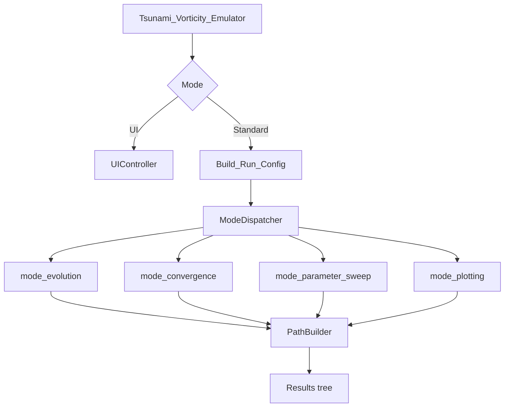
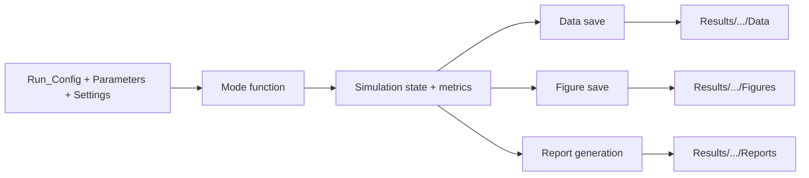
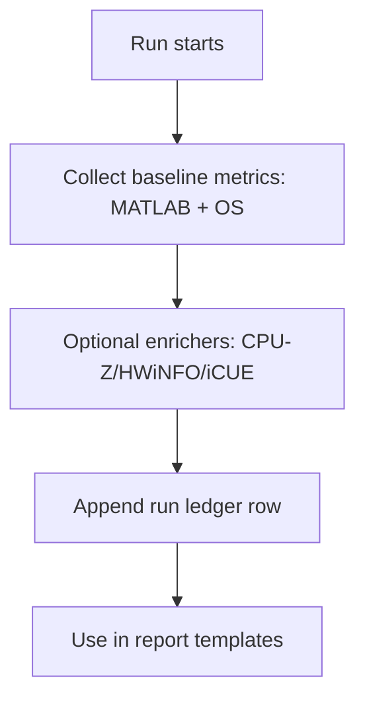

# Tsunami Vortex Numerical Modelling

Repository for numerical analysis of 2D vortex dynamics in vorticity-streamfunction form.

## Current Entrypoints
- Standard/UI driver: `Scripts/Drivers/Tsunami_Vorticity_Emulator.m`
- Mode dispatcher: `Scripts/Infrastructure/Runners/ModeDispatcher.m`
- Method-level runner: `Scripts/Solvers/run_simulation_with_method.m`

## Quick Start

### 1) Open MATLAB at repo root
```matlab
cd('C:/path/to/MECH0020-Numerical-Analysis-of-Tsunami-Vortices-on-Ocean-Surfaces')
```

### 2) Run UI mode
```matlab
Tsunami_Vorticity_Emulator('Mode','UI')
```

### 3) Run standard mode
```matlab
Tsunami_Vorticity_Emulator('Mode','Standard')
```

## Editable Configuration (Standard Mode)
Standard mode expects editable user defaults in:
- `Scripts/Editable/Parameters.m`
- `Scripts/Editable/Settings.m`

If you want to change animation frame behavior, edit:
- `Parameters.m`: `num_plot_snapshots`, `num_animation_frames`, `animation_format`, `animation_codec`
- `Settings.m`: `animation_frame_rate`, `animation_frame_count`, `animation_format`, `animation_quality`

## UI Mode Expectations
UI mode is for interactive setup and live monitoring. The canonical run execution still routes through shared infrastructure (build config + dispatch + save paths), not a separate solver stack.

### Interactive vs UI vs Standard
- `Mode='Interactive'`: opens startup choice dialog and lets you pick UI or Standard at runtime.
- `Mode='UI'`: launches `Scripts/UI/UIController.m` directly.
- `Mode='Standard'`: skips UI and runs from editable defaults in `Scripts/Editable`.

### Developer Mode (inside UI)
- Developer mode is a UI editing aid only.
- It enables component inspection and layout debugging; it does not change solver numerics or output semantics.

### Live Monitor Contract
- Live monitor dashboard is fixed to a 3x3 tile layout (9 tiles).
- 8 tiles are ranked plots and tile 9 is a scrollable numerical metrics table.
- Terminal and telemetry source readiness live in the sidebar.

## Architecture Flow


## Repository Structure
```text
Scripts/
  Drivers/
    Tsunami_Vorticity_Emulator.m
  Editable/
    Parameters.m
    Settings.m
  Infrastructure/
    Builds/
    DataRelatedHelpers/
    Initialisers/
    Runners/
    Utilities/
  Methods/
    FiniteDifference/
    Spectral/
    FiniteVolume/
  Modes/
    mode_evolution.m
    mode_parameter_sweep.m
    mode_plotting.m
    Convergence/mode_convergence.m
  Solvers/
    run_simulation_with_method.m
  Sustainability/
  UI/

docs/
  03_NOTEBOOKS/
  implementation/

tests/
```

## Data and Output Storage
Canonical runtime output root is `Results/`.

### Run tree
```text
Results/
  <Method>/
    <Mode>/
      <RunID>/
        Config.mat
        Data/
          results.mat
        Figures/
          Evolution/
          Contours/
          Vector/
          Streamlines/
          Animation/
        Reports/
          Report.txt
```

### Figure and media intent
- Plot snapshots: controlled by `num_plot_snapshots`.
- Animation frames: controlled by `num_animation_frames` and `animation_frame_rate`.
- Plot snapshots and animation frames are independent controls.

## Mode and Method Compatibility

### ModeDispatcher path
- Fully supported now: FD mode routing (`Evolution`, `Convergence`, `ParameterSweep`, `Plotting`)
- Spectral is enabled for `Evolution` and `Convergence` (experimental spectral callback path)
- Spectral `ParameterSweep` remains blocked in dispatcher mode for this checkpoint
- Finite Volume is enabled for `Evolution` (experimental layered 3D callback path)
- Finite Volume `Convergence` and `ParameterSweep` remain blocked in dispatcher mode for this checkpoint

### Method-level runner path
- `run_simulation_with_method` can execute currently available method-level run paths (`finite_difference`, `spectral`, `finite_volume`) directly from each self-contained method module

## Run and Report Pipeline


## Sustainability Tracking Direction
The implementation plan adds continuous per-run sustainability logging with machine tagging and collector source flags, rooted at:
- `Results/Sustainability/runs_sustainability.csv`



## Notebook
Primary notebook:
- `docs/03_NOTEBOOKS/Tsunami_Vortex_Analysis_Complete_Guide.ipynb`

It is aligned with current paths and distinguishes method-level execution from dispatcher-mode compatibility.

## Testing
Main regression entrypoint:
- `tests/Run_All_Tests.m`

Planned hardening checks include:
- path invariants (no writes outside canonical output roots)
- report artifact generation checks
- media output policy checks
- sustainability ledger append checks

## Implementation Plan Artifacts
- `docs/implementation/2026-02-11_repo_hardening_execution_plan.md`
- `docs/implementation/2026-02-11_repo_hardening_baseline.md`

## Legacy Docs
- Migration index: `docs/archive/README.md`
