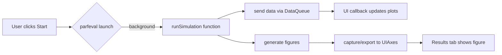

# do deep research on MATLAB UI controller and App integration

**Executive summary:** The repository UI controller script isn’t accessible. Below we give canonical MATLAB solutions. Live monitoring uses a `parallel.pool.DataQueue` to send data from the simulation to UI callbacks. IC previews use `uifigure` and `uidropdown` entries. LaTeX is rendered by setting `Label.Interpreter='latex'`. Simulations are launched via `parfeval` or `backgroundPool`. Figure windows can be captured into UIAxes via `copyobj` or by exporting to an image and displaying it. Updates are throttled to avoid blocking (`drawnow limit`, timed updates).

- **DataQueue live-monitor:** In App startup:  
  ```matlab
  q = parallel.pool.DataQueue;
  afterEach(q, @(data) updatePlots(data));  
  f = parfeval(backgroundPool, @runSimulation, 0, q, otherArgs);
  ```  
  In `runSimulation`, periodically call `send(q,[t,metric1,metric2]);`. The `updatePlots` callback plots these values on `UIAxes`.

- **UI elements:** Use `uifigure` and `uiaxes`. For example, dropdowns:  
  ```matlab
  d = uidropdown(app.UIFigure,'Items',{'Option1','Option2'});
  d.ValueChangedFcn = @(src,evt) updatePreview(src.Value);
  ```  
  Titles/labels: e.g. `app.UITable.Title = '$$t \,(\mathrm{s})$$'; app.UIAxes.Title.Interpreter='latex';`.

- **LaTeX in labels:**  
  ```matlab
  app.Label.Interpreter = 'latex';
  app.UIAxes.Title.String = '\psi (m^2/s)';
  ```

- **Embedding figures:** To capture a MATLAB figure into the Results tab: either use  
  ```matlab
  fig = figure; surf(...);
  copyobj(fig.CurrentAxes, app.UIAxesResults);
  ```  
  or  
  ```matlab
  exportgraphics(fig,'temp.png','BackgroundColor','none');
  img = imread('temp.png');
  imshow(img,'Parent',app.UIAxesResults);
  ```  

- **Parallel handoff:** Use `parfeval(backgroundPool,...)` or `parpool` with `parfeval`. Do NOT use blocking `wait`. Collect outputs via `fetchOutputs` if needed. Use the DataQueue to update UI without pausing the sim. Example:  
  ```matlab
  f = parfeval(backgroundPool,@simulate,0,q,...);
  ```

- **Performance notes:** Throttle UI updates (e.g. send every n steps). Use `drawnow limitrate` in callbacks. Use timers if needed:  
  ```matlab
  t = timer('ExecutionMode','fixedRate','Period',0.5,...
            'TimerFcn',@(~,~)updateUICallback());
  start(t);
  ```  

**Pseudocode (UI flow):**  
```
AppStartup: create DataQueue, setup afterEach callback.
StartButtonPushed: call parfeval @simulate with queue.
simulate(): loop steps, send metrics via send(q,metrics).
afterEach callback: plot metrics on live-monitor UIAxes.
On simulation completion: capture final figures into UIAxes.
```



**Tags:** UI, DataQueue, parallel, figures, latex

